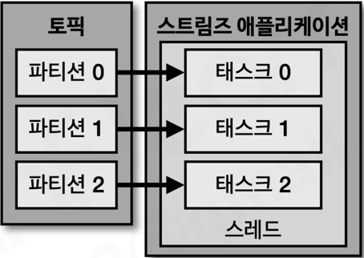
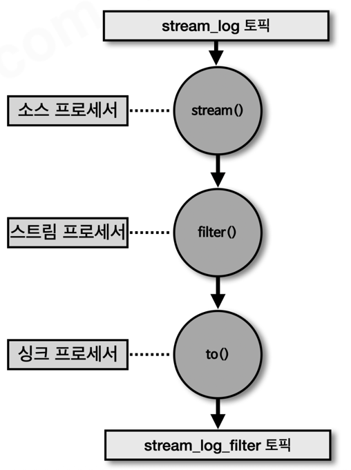
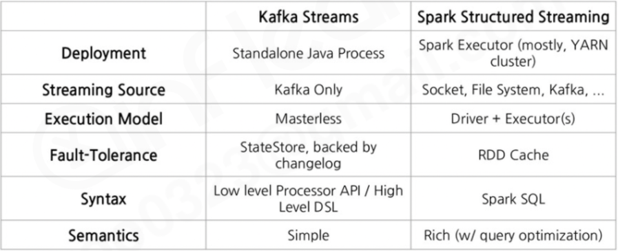

# Sec 9 카프카 스트림즈

---

### 카프카 스트림즈 소개
- 카프카에 저장된 데이터를 실시간으로 변환하여 다른 토픽에 적재하는 라이브러리로 실시간 처리를 위해 사용하는 자바 라이브러리
- 스트림 처리에 필요한 여러가지 기능들을 제공함
  - 스트림즈 애플리케이션이나 카프카 브로커에 장애가 발생하더라도 정확히 한번 데이터를 처리할 수 있도록 장애허용형 시스템을 갖추고 있음 -> 데이터 처리 안정성이 매우 뛰어나다
- 카프카 클러스터를 운영하면서 토픽에 있는 데이터를 실시간으로 처리해야 한다면 1순위로 고려해볼 수 있다
- **프로듀서와 컨수머를 조합이 아닌 스트림즈를 사용해야하는 이유** 
  - 스트림 데이터 퍼리에 필요한 다양한 기능을 스트림즈DSL이나 프로세서 API를 사용해 아주 쉽게 코드로 구현할 수 있음
    - 각각 stateless하게 각각의 레코드에 대한 변경처리나 변환처리 혹은 윈도우 데이터 처리나 어그리게이션 같은 처리를 할 때는 디스크의 데이터를 저장하거나 change log를 저장하는 등의 기능이 필요한데 이러한 기능을 라이브러리로 제공하고 있고, 추상화되어 개발자가 활용할 수 있음
  - 단 한번의 데이터 처리나 장애 허용 시스템 등의 스트림즈의 특징은 컨수머 프로듀서 조합만으로는 구현하기가 어려움
  - 반대로 스트림즈가 지원하지 못하는 기능도 있음
    - 소스 토픽(사용하는 토픽)과 싱크 토픽(저장하는 토픽)의 카프카 클러스터가 서로 다른 경우에는 스트림즈가 지원이 불가함
      - 이 경우에는 컨수머와 프로듀서를 사용하고 각각에 클러스터를 지정하는 방식으로 개발이 가능
#### 스트림즈 내부 구조

- 애플리케이션 내부에서 스레드를 1개 이상 생성할 수 있으며, 스레드는 1개 이상의 task를 가짐
- 스트림즈의 task:
  - 스트림즈 애플리케이션을 실행하면 생기는 데이터 처리 최소 단위
  - 각 파티션당 하나의 태스크가 할당되고, 컨수머처럼 파티션과 1대1 매칭된다
  - 스레드를 더 할당하게 하나의 인스턴스의 여러 스레드를 이용해 병렬처리가 가능하고, 여러 인스턴스에서 병렬처리할 수 있게 만드는 것 또한 가능하다.
    - 일반적으로는 장애가 발생하더라도 **페일 오버되면서 지속적으로 데이터를 처리할 수 있도록 파티션 개수만큼 프로세스를 실행시켜서 운영** 만들어야 한다
  - 스트림즈 애플리케이션에는 컨수머의 그룹 개념이 없고, `application.id` 값을 통해 애플리케이션ID값을 통해 같은 값을 가진 애플리케이션들이 할당 과정을 거쳐서 데이터가 처리됨
- 토폴로지: 데이터가 흘러가는 처리 구조
  - 링형, 트리형, 성형 토폴로지가 대표적
    - 네트워크 공부를 했다면 많이 봤을 것이라함..
  - 카프카 스트림즈는 트리형 토폴로지를 따른다
- 프로세서: 데이터를 실제로 처리하는 노드
  - 소스 프로세서: 데이터를 첫번째로 받는 노드
  - 스트림 프로세서: 데이터를 처리하거나 변환하거나 분기 처리 같은 데이터 처 로직을 담당하는 노드
  - 싱크 프로세서: 처리가 완료된 데이터를 저장하는 역할을 하는 노드
    - 특정 토픽 혹은 다른 토픽에 데이터를 저장
- 스트림: 노드와 노르를 이은 선으로 데이터가 흐르는 라인.
- 스트림즈 애플리케이션: 토폴로지를 실행하는 애플리케이션

- 스트림즈DSL과 프로세서API: 스트림즈 애플리케이션을 개발할 때 사용하는 방법
  - 스트림증DSL: 스트림 프로세싱에 쓸만한 다양한 기능들을 자체 API로 만들어 놓은 코드 뭉치
    - 카운트, 어그리게이션, 맵, 플랫맵등 여러 API들을 메서드로 제공함
    - 다만 일부 기능은 활용이 불가능함:
      - 메세지 값의 종류에 따라 토픽을 가변적으로 전송한다거나, 일정 간격으로 데이터를 처리하는 등
        - 이런 기능들은 프로세서 API를 이용해 구현이 가능함
    - 대부분의 기능이 스트림즈DSL에서 제공되고 있기에 저자도 프로세서API를 운영해본 경험이 많지는 않다고함
      - 그러나 프로세서 API가 어렵진 않기에 직접 구현하는 것도 배우면 좋다함

### 스트림즈DSL
- 가장 많이 사용되는 스트림즈 구성시의 라이브러리
- 다른 메세징 큐나 이벤트 스트림 플랫폼에서 사용하지 않는 개념인 KStream, KTable, GlobalKTable 을 사용함
- KStream, KTable, GlobalKTable 는 기본 소스 프로세서로서 토픽에 있는 데이터를 어떤 형태로 선언할 건지(레코드의 흐름)를 추상화한 개념.

### KStream, KTable, GlobalKTable
- 스트림즈에서 가장 많이 사용되고 활용도가 높은 개념들임
- `KStream`
  - 레코드의 흐름을 표현
  - 메세지 키와 메세지 값으로 구성되어 있음
  - 컨수머로 토픽을 구독하는 것과 동일하게 사용하는 것과 비슷함
    - 레코드가 하나하나 추가될 때 마다 레코드를 하나하나 처리하는 방식
  - 같은 키가 여러 번 들어와도 각각 독립 이벤트로 처리
- `KTable`
  - 키 기준으로 가장 최신의 메세지 값만 노출시키는 전략
    - 같은 키의 새 값이 들어오면 기존 값을 갱신
  - 토픽에 있는 데이터를 key-value 스토어 마냥 사용하는 느낌
  - 가장 최신의 데이터만 유지하고 사용하고 싶을 때 사용하는 방식
    - ex: 유저의 주소 정보 등
- 코파티셔닝:
  - KStream과 KTable을 조인하기 위해 거쳐야하는 과정
  - 두가지 조건이 충족되어야함
    - join을 하는 두 토픽의 파티션 개수가 동일함
    - 두 토픽의 파티셔닝 전략이 동일함
    - 위 두 조건이 만족되면 코파티셔닝 되어있다고 표현함
  - 두 토픽이 코파티셔닝 되었다면 동일한 메세지 키를 가진 데이터는 반드시 동일한 파티션 번호에 들어가는 것을 보장할 수 있게됨 -> 스트림즈 애플리케이션의 각각의 태스크에 동일한 데이터가 도착하는 것을 보장할 수 있음
    - 반대로 코파티셔닝이 되어있지 않다면 (파티션 개수가 다르거나 파티셔닝 전략이 다르면) 동일환 메세지 키의 값이 동일한 태스크에 도달하는 것에 대한 보장이 되지 않음
  - 코파티셔닝이 안된 토픽들로 부터 스트림드 애플리케이션에서 조인을 시도하면 TopologyException이 발생함
- `GlobalKTable`
  - 토픽들에 있는 전체 파티션의 모든 데이터를 materialized view 로 각각의 태스크에서 활용하는 방식
  - 파티션 키가 맞지 않아도 조인할 때 활용 가능
  - GlobalKTable의 데이터가 비대해지게되면, 애플리케이션에 큰 부담을 주게됨
    - 데이터 양이 충분히 적을 경우에만 활용하는게 좋다
    - 어쩔 수 없는 경우에는 리텐션 기간을 조절해서 빠르게 삭제될 수 있게 운영하는게 좋다
- 일반적으로는 코파티셔닝된 KTable이나 KStream을 운용한다.

### 스트림즈 주요 옵션 소개
- 필수 옵션:
  - `bootstrap.servers`
    - 접속할 카프카 브로커 정보
  - `application.id`
    - 스트림즈 애플리케이션을 식별하는 값
    - 컨슈머 그룹 ID와 같이 스트림 그룹을 묶기 위해 사용함
      - 여러 인스턴스를 띄워서 병렬 처리하는 용도
- 선택 옵션:
  - `default.key.serde`, `default.value.serde`
    - 기본 키/값 직렬화, 역직렬화 설정
    - 스트림 마다 집계를 통해 count()를 가져온다거나 하는 경우도 있을 수 있음 -> 이러한 경우는 기본 직렬화 역직렬화 방식을 따를 수 없고 이 설정값을 통해 지정해야함
  - `num.stream.threads`
    - 스트림 프로세싱 실행 시 실행될 스레드 개수를 지정
    - 스케일 업을 하게되면 이 값을 태스크 개수에 맞춰서 올리면 병렬처리에 좀 더 좋은 성능을 낼 수 있음
  - `state.dir` 상태기반 데이터를 처리할 떄 데이터를 저장한 디렉터리
    - 기본값은 `/tmp/kafka-streams`
    - 스트림즈에서는 모든 데이터를 메모리에 올려두고 있는게 아니라, 디스크의 파일 시스템의 데이터를 저장해 활용함
      - 이 때 사용되는게 RocksDB고, 이 데이터베이스에 저장되는 파일들의 위치를 설정하는 설정값임
      - RocksDB는 잘 알 필요는 없음 (추상화된 레이어에서만 활용)
    - 사용하는 OS에 따라 tmp 디렉터리의 생명 주기가 다르기 때문에 특정 디렉터리를 만들고 상태를 저장하는게 더 좋을 것 같다

### 스트림즈 애플리케이션 개발하기
```java
dependencies {
    compile 'org.apache.kafka:kafka-streams:2.5.0'
}
```
- 스트림즈 라이브러리를 별도로 추가해야함
- 스트림즈 애플리케이션을 개발시에는 반드시 **토폴로지에 대한 개념을 숙지해 어떻게 데이터를 처리**하는 것을 가지치기하듯이 진행할지에 대한 고민이 필요함
#### 간단한 필터링 스트림즈 애플리케이션:

- 특정 토픽에 있는 데이터를 가져오고, 그 데이터들에 대한 필터를 통해 특정한 조건을 가진 데이터만 다음 프로세서로 넘기고 특정 토픽으로 데이터를 저장하는 간단한 예시
- 비상태 기반 스트림 데이터 처리의 예시
- 스트림즈DSL의 filter 메서드를 사용해 처리가 가능
```java
StreamsBuilder builder = new StreamsBuilder();
KStream<String, String> streamLog = builder.stream(STREAM_LOG);

streamLog
    .filter((key, value) -> value.length() > 5)
    .to(STREAM_LOG_FILTER);

KafkaStreams streams = new KafkaStreams(builder.build(), props);
streams.start();
```
- 스트림 빌더를 통해서 토폴로지 구성에 필요한 소스 프로세서, 스트림 프로세서, 싱크 프로세서 개념을 직접 구현해야함
  - stream(), filter(), to() 등의 메서드로 구현되어 있음

### KStream과 KTable 조인 스트림즈 애플리케이션
- KStream과 KTable 조인을 하는 의미는?
  - 스트림즈 데이터를 스트림과 배치 데이터처럼 활용하는 것과 거의 유사
  - ex: 주문데이터는 KStream으로 가져오고 주소 데이터는 KTable로 관리한다고 할 때, 실시간으로 스트림 데이터로 주소를 조인해서 가져오고 싶을 경우에 사용이 가능
    - 즉 이벤트 데이터(주문)와 최신 상태 데이터(주소)를 조인할 때 사용
- 조인 기준은 레코드 키
- stream과 table로 메모리에 레코드들을 가져온 후 join을 통해 합친후 필요한 로직을 수행한 후 다시 to 메서드로 다음 토픽으로 전송 가능
```java
KTable<String, String> addressTable = builder.table(ADDRESS_TABLE);
KStream<String, String> orderStream = builder.stream(ORDER_STREAM);

orderStream
    .join(addressTable, (order, address) -> order + " send to " + address)
    .to(ORDER_JOIN_STREAM);
```

### KStream, GlobalKTable 조인 스트림즈 애플리케이션
- 코파티셔닝 되어 있지 않은 두개의 토픽에 대해서 조인을 하기 위해서는 크게 2가지 방식이 있음
  1. GlobalKTable 을 활용하는 방식
  2. 리파티셔닝을 수행해 두 토픽을 코파티셔닝된 상태로 만들기
- 리파티셔닝이란?
  - 특정 토픽에 있는 파티션을 조인하고자 하는 토픽의 파티션 개수와 맞춰주는 작업
  - 기존 토픽에 작업하는게 아니라 신규 토픽을 만들고 데이터를 복사해 사용함
  - 신규 토픽을 만들어야 하고 중복데이터가 추가되는 단점이 있으나, 토픽에 너무 많은 데이터가 있어서 GlobalKTable을 사용할 때 스트림즈 애플리케이션에 부하가 커지는 경우에 사용할 듯 함

### 스트립즈DSL의 윈도우 프로세싱
- 스트림 데이터를 분석할 때 가장 많이 활용하는 프로세싱 중 하나는 윈도우 연산
- 윈도우 연산이란?
  - 특정 시간에 대응하여서 취합연산을 처리할 때 활용한다.
  - 카프카 스트림즈에서는 4가지 윈도우 프로세싱을 지원함
- 카프카에서의 모든 윈도우 프로세싱은 메세지 키를 기준으로 취합되기 때문에 레코드에 데이터를 넣을 때 메시지 키를 지정해야만 함
  - 커스텀 파티셔너를 활용해 같은 키인데도 다른 파티션에 적재되는 케이스가 있다면 카프카 윈도우 프로세스가 동작하지 않을 수 있다.
- 카프카 스트림즈에서 지원하는 4가지 윈도우 프로세싱
  - 텀블링 윈도우
    - 서로 겹치지 않는 윈도우를 지속적으로 처리할 때 사용됨
    - 데이터 베이스에 bulk 로 데이터를 저장하거나 하는 경우에 활용됨.
      - 한번에 여러 데이터를 처리할 수 있는 장점이 있어 레코드가 들어올 때 마다 저장할 때에 비해 데이터베이스 연결 횟수가 크게 줄어들어 효율을 높일 수 있음
      - ex: 특정 시간동안 접속한 유저의 수 측정 등
  - 호핑 윈도우
    - 고정 시간 구간이지만 겹치는 부분이 있을 수 있는 윈도우
    - 동일한 키의 데이터는 다른 윈도우에서 여러번 연산될 수 있다는 특징이 있음
  - 슬라이딩 윈도우
    - 호핑 윈도우와 유사하나 아주 낮은 인터벌을 기반으로 각 이벤트의 시간 차 마다 윈도우를 생성하는 방식
      - 그 때문에 호핑 윈도우에 비해 보통은 더 많은 중복이 발생할 수 있음
    - 여기서 말하는 시간: 레코드에 포함된 타임 스탬프의 정확한 시간
  - 세션 윈도우
    - 메세지 키를 한 세션에 묶어 연산할 때 사용
    - 세션의 최대 만료 시간에 따라 윈도우 사이즈가 달라짐
  - 모든 윈도우를 적용할 때는 레코드를 groupByKey 로 묶고, 그 다음 필요한 windowedBy 메서드를 활용해 지정 가능
- 텀블링 윈도우 예시:
```java
KTable<Windowed<String>, Long> countTable = stream.groupByKey()
    .windowedBy(TimeWindows.of(Duration.ofSeconds(5)))
    .count();
```
- 윈도우 연산시 주의해야할 사항:
  - 카프카 스트림즈는 커밋을 수행할 때 윈도우 사이즈가 종료되지 않아도 중간 정산 데이터를 출력함
    - 디폴트 커밋 시간은 30초
  - 그래서 동일 윈도우 시간 데이터는 겹처쓰기(upsert)하는 방식으로 처리하는 것이 더 좋다

### 스트림즈DSL의 Queryable Store
- `KTable`의 Materialized View 데이터를, 로컬 상태 저장소로 만들고 키/값 형태로 조회 가능
- 카프카를 사용해서 로컬 캐시를 구현한 것과 유사한 사용법
- 실시간 처리 결과를 API 등으로 조회해야 할 때 활용할 수 있을 것 같다

### Processor API
- DSL보다 더 낮은 수준에서 토폴로지를 직접 구성하는 방식
  - 그래서 보통은 스트림즈DSL을 활용하나, 로우 레벨의 구현이 필요할 때 프로세서 API를 활용할 수 있다 함
- 프로세서 API를 구현하기 위해 구현해야하는 인터페이스:
  - `Processor`: 일정 로직이 이루어진 뒤 다음 프로세서로 데이터가 넘어가지 않을 때 사용
    - 컨텍스트를 사용하면 데이터를 넘길 수 있음
    - `init`, `process`, `close`를 override 해 구현해야함
  - `Transformer`: 일정 로직이 이루어진 뒤 다음 프로세스로 데이터를 넘길 때 활용

### 카프카 스트림즈와 스파크 구조적 스트리밍 비교
- 차이점에 대한 표:  

- 스파크는 클러스터가 마련되어 있지 않다면 운영이 힘듦
- 언제 무엇을 쓸까?
  - 카프카 스트림즈: 카프카 토픽을 인풋으로 하는 경량 프로세싱 애플리케이션 개발
  - 스파크 스트리밍: 카프카 토픽을 포함한 하둡 생태계(HDFS, hive 등)를 인풋으로 활용하는 복잡한 프로세실 애플리케이션 개발