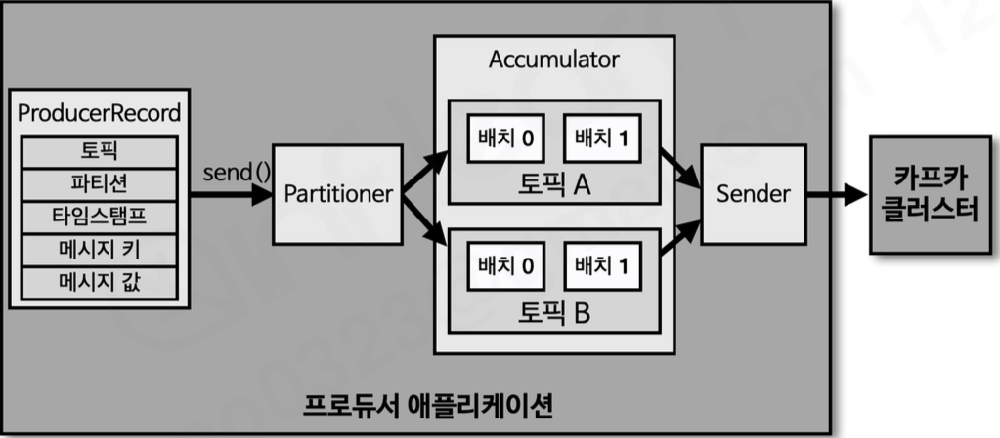

# Sec 6 카프카 프로듀서 애플리케이션 개발

---

### 39. 카프카 프로듀서 소개

- 프로듀서 내부 구조:
  - 프로듀서 레코드: 프로듀서에서 생성하는 레코드. (오프셋은 포함되어 있지 않음)
  - 프로듀서의 클라이언트 SDK를 이용해 send() 메서드 호출
    - 레코드를 전송 요청하는 메서드
  - Partitioner: 어느 파티션으로 전송할지 지정하는 파티셔너. 기본값으로 DefaultPartitioner로 설정됨
    - 메시지키가 있으면 Hash 로 파티션을 결정
    - 메시지키가 없으면 라우든 로빈
  - Accumulator: Batch로 묶어서 전송할 데이터를 모으는 버퍼
    - 파티셔너에 의해 분리된 레코드들을 토픽별로 들고 있음
  - Sender: 실제로 데이터를 전송하는 역할
    - 매번 send()가 호출될 때마다 TCP 연결을 만들어 보내는 것이 아니라, 쌓인 데이터를 한번에 보내는 방식

### 40. 파티셔너
- 카프카 클라이언트 라이브러리 2.5.0 버전에서 제공하는 파티셔너
  - RoundRobinPartitioner: 원래 제공되던 옛날 파티셔너
  - UniformStickyPartitioner: 기본 디폴트 파티셔너로, RoundRobinPartitioner를 개선한 버전
  - 둘 다 메시지 키가 있을 때는 해시값을 사용해 파티션을 매칭
    - 동일한 키를 가진 경우에는 항상 동일한 파티션 번호에 전달됨
    - 파티션 개수가 변경되면 메시지 키와 파티션 번호 매칭은 깨짐
      - 파티션 변경이 자주 있어선 안됨 -> 충분히 큰 개수로 운영하면 좋다
        - 컨수머와 프로듀서가 처리/생성 가능한 양을 산정해 그에 맞춘 운영을 하면 더 좋다.
  - 메시지 키가 없을 때:
    - 각 파티션에 최대한 동일하게 분배하는 로직 
    - RoundRobinPartitioner:
      - 말 그대로 파티션을 순회하면서 전송을 했음
      - 그러나 이 방식의 문제는 Accumulator에서 묶이는 정도가 적어지는 문제가 있음 -> 배치성으로 보내는 효율이 떨어짐
    - UniformStickyPartitioner:
      - Accumulator에서 레코드들리 묶일 때 까지 기다렸다가 전송
      - 배치로 묶이기는 하나, 결과적으로는 각 파티션에 데이터를 계속해서 보내는게 동일하기 때문에, RoundRobinPartitioner 보다 향상된 성능을 가짐
- 커스텀 파티셔너:
  - 특수한 키를 무조건 특수한 파티션으로 보내는 등의 로직을 구현할 수 있음.
  - 메시지 키만이 아니라 밸류까지 파악해 파티션을 지정하는 로직을 구현하는 것도 가능해짐.

### 41. 프로듀서 주요 옵션 소개
#### 필수 옵션들:
- 기본값이 없어서 반드시 정해줘야 하는 값들
- bootstrap.servers: 프로듀서가 데이터를 전송할 대상 카프카 클로스터에 속한 브로커들의 접속 정보 (IP/도메인:포트).
  - 최소 1개 이상이 필요함
  - 여러 개를 지정할 경우 쉼표(,)로 구분
- key.serializer: 레코드의 메시지 키를 직렬화하는 클래스를 지정하는 설정
- value.serializer: 레코드의 메시지 값을 직렬화하는 클래스를 지정하는 설정
  - 키와 값의 직렬화를 통해 모든 형태의 데이터를 보내는게 가능함
  - String 시리얼라이저를 쓰는 것도 좋은 방법:
    - 장점:
      - Kafka-console-consumer를 사용할 때 용이해짐
        - 이런 이슈 때문에 특수한 경우가 아니면 String 을 사용한다고 함
      - Topic에 들어가 있는 데이터가 어떻게 들어가 있는지 확인할 때 운영상의 이점이 있음
    - 문제점: 
      - float/int 등을 쓰지 않고 String을 사용하는 것은 공간 낭비 (더 많은 데이터의 사용)이 발생할 수 있음

#### 선택 옵션들:
- acks: 프로듀서가 전송한 데이터가 브로커들에 정상적으로 전송 성공 여부를 확인하는데에 사용하는 옵션
  - 0,1, -1(all) 중 하나로 설정이 가능하고, 기본값은 1
- linger.ms: 배치를 전송하기 전까지 기다리는 최소 시간.
  - 기본값은 0
- retries: 브로커로부터 에러를 받았을 때 재시도를 하는 횟수
  - 기본값은 int 최대값
- max.in.flight.requests.per.connection: 한 번에 요청하는 최대 커넥션 개수.
  - Sender를 통해 데이터를 보낼 때 스레드의 개수에 대한 설정
  - 설정된 값만큼 동시에 요청을 보냄
  - 기본값은 5.
- partirioner.class: 파티셔너 클래스 지정하는 설정. 
- enable.idenpotency: 멱등성 프로듀서로 동작할지 여부에 대한 설정
  - 기본값은 false
  - 프로듀서와 브로커의 통신시 네트워크 이슈가 발생했을 때 중복해서 보내는 것을 방지하기 위한 설정
    - 3.X 버전에서는 true가 디폴트
- transaction.id: 프로듀서가 레코드를 전송할 때 레코드를 트랜잭션 단위(원자적으로)로 묶을지 여부에 대한 설정
  - 기본값은 null
  - 이 값이 지정된 프로듀서는 트랜잭션 프로듀서라고 불림

### 42. ISR(In-Sync Replicas) 와 acks 옵션
- acks가 뭘로 설정되어 있는냐 -> 얼마나 성능을 포기하고 안전하게 데이터를 보낼 것이냐
  - 처리량과 안정성의 균형에 따라 결정해야함
- ISR이라는 용어가 나온 이유는 팔로워 파티션이 리더 파티션으로부터 데이터를 복제하는데 시간이 걸리게 되고, 이로인해 오프셋 차이 (리더의 오프셋과 팔로워의 오프셋의 차이)
  - 복제를 하는 과정:
    - 리더가 수신함 -> 리더의 오프셋 수정 -> 팔로워가 주기적으로 리더에서 수신 -> 팔로워의 오프셋 수정
    - 이런 흐름이기에 시간에 따라 안맞는 타이밍이 있을 수 있음
- acks 옵션: -1, 0, 1
  - 0: 어떤 브로커에서도 데이터의 저장 여부를 확인하지 않음.
    - 속도는 가장 빠름
    - 신뢰도는 가장 낮음
    - GPS등의 머신의 지표데이터 등, 전체적인 데이터 처리가 중요한 경우에 사용할 수 있는 처리량 최우선 옵션
  - 1: 리더에만 저장되었는지 확인 (디폴트)
    - 0에 비해선 신뢰도가 오르기는하나, 다른 브로커에 복제되기 전까지는 데이터 손실 가능성이 있음
      - 하지만 드문 케이스이고, 저자의 경험상 큰 장애가 아닌 이상 문제되지 않았음
      - 대다수의 경우 1로 하더라도 문제가 없다
  - -1(all): 모든 ISR에서 전송된 데이터가 저장됨을 확인할 때까지 기다림
    - 가장 안전한 옵션이지만, 처리량이 가장 낮음
    - 토픽별로 설정가능한 min.insync.replicas 옵션값에 따라 몇개의 팔로워에까지 저장할지 정하는 옵션
      - min.insync.replicas를 높일 수록 신뢰도가 올라가나 성능이 떨어짐
      - 저자의 경험에는 대부분의 경우 2로 설정을 해도 충분했다 함
        - 웬만한 경우에 데이터가 반드시 적재됨
  - 복제 갯수가 1이라면 사실상 성능 변화가 거의 없긴 함.

### 43. 프로듀서 애플리케이션 개발하기
- 브로커의 버전과 동일한 클라이언트 버전을 활용해야함
```java
  public static void main(String[] args) {
    Properties configs = new Properties();
    configs.put(ProducerConfig.BOOTSTRAP_SERVERS_CONFIG, BOOTSTRAP_SERVERS);
    configs.put(ProducerConfig.KEY_SERIALIZER_CLASS_CONFIG, StringSerializer.class.getName());
    configs.put(ProducerConfig.VALUE_SERIALIZER_CLASS_CONFIG, StringSerializer.class.getName());

    KafkaProducer<String, String> producer = new KafkaProducer<>(configs);

    String messageValue = "testMessage";
    ProducerRecord<String, String> record = new ProducerRecord<>(TOPIC_NAME, messageValue);
    producer.send(record);
    logger.info("{}", record);
    producer.flush();
    producer.close();
  }
```

### 44. 메시지 키를 가진 프로듀서 애플리케이션
- 위 코드의 ProducerRecord 생성자에 스트링 아규먼트를 추가하면 됨
- 메시지가 키를 가진체 전송됐는지 확인시:
  - kafka-console-consumer.sh --bootstrap-server {ip:port} --topic {topic_name} --property print.key=true --property key.separator="-" --from-beginning

### 45. 파티션 번호를 지정한 프로듀서 애플리케이션
- 위 코드의 ProducerRecord 생성자에 아규먼트를 String, int, String, Object 로 넣으면 됨
  - 순서대로 토픽, 파티션 번호, 메시지 키, 메세지 값


### 46. 커스텀 파티셔너 프로듀서 애플리케이션
- 위 코드의 configs에 새로운 커스텀 파티셔너를 추가하는 라인을 추가해야함
  - ex: `configs.put(ProducerConfig.PARTITIONER_CLASS_CONFIG, {CustomPartitioner}.class);`
- 커스텀 파티셔너들의 조건
  - 카프카의 Partitioner의 구현체여야 함

### 47. 레코드 전송 결과를 확인하는 프로듀서 애플리케이션
- send()는 기본적으로 Future 객체를 반환함.
  - 이 값에 get() 메서드를 호출함으로 저장된 메타데이터 정보를 동기적으로 가져올 수 있다.
- acks값이 0 일 경우에는 전송후 데이터 저장을 보장하지 않기 때문에, 클라이언트 입장에서 동기적으로 get()을 한다해도 저장된 오프셋을 동기적으로 가져올 수 없음

### 48. 프로듀서 애플리케이션의 안전한 종료
- 프로듀서를 안전하게 종료시키는 메서드: close() 
  - 동장방식: accumulator에 저장되어 있는 모근 데이터를 카프카 클러스터로 전송됨