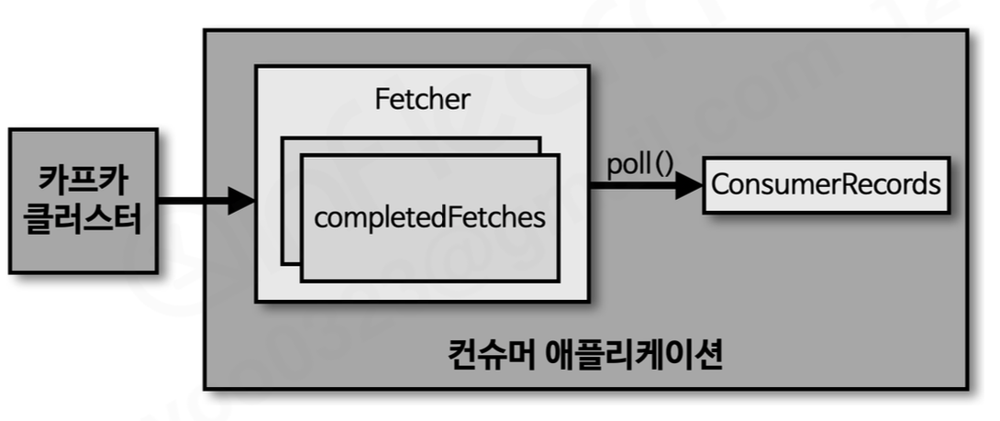
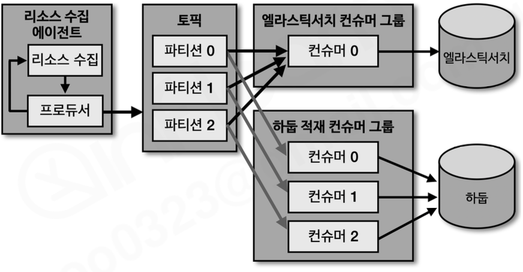

# Sec 7 카프카 컨슈머 애플리케이션 개발

---

### 51. 카프카 컨슈머 소개
- 토픽에 데이터가 들어오면 데이터를 사용하는 용도로 활용 
- 특정 토픽에 들어온 데이터를 특정 데이터 처리를 위해 지정한다
  - ex: 이메일/문자 전송 등
- 컨수머 내부 구조:  

  - Fetcher: 리더 파티션에서 레코드들을 미리 가져와서 대기
    - 이 존재로 인해 컨수머 애플리케이션에서 poll()이 호출되어도, 실제 데이터가 동기화 되기 전이라도 가져올 수가 있음
  - poll(): Fetcher가 가져온 레코드들을 리턴하는 메서드
  - ConsumerRecords: 처리하려는 레코드의 모음

### 52. 컨수머 그룹
- 특정 토픽에 대해 어떤 목적에 따라 데이터를 처리하는 컨수머의 그룹
  - 같은 그룹에 속한 컨수머들은 토픽의 파티션을 나누어서 병렬 처리가 가능함
- 컨수머 그룹이 추가되면, 기존 데이터들도 가져갈 수가 있게됨
- 일반적으로 파티션 갯수만큼 컨수머 스레드/컨수머 어플리케이션을 늘리는 것이 좋다
  - 각각의 파티션에 있는 데이터를 1:1 매칭해야 최대의 성능
- 그룹 내 컨수머 수가 파티션 수보다 많으면 일부 컨수머는 유휴 상태가 됨
  - ex 파티션이 추가되지 않았는데 컨수머가 추가된 경우 
- 컨수머 그룹을 활용하는 이유:
  - 데이터 처리의 병렬화 및 확장성 확보
    - ex: 리소스를 수집하는 경우에 같은 데이터를 일라스틱서치랑 하둡 양쪽에 저장이 필요한 경우, 양쪽에 전부 데이터 저장이 필요하면 동기적으로 하나 처리하고 다음걸 처리했어야 했음 
      - -> 컨수머 그룹을 나누어 각각의 컨수머가 데이터를 처리하도록 하면 비동기적으로 변경이 가능함
      - 추가로 일라스틱 서치나 하둡에 장애가 생기더라도 카프카만 살아있다면 나중에라도 데이터를 추가할 수 있음 (유실 방지)
    

### 53. 리밸런싱
- 컨수머의 독특한 failover 방식
  - 토픽과 토픽에 있는 Partition과 Consumer의 할당과정이 변경되는 과정
  - ex: 3개 파티션이 있고 3개의 컨수머가 컨수머 그룹에 있었는데 컨수머2이 죽으면 파티션2에 쌓이는 데이터는 처리되지 못하는 문제가 생긴다.
    - 이러한 상황에 2번 파티션의 데이터가 처리될 수 있도록 재할당하는 로직이라 보면 된다
    - 컨수머2이 다시 살아나면 다시 파티션2의 데이터를 처리하도록 재할당이 이루어진다
- 리밸런싱 과정은 토픽에 있는 파티션 개수에 큰 영향을 미침.
  - 토픽의 파티션 개수가 100~1000개 이상 엄청나게 많을 경우 리밸런싱이 일어나는 상황 자체가 장애와 같은 상황이 된다. 
    - 리밸런싱을 하는 동안의 시간이 길어져 처리되지 못하는 메세지가 많이 쌓이기 때문
### 54. 커밋
- 컨수머가 처리한 오프셋을 저장하는 과정
  - 자동 커밋(auto commit)과 수동 커밋(manual commit) 방식이 있음
- 내부 토픽 (__consumer_offsets__)에 기록됨

### 55. 어사이너(Assigner)
- 컨수머와 파티션의 할당 정책
- RangeAssigner (디폴트)
  - 각 토픽에서 파티션을 숫자로 정렬
  - 컨수머를 alphabetic order로 정렬하여 할당
- RoundRobinAssigner
  - 모든 파티션을 컨수머에서 번갈아 가면서 할당
- StickyAssigner
  - 최대한 파티션을 균등하게 배분하면서 할당
- 파티션 개수만큼 컨수머 개수를 늘려서 운영하자는 기본 원칙을 새우고 운영하되, 특별한 경우에만 어싸이너의 동작을 확인하면 좋을 것 같다

### 56. 컨수머 주요 옵션 소개
#### 필수 옵션
- bootstrap.servers: 프로듀서와 동일
- key.deserializer: 레코드의 메시지 키를 역직렬화하는 클래스를 지정하는 설정
- value.deserializer: 레코드의 메시지 값을 역직렬화하는 클래스를 지정하는 설정
  - 프로듀서에서 직렬화한 것과 동일한 방식으로 역직렬화해야 함
  - 저자는 주로 JSON 데이터를 String 으로 직렬화/역직렬화 했다고 함
#### 선택 옵션
- group.id: subscribe를 사용하는 경우에는 필수 값이 됨
  - 기본값은 null
  - 대부분의 경우 subscribe를 사용한다고 함
- auto.offset.reset: 컨수머 그룹이 특정 파티션을 읽을 때 컨수머 오프셋이 없는 경우(컨수머에서 commit을 하지 않은 상태일 떄) 어느 오프셋부터 읽을지 선택하는 옵션
  - 기본값은 latest
- enable.auto.commit: 자동 커밋을 사용할지 여부
  - 기본값은 true
  - true이면 컨수머가 일정 주기마다 읽은 오프셋을 자동으로 커밋
  - 수동 커밋을 직접 제어하려면 false로 설정
- auto.commit.interval.ms: 자동 커밋을 사용할 때 오프셋 커밋 주기
  - 기본값은 5000ms
  - enable.auto.commit=true일 때 의미가 있음
- max.poll.records: poll()을 한 번 호출했을 때 반환되는 레코드 최대 개수
  - 기본값은 500
  - 한 번에 너무 많은 레코드를 가져오면 처리 시간이 길어져 리밸런싱 이슈가 생길 수 있음
- session.timeout.ms: 컨수머와 브로커 사이의 세션 타임아웃 시간
  - 기본값은 10000ms
  - 이 시간 안에 하트비트를 받지 못하면 브로커는 해당 컨수머에 장애가 발생했다고 보고 리밸런싱을 수행
- heartbeat.interval.ms: 컨수머가 브로커로 하트비트를 보내는 주기
  - 기본값은 3000ms
  - 일반적으로 session.timeout.ms보다 작게 설정해야 함
- max.poll.interval.ms: poll() 호출 간 최대 허용 시간
  - 기본값은 300000ms
  - poll() 이후 레코드 처리 시간이 이 값을 넘으면 컨수머가 멈춘 것으로 판단되어 리밸런싱이 발생할 수 있음
- isolation.level: 트랜잭션 프로듀서가 사용된 경우 컨수머가 읽을 데이터 범위를 정하는 옵션
  - read_uncommitted: 커밋 여부와 상관없이 읽음
  - read_committed: 트랜잭션이 커밋된 데이터만 읽음


### 57. auto.offset.reset
- 컨수머 그룹이 특정 파티션을 처음 읽을 때 커밋된 오프셋이 없으면 어느 위치부터 읽을지 정하는 옵션
  - 이미 커밋된 오프셋이 있으면 이 옵션은 적용되지 않음
- 설정 가능한 값:
  - latest: 가장 최근 오프셋부터 읽음
    - 기본값
    - 컨수머 그룹 생성 이후 새로 들어오는 데이터만 처리하고 싶을 때 사용
  - earliest: 가장 오래된 오프셋부터 읽음
    - 토픽에 남아 있는 데이터를 처음부터 모두 읽고 싶을 때 사용
  - none: 커밋된 오프셋이 없으면 에러를 발생시킴
    - 명시적인 오프셋 관리가 필요할 때 사용
- auto.offset.reset은 컨수머가 커밋을 하지 않은 상태에서만 의미가 있음
  - 한 번 커밋된 이후에는 커밋된 오프셋 기준으로 다시 읽게 됨

### 58. 컨수머 애플리케이션 개발하기
- 카프카 브로커 버전과 동일한 카프카 클라이언트 버전을 사용하는 것이 좋음
- 기본 컨수머 애플리케이션 흐름:
  - Properties에 컨수머 옵션 설정
  - KafkaConsumer 생성
  - subscribe()로 토픽 구독
  - poll()을 반복 호출해 ConsumerRecords를 가져와 처리
```java
public static void main(String[] args) {
  Properties configs = new Properties();
  configs.put(ConsumerConfig.BOOTSTRAP_SERVERS_CONFIG, BOOTSTRAP_SERVERS);
  configs.put(ConsumerConfig.GROUP_ID_CONFIG, GROUP_ID);
  configs.put(ConsumerConfig.KEY_DESERIALIZER_CLASS_CONFIG, StringDeserializer.class.getName());
  configs.put(ConsumerConfig.VALUE_DESERIALIZER_CLASS_CONFIG, StringDeserializer.class.getName());

  KafkaConsumer<String, String> consumer = new KafkaConsumer<>(configs);

  consumer.subscribe(Arrays.asList(TOPIC_NAME));

  while (true) {
    ConsumerRecords<String, String> records = consumer.poll(Duration.ofSeconds(1));
    for (ConsumerRecord<String, String> record : records) {
      logger.info("record:{}", record);
    }
  }
}
```
- poll() 메서드:
  - 브로커에서 데이터를 가져오는 동작과 리밸런싱 같은 컨수머 그룹 관련 처리를 함께 수행
  - 지속적으로 호출되지 않으면 컨수머가 정상적으로 동작하지 않는 것으로 판단될 수 있음

### 59. 수동 커밋 컨수머 애플리케이션
- 자동 커밋은 일정 주기마다 컨수머가 읽은 오프셋을 자동 저장함
  - 처리가 끝나기 전에 커밋되면 장애 시 데이터가 유실된 것처럼 보일 수 있음
- 수동 커밋을 사용하려면 `enable.auto.commit=false`로 설정
- 동기 커밋:
  - `commitSync()` 사용
  - 커밋이 완료될 때까지 기다림
  - 안정성은 좋지만 처리량에는 불리할 수 있음
```java
while (true) {
    ConsumerRecords<String, String> records = consumer.poll(Duration.ofSeconds(1));
    for (ConsumerRecord<String, String> record : records) {
        logger.info("record:{}", record);
    }
    consumer.commitSync();
}
```
- 특정 레코드 단위로 커밋 위치를 지정할 수도 있음
  - 커밋할 오프셋은 다음에 읽을 오프셋이므로 `record.offset() + 1`을 저장
```java
Map<TopicPartition, OffsetAndMetadata> currentOffset = new HashMap<>();

for (ConsumerRecord<String, String> record : records) {
    logger.info("record:{}", record);
    currentOffset.put(
            new TopicPartition(record.topic(), record.partition()),
            new OffsetAndMetadata(record.offset() + 1, null));
    consumer.commitSync(currentOffset);
}
```
- 비동기 커밋:
  - `commitAsync()` 사용
  - 커밋 응답을 기다리지 않기 때문에 처리량 측면에서 유리
  - 실패 시 재시도 순서 문제가 생길 수 있으므로 콜백으로 실패를 처리/로깅하는 방식이 필요함
```java
consumer.commitAsync(new OffsetCommitCallback() {
    public void onComplete(Map<TopicPartition, OffsetAndMetadata> offsets, Exception e) {
        if (e != null) {
            logger.error("Commit failed for offsets {}", offsets, e);
        }
    }
});
```

### 60. 리밸런스 리스너를 가진 컨슈머 애플리케이션
- 리밸런싱이 발생하면 기존 컨수머에 할당된 파티션이 회수되거나 새로 할당됨
- 리밸런스 직전에 처리한 오프셋을 안전하게 커밋하지 않으면 중복 처리나 유실 위험이 커짐
- `ConsumerRebalanceListener`를 구현해 리밸런싱 시점에 필요한 처리를 넣을 수 있음
  - `onPartitionsAssigned()`: 파티션이 컨수머에 할당될 때 호출
  - `onPartitionsRevoked()`: 파티션이 컨수머에서 회수될 때 호출
    - 보통 여기서 마지막 처리 오프셋을 커밋
```java
public class RebalanceListener implements ConsumerRebalanceListener {
    public void onPartitionsAssigned(Collection<TopicPartition> partitions) {
        logger.warn("Partitions are assigned");
    }

    public void onPartitionsRevoked(Collection<TopicPartition> partitions) {
        logger.warn("Partitions are revoked");
    }
}
```
- subscribe() 호출 시 리밸런스 리스너를 같이 넘겨서 사용 가능

### 61. 파티션 할당 컨슈머 애플리케이션
- subscribe()는 컨수머 그룹의 리밸런싱을 통해 파티션을 자동 할당받는 방식
- assign()은 특정 토픽 파티션을 직접 지정해서 읽는 방식
  - 컨수머 그룹 리밸런싱이 필요 없는 특수한 상황에 사용
  - group.id가 필수는 아니지만, 일반적인 컨수머 그룹 운영과는 다른 방식임
```java
private final static int PARTITION_NUMBER = 0;

KafkaConsumer<String, String> consumer = new KafkaConsumer<>(configs);
consumer.assign(Collections.singleton(new TopicPartition(TOPIC_NAME, PARTITION_NUMBER)));

while (true) {
    ConsumerRecords<String, String> records = consumer.poll(Duration.ofSeconds(1));
    for (ConsumerRecord<String, String> record : records) {
        logger.info("record:{}", record);
    }
}
```
- 특정 파티션만 지정해서 테스트하거나 별도 처리 로직을 붙일 때 유용함

### 62. 컨슈머 애플리케이션의 안전한 종료
- 컨수머는 poll()을 반복하는 구조라 외부 종료 요청을 안전하게 처리해야 함
- `KafkaConsumer`는 스레드 세이프하지 않음
  - 다른 스레드에서 안전하게 호출할 수 있는 대표 메서드가 `wakeup()`
- JVM 종료 시 shutdown hook에서 `consumer.wakeup()`을 호출하고, poll() 루프에서는 `WakeupException`을 잡아 종료 처리
```java
static class ShutdownThread extends Thread {
    public void run() {
        logger.info("Shutdown hook");
        consumer.wakeup();
    }
}

public static void main(String[] args) {
    Runtime.getRuntime().addShutdownHook(new ShutdownThread());

    try {
        while (true) {
            ConsumerRecords<String, String> records = consumer.poll(Duration.ofSeconds(1));
            for (ConsumerRecord<String, String> record : records) {
                logger.info("{}", record);
            }
        }
    } catch (WakeupException e) {
        logger.warn("Wakeup consumer");
    } finally {
        consumer.close();
    }
}
```
- finally에서 close()를 호출하면 컨수머가 사용하던 리소스를 정상적으로 해제할 수 있음

### 65. 멀티스레드 컨슈머 애플리케이션
- 컨수머는 기본적으로 1개의 컨수머가 1개 이상의 파티션을 할당받아 처리함
- 처리량을 늘리는 방법:
  - 파티션 개수를 늘리고 컨수머 개수도 함께 늘림
  - 컨수머 내부 처리 로직을 멀티스레드로 분리
- 주의점:
  - 하나의 `KafkaConsumer` 인스턴스를 여러 스레드에서 공유하면 안 됨
  - 컨수머는 스레드 세이프하지 않기 때문
- 구현 방식:
  - 컨수머 스레드를 여러 개 띄우고 각 스레드가 KafkaConsumer를 별도로 생성
    - 파티션 개수만큼 컨수머를 늘릴 때 가장 단순한 방식
  - poll()은 한 스레드에서 수행하고, 레코드 처리는 별도 워커 스레드에 위임
    - 처리량은 늘릴 수 있지만 오프셋 커밋 타이밍 관리가 어려워짐
- 일반적으로는 파티션 수와 컨수머 수를 맞춰 수평 확장하는 방식이 운영상 단순함

### 66. 컨수머 랙
- 컨수머 랙(Consumer Lag)은 프로듀서가 넣은 최신 오프셋과 컨수머가 처리한 오프셋의 차이
  - `LOG-END-OFFSET - CURRENT-OFFSET = LAG`
- 랙이 커진다는 것은 컨수머가 프로듀서의 생산 속도를 따라가지 못한다는 의미
- 랙을 확인해야 하는 이유:
  - 컨수머 장애를 빠르게 감지할 수 있음
  - 처리 지연 여부를 판단할 수 있음
  - 파티션/컨수머 증설 필요 여부를 판단할 수 있음
- 랙은 토픽 전체가 아니라 토픽-파티션-컨수머 그룹 단위로 봐야 함
  - 특정 파티션만 랙이 커지는 경우도 있기 때문

### 67. 컨슈머 랙을 모니터링하는 방법
- kafka-consumer-groups.sh 사용:
```bash
$ bin/kafka-consumer-groups.sh --bootstrap-server my-kafka:9092 \
  --group my-group --describe
```
```text
TOPIC       PARTITION  CURRENT-OFFSET  LOG-END-OFFSET  LAG  CONSUMER-ID  HOST        CLIENT-ID
test-topic  0          2               5               3    consumer-01  /127.0.0.1 consumer-1
test-topic  1          2               2               0    consumer-02  /127.0.0.1 consumer-2
test-topic  2          2               3               1    consumer-03  /127.0.0.1 consumer-3
```
- 컨수머 애플리케이션 내부 metrics() 사용:
```java
for (Map.Entry<MetricName, ? extends Metric> entry : kafkaConsumer.metrics().entrySet()) {
    if ("records-lag-max".equals(entry.getKey().name()) ||
            "records-lag".equals(entry.getKey().name()) ||
            "records-lag-avg".equals(entry.getKey().name())) {
        Metric metric = entry.getValue();
        logger.info("{}:{}", entry.getKey().name(), metric.metricValue());
    }
}
```
- 외부 모니터링 도구 사용:
  - 데이터독, 컨플루언트 컨트롤 센터 등
  - 운영 환경에서는 랙을 지속적으로 수집하고 알림을 거는 방식이 필요함
- 단순 명령어 확인은 일회성 확인에는 좋지만, 지속적인 운영 모니터링에는 별도 도구가 더 적합함

### 68. 버로우
- 버로우(Burrow)는 링크드인에서 만든 카프카 컨수머 랙 모니터링 오픈소스
- 컨수머 그룹별 랙 상태를 모니터링
- 단순히 랙 숫자만 보는 것이 아니라 시간 흐름에 따른 컨수머 상태를 평가
- HTTP API를 통해 컨수머 그룹 상태를 조회할 수 있음
- 컨수머 랙 상태 판단:
  - OK: 정상
  - WARNING: 랙 증가 등 주의가 필요한 상태
  - ERROR: 컨수머가 데이터를 제대로 처리하지 못하는 상태
- 버로우는 10개 윈도우(sliding window)를 기반으로 오프셋 변화를 보고 상태를 계산
  - 컨수머가 최신 오프셋을 따라잡고 있는지, 랙이 계속 증가하는지, 컨수머가 더 이상 커밋하지 않는지 등을 기준으로 판단
- 운영에서는 버로우 API 결과를 알림 시스템과 연동해 사용하는 방식이 일반적