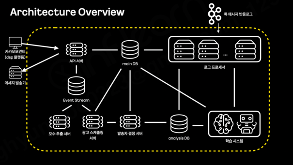
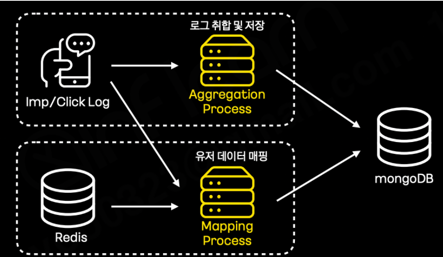
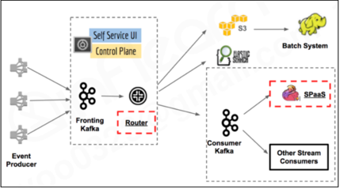
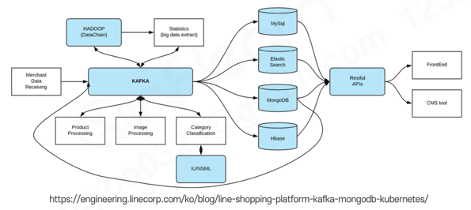

# Sec 11 카프카 활용 아키텍처 사례 분석 

---

- 여러 사례 별로 어떤 아키텍처로 카프카를 구성하였는지
  - 다른 회사에서는 어떤 문제를 해결하기 위해 어떤 아키텍처를 사용했는지를 알아야 나에게 주어진 문제에 대한 해결을 할 때 활용가능함

### [카카오 스마트 메시지 서비스](https://if.kakao.com/2021/session/22)
- 저자가 2011년 if-kakao에서 발표했던 내용
- 카프카 스트림즈를 활용해 메세지를 취합하고 데이터 처리를 진행해 유저 타게팅을 통해 유저 최적화된 광고메세지 전달 서비스의 개발 사례
- 당시의 아키텍처:   

- 통 메세지 반응로그를 통해 로그 프로세서(카프카 스트림즈)를 통해서 분석 DS에 저장하거나 메인 디비에 저장하는 등 저장하는 용도로 주로 사용함
- 그 다음 저장된 데이터를 기반으로 타게팅을 수행
- 카프카 스트림즈의 활용처:   

- 클릭 로그와 레디스에 있는 데이터를 기반으로 데이터 매핑을 하거나 로그 취합 및 저장을 수행했음
  - 데이터를 건건이 저장하는 방식과 취합하는 방식중 취합하는 방식을 취함
    - 건건이 저장할 때의 단점은 몽고DB에 너무 큰 쓰기 부하가 발생하게됨
    - 취합해서 저장할 경우의 장점은 안전한 저장에 유리하고, 많은양의 데이터라도 특정 시간 (5분/10분 등) 마다 윈도우 단위로 저장하여 디비로의 부하를 줄일 수 있었고, 디비 처리량을 높일 수 있었다

### 넷플릭스의 키스톰 프로젝트

- 2종류의 카프카를 사용하고 있음
  - 프론팅:
    - 유저의 인풋 정보 (클릭 등의 이벤트)를 적재하는 카프카 클러스터
  - 컨수머:
    - 라우터를 통해 전달받은 유저 정보를 받아서 필요한 처리를 담당하는 스트림 컨수머에 넘겨주는 역할
  - 라우터: 2개로 나누어진 카프카 클러스터를 이어주는 도구
- 왜 2개의 클러스터를 사용할까?
  - 리텐션 기간이나 기본 파티션 개수등의 설정이 필요에 따라 로직과 옵션이 달라져야 하는 경우에 나누어서 활용을 한다

### 라인 쇼핑 플랫폼

- 레거시에 비해 시스템 유연성을 개선하고 처리량 한계를 없애기 위해 카프카를 중앙에 둔 아키텍처
  - 365일 24시간 무중단으로 운영되는 이벤트 스트림 프로세싱을 달성하기 위해 이런 식으로 운영되었다고 함
- MongoDB Change Data Capture를 커넥터로 추가하여 활용함
  - 특정 데이터 (주문 데이터 등)에 의해서 데이터가 변환되면 해당 CDC 데이터를 기반으로 다시 카프카로 데이터를 재가공해서 가져온다 
  - 이를 통해서 여러 데이터 분석의 진행이 가능해짐
    - 이벤트 기반 데이터 처리로 상품 처리가 기존에 비해서 매우 빨라졌다 함

### 11번가 주문/결제 시스템 적용 사례
- 디비 병목을 해소하기 위해 도입함
  - 설날이나 블프등의 이벤트 기간동안 주문 결제가 많이 오게되면 데이터베이스가 한계에 도달해 버림
- 카프카를 단일 진실 공급원으로 정의하고 실질적인 결제나 주문 같은 데이터들을 카프카에 하나만 남기게해서 데이터를 처리할 때 중복해서 저장하고 분산돼서 파편화 되는 것을 막음
- 각각의 메세지를 마테리얼라이즈드 뷰로 구축해 배치 데이터처럼 활용했음

### 각 기술이 사용되는 지점:
1. 카프카 커넥트:
   - 라인의 사례에서 알 수 있듯이 반복적인 프로듀스/컨수머 어플리케이션을 개발해야할 경우에 활용
   - 주로 오픈소스 커넥터를 활용하는게 좋다
     - 없으면 어쩔수 없이 커스텀 개발을 해야함
   - REST API 통신이 가능하기에 화면을 사용하면 좋다
2. 카프카 스트림즈:
   - 특징: stateful / stateless 프로세싱 기능
   - 대용량 대규모로 처리하기에 굉장히 좋다
     - 취합하거나 카운트/윈도우 프로세싱등을 할 때 높은 성능을 가짐
   - 일반적인 데이터 프로세싱에서는 스트림즈를 우선 고려
   - 커넥트는 stateful 기능에 취약한데 스트림즈는 stateful / stateless 양쪽에 다 강점을 가짐
3. 컨수머 프로듀서
   - 커넥트/스트림즈로 구현할 수 없거나 단일성 파이프라인 개발일 경우에는 컨수머 프로듀서로 개발한다