# 카프카 생태계

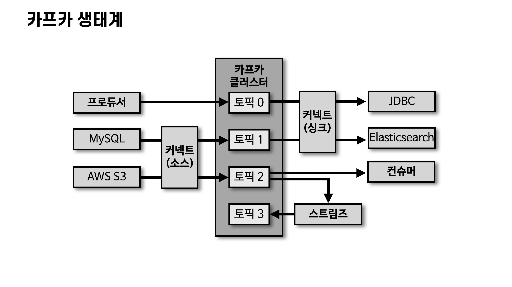

프로듀서/컨슈머, 커넥트(소스/싱크), 스트림즈가 카프카 클러스터의 토픽을 중심으로 데이터를 주고받는다.

# 카프카 브로커 · 클러스터 · 주키퍼

**브로커(Broker)는 카프카 클라이언트와 데이터를 주고받기 위해 사용하는 주체**이자, 데이터를 분산 저장하여 장애가 발생하더라도 안전하게 사용할 수 있도록 도와주는 애플리케이션이다.

- 하나의 서버에는 한 개의 카프카 브로커 프로세스가 실행된다.
- 브로커 1대로도 동작하지만, 데이터를 안전하게 보관하고 처리하기 위해 **3대 이상의 브로커를 1개의 클러스터로 묶어서 운영**한다.
- 클러스터로 묶인 브로커들은 프로듀서가 보낸 데이터를 안전하게 분산 저장하고 복제한다.

### 주키퍼(Zookeeper)

주키퍼는 카프카와 별개의 프로그램으로, **클러스터의 공유 정보를 대신 기록·감시해주는 관리대장** 역할을 한다. 브로커 여러 대가 한 팀으로 움직이려면 살아있는 브로커 목록, 파티션 리더 정보, 컨트롤러가 누구인지 등을 공유해야 하는데 이걸 주키퍼에 저장한다.

- **znode** : 주키퍼가 정보를 저장하는 단위. 파일시스템의 폴더(디렉토리)라고 생각하면 된다.
- 클러스터마다 서로 다른 znode(폴더)를 지정하면 정보가 섞이지 않으므로, **1개의 주키퍼에 여러 카프카 클러스터를 연결할 수 있다.**
    - root znode(`/`)에 직접 쓰지 않고, `/kafka-cluster-A` 처럼 클러스터별 znode를 만들어 실행 시 하위 znode로 설정

```
/                      ← root znode (직접 쓰지 않음)
├── /kafka-cluster-A   ← A 클러스터 전용
└── /kafka-cluster-B   ← B 클러스터 전용
```

- **카프카 3.0부터는 주키퍼 없이도 클러스터 동작이 가능**하다. (KRaft 모드)
    - 주키퍼가 하던 일(브로커 목록 관리, 컨트롤러 선출, 메타데이터 저장)을 카프카가 자체 내장 → 별도 프로그램을 운영할 부담이 사라짐

# 브로커의 역할

### 1. 컨트롤러(Controller)

클러스터의 다수 브로커 중 **한 대가 컨트롤러 역할**을 한다.

- 다른 브로커들의 상태를 체크하고, 브로커가 클러스터에서 빠지면 해당 브로커의 리더 파티션을 재분배한다.
- 컨트롤러 브로커에 장애가 생기면 다른 브로커가 컨트롤러 역할을 넘겨받는다.

### 2. 데이터 삭제

- 카프카는 컨슈머가 데이터를 가져가도 토픽의 데이터가 삭제되지 않는다.
- 컨슈머나 프로듀서가 삭제를 요청할 수도 없고, **오직 브로커만이 데이터를 삭제할 수 있다.**
- 삭제는 파일 단위로 이루어지며 이 단위를 **로그 세그먼트(log segment)**라고 부른다. → DB처럼 특정 데이터만 선별해서 삭제할 수 없다.

### 3. 컨슈머 오프셋 저장

- 컨슈머 그룹은 파티션의 어느 레코드까지 가져갔는지 확인하기 위해 오프셋을 커밋한다.
- 커밋한 오프셋은 `__consumer_offsets` 토픽에 저장되고, 이를 토대로 다음 레코드를 가져간다.

### 4. 그룹 코디네이터(Group Coordinator)

- 컨슈머 그룹의 상태를 체크하고 파티션을 컨슈머와 매칭되도록 분배한다.
- 컨슈머가 그룹에서 빠지면 매칭되지 않은 파티션을 정상 동작하는 컨슈머에게 할당한다.
- 이렇게 파티션을 컨슈머로 재할당하는 과정을 **리밸런스(rebalance)**라고 부른다.

### 5. 데이터 저장

- 카프카 실행 시 `config/server.properties`의 `log.dir` 옵션에 정의한 디렉토리에 데이터를 저장한다.
- 토픽 이름과 파티션 번호의 조합으로 하위 디렉토리를 생성한다. (예: `hello.kafka-0`)

| 파일 | 내용 |
| --- | --- |
| .log | 메시지와 메타데이터 |
| .index | 메시지의 오프셋을 인덱싱한 정보 |
| .timeindex | 메시지의 timestamp 기준으로 인덱싱한 정보 |

# 로그와 세그먼트

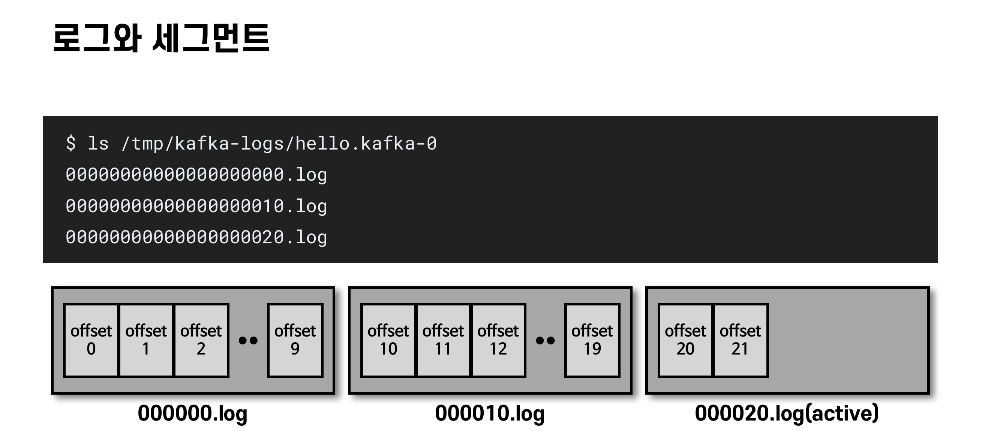

파티션의 데이터는 여러 개의 세그먼트 파일로 나뉘어 저장된다. 파일명은 해당 세그먼트의 시작 오프셋이다.

```
$ ls /tmp/kafka-logs/hello.kafka-0
00000000000000000000.log   # offset 0 ~ 9
00000000000000000010.log   # offset 10 ~ 19
00000000000000000020.log   # offset 20 ~ (active)
```

- `log.segment.bytes` : 최대 세그먼트 크기. 기본값 1GB
- `log.roll.ms(hours)` : 세그먼트 생성 후 다음 파일로 넘어가는 시간 주기. 기본값 7일

### 액티브 세그먼트(Active Segment)

- 가장 마지막 세그먼트(쓰기가 일어나고 있는 파일)를 액티브 세그먼트라고 부른다.
- **액티브 세그먼트는 삭제 대상에 포함되지 않고**, 나머지 세그먼트만 retention 옵션에 따라 삭제 대상이 된다.

### 세그먼트 삭제(cleanup.policy=delete)

- `retention.ms(minutes, hours)` : 세그먼트를 보유할 최대 기간. 기본값 7일
- `retention.bytes` : 파티션당 로그 적재 최대 바이트. 기본값 -1(무제한)
- `log.retention.check.interval.ms` : 삭제 대상 확인 간격. 기본값 5분

삭제는 세그먼트 단위로만 발생하므로 레코드 단위 개별 삭제는 불가능하다. 이미 적재된 레코드는 수정도 불가능하므로 **적재 전(프로듀서) 또는 사용 시(컨슈머) 데이터를 검증하는 것이 좋다.**

### 토픽 압축(cleanup.policy=compact)

zip 같은 압축(compression)이 아니라, **메시지 키 별로 오래된 레코드를 삭제하는 정책**이다. 세그먼트 단위 삭제와 다르게 일부 레코드만 삭제될 수 있다. (액티브 세그먼트는 압축 대상에서 제외)

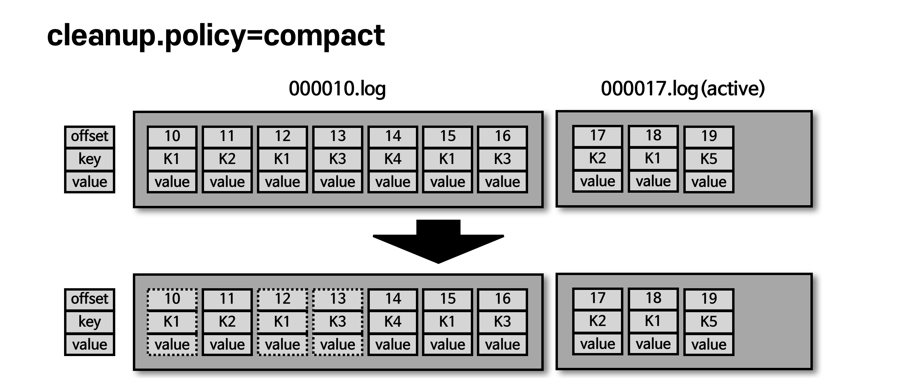

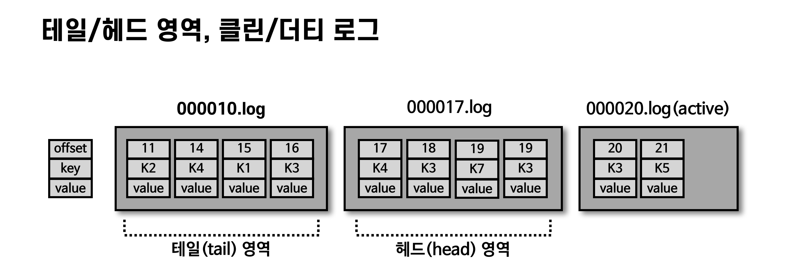

- **테일(tail) 영역** : 압축이 완료된 레코드들. 클린(clean) 로그. 중복 메시지 키가 없다.
- **헤드(head) 영역** : 압축되기 전 레코드들. 더티(dirty) 로그. 중복 메시지 키가 있다.
- `min.cleanable.dirty.ratio` : 압축 시작 시점을 결정하는 테일/헤드 레코드 개수 비율
    - 크게(0.9) 설정 → 한 번에 많이 압축되어 효율은 좋지만 그때까지 용량을 차지
    - 작게(0.1) 설정 → 최신 데이터만 유지되지만 압축이 자주 일어나 브로커에 부담

# 복제(Replication)와 ISR

**데이터 복제는 카프카를 장애 허용 시스템(fault tolerant system)으로 동작하게 하는 원동력**이다.

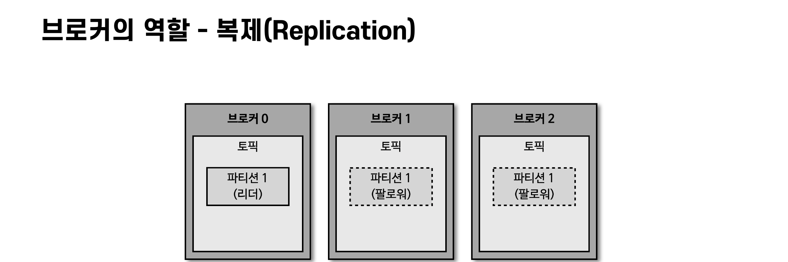

- 복제는 **파티션 단위**로 이루어지며, 토픽 생성 시 복제 개수(replication factor)를 설정한다. (최소 1 ~ 최대 브로커 개수)
- 프로듀서/컨슈머와 직접 통신하는 파티션을 **리더 파티션**, 복제 데이터를 가진 나머지를 **팔로워 파티션**이라고 부른다.
- 팔로워 파티션은 리더 파티션의 오프셋을 확인하여 차이가 나면 데이터를 가져와 저장한다. → 이 과정이 '복제'
- 복제 개수만큼 저장 용량이 증가하는 단점이 있지만, 안전성이 훨씬 중요하므로 **운영 시 2 이상의 복제 개수를 설정하는 것이 중요하다.** (금융 정보처럼 유실되면 안 되는 데이터는 3)

### 브로커에 장애가 발생한 경우

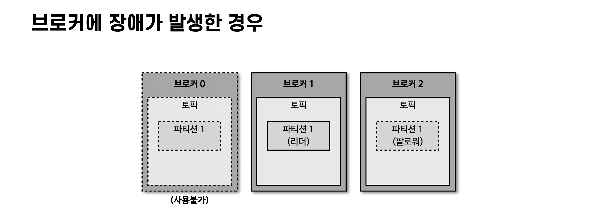

- 브로커가 다운되면 해당 브로커의 리더 파티션은 사용할 수 없으므로 **팔로워 파티션 중 하나가 리더 지위를 넘겨받는다.**
- 이를 통해 데이터 유실 없이 프로듀서/컨슈머와 데이터를 계속 주고받을 수 있다.

### ISR(In-Sync-Replicas)

**리더 파티션과 팔로워 파티션이 모두 싱크가 된 상태**를 뜻한다.

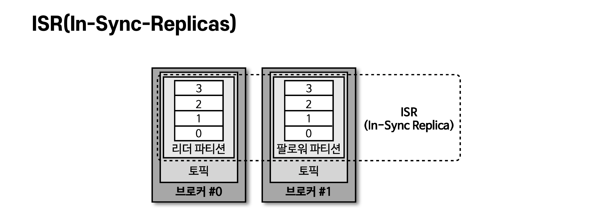

- 동기화 완료 = 리더 파티션의 모든 데이터가 팔로워 파티션에 복제된 상태

### unclean.leader.election.enable

싱크가 안 된 팔로워 파티션이 리더로 선출되면 데이터가 유실될 수 있다. 유실을 감수하고라도 서비스를 지속할지 선택하는 옵션이다.

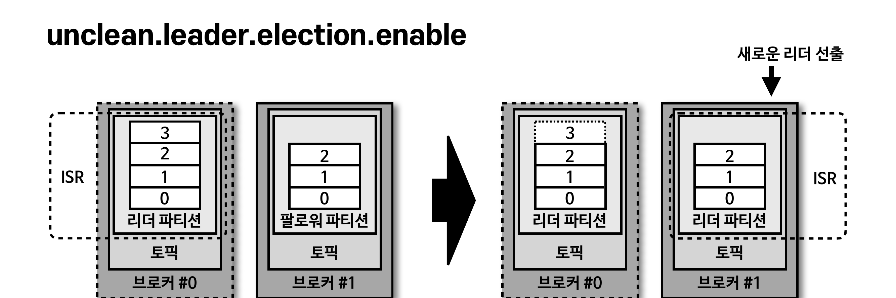

- `true` : 유실 감수. 복제 안 된 팔로워 파티션을 리더로 승급 (서비스 지속)
- `false` : 유실 감수하지 않음. 해당 브로커가 복구될 때까지 중단

# 토픽과 파티션

**토픽은 카프카에서 데이터를 구분하기 위해 사용하는 단위**이며, 1개 이상의 파티션을 소유한다. 파티션에 저장되는 프로듀서가 보낸 데이터를 **레코드(record)**라고 부른다.

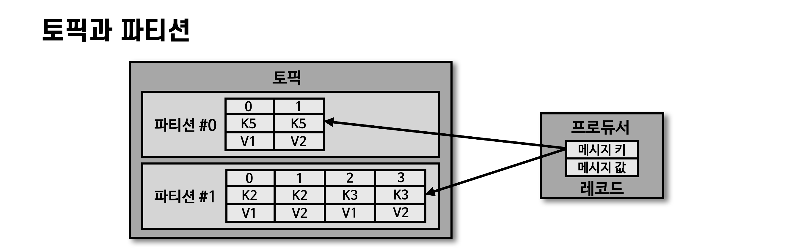

- 파티션은 큐(queue)와 비슷한 FIFO 구조로, 먼저 들어간 레코드를 컨슈머가 먼저 가져간다.
- 단, 일반적인 큐와 다르게 **pop 해도 레코드가 삭제되지 않는다.** → 여러 컨슈머 그룹이 같은 데이터를 여러 번 가져갈 수 있는 이유

### 파티션 배치와 쏠림

- 토픽 생성 시 리더 파티션은 0번 브로커부터 **round-robin 방식으로 분배**된다. 클라이언트는 리더 파티션과 통신하므로 여러 브로커에 통신이 분산된다. → hot spot 방지, 선형 확장(linear scale out)
- 특정 브로커에 파티션이 쏠린 경우 `kafka-reassign-partitions.sh` 명령으로 재분배할 수 있다.

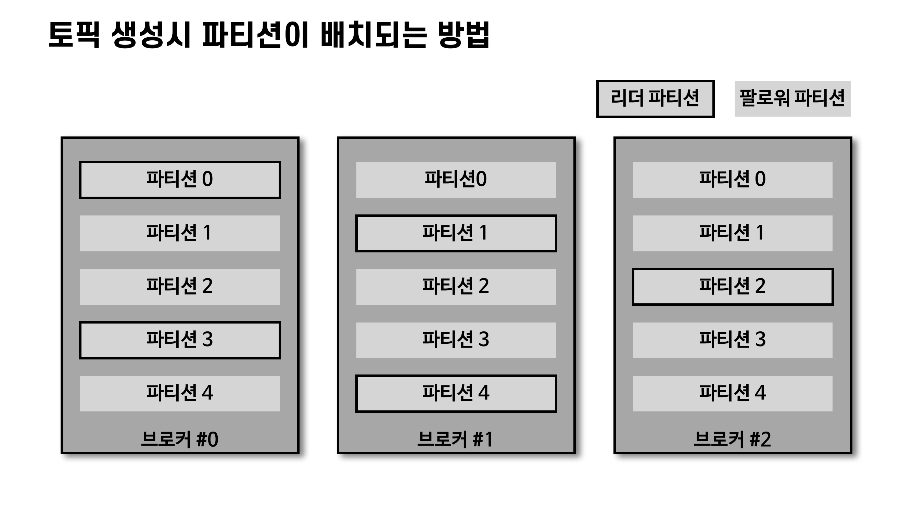

### 파티션 개수와 처리량

- 파티션은 카프카 병렬처리의 핵심으로, 그룹으로 묶인 컨슈머들이 레코드를 병렬로 처리할 수 있도록 매칭된다.
- 처리량을 늘리는 가장 좋은 방법 = **컨슈머 개수를 늘려 스케일 아웃** (파티션 개수도 함께 증가)

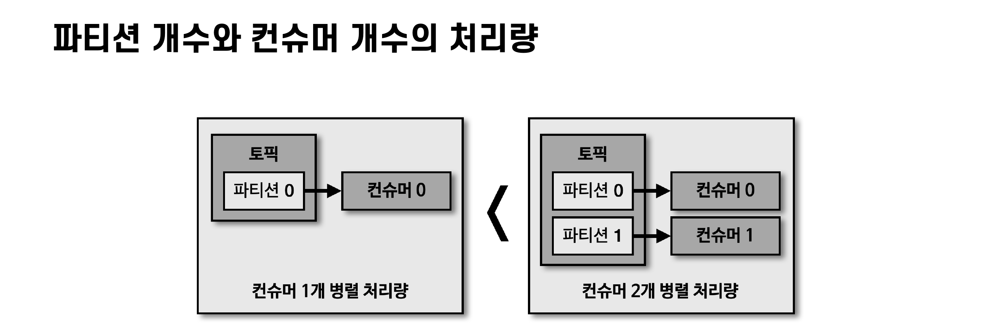

### 파티션 개수를 줄이는 것은 불가능

- 카프카는 파티션 개수 축소를 지원하지 않는다. 줄이려면 토픽을 삭제하고 재생성하는 방법뿐이다.
- **파티션을 늘릴 때는 신중하게 결정해야 한다.**

# 레코드(Record)

레코드는 **timestamp, offset, headers, key, value**로 구성된다. 브로커에 한번 적재된 레코드는 수정할 수 없고 로그 리텐션 기간 또는 용량에 따라서만 삭제된다.

| 구성 요소 | 설명 |
| --- | --- |
| timestamp | 스트림 프로세싱에서 활용하는 시간. 기본값은 ProducerRecord 생성 시간(CreateTime), 브로커 적재 시간(LogAppendTime)으로 설정 가능 |
| offset | 프로듀서가 생성한 레코드에는 없고 **브로커에 적재될 때 지정**된다. 0부터 1씩 증가하며 컨슈머가 처리 완료/미처리 데이터를 구분하는 기준 |
| headers | key/value 형태의 부가 정보(스키마 버전, 포맷 등). 0.11부터 제공 |
| key | 메시지 값을 분류하기 위한 용도(파티셔닝). 필수 값이 아니며 미지정 시 null → 라운드 로빈으로 분배, null이 아니면 해쉬값으로 특정 파티션에 매핑 |
| value | 실질적으로 처리할 데이터. 포맷은 사용자가 지정(String, Byte[] 등)하므로 **컨슈머는 역직렬화 포맷을 미리 알고 있어야 한다** |

# 유지보수하기 좋은 토픽 이름 정하기

### 토픽 이름 제약 조건

- 빈 문자열, 마침표 하나(.)/둘(..)은 불가
- 249자 미만, 영어 대소문자 + 숫자 + 마침표(.) + 언더바(_) + 하이픈(-) 조합만 가능
- 내부 토픽(`__consumer_offsets`, `__transaction_state`)과 동일한 이름 불가
- 마침표(.)와 언더바(_)가 동시에 들어가면 이슈가 발생할 수 있어 WARNING 발생

### 작명 규칙

토픽 이름은 데이터의 얼굴이다. `test`, `abcd` 같은 모호한 이름은 지양하고, **사전에 규칙을 정의하고 구성원들이 따르는 것이 중요하다.** 카프카는 토픽 이름 변경을 지원하지 않으므로 삭제 후 재생성하는 방법뿐이다.

```
<환경>.<팀-명>.<애플리케이션-명>.<메시지-타입>
예) prd.marketing-team.sms-platform.json

<프로젝트-명>.<서비스-명>.<환경>.<이벤트-명>
예) commerce.payment.prd.notification
```

# 카프카 브로커와 클라이언트가 통신하는 방법

### 클라이언트 메타데이터

카프카 클라이언트는 통신하고자 하는 **리더 파티션의 위치를 알기 위해 메타데이터를 브로커로부터 전달받는다.**

- `metadata.max.age.ms` : 메타데이터를 강제로 리프래시하는 간격. 기본값 5분
- `metadata.max.idle.ms` : 프로듀서가 유휴상태일 경우 메타데이터를 캐시에 유지하는 기간. 기본값 5분

### 메타데이터 이슈 (LEADER_NOT_AVAILABLE)

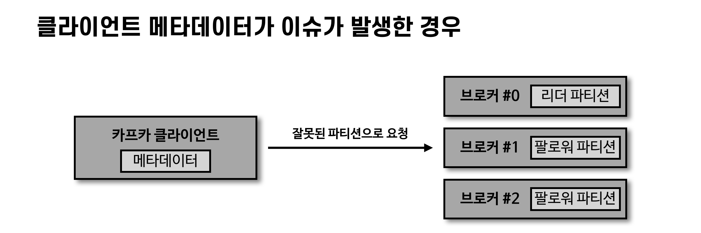

- 클라이언트는 반드시 리더 파티션과 통신해야 한다.
- 메타데이터가 리프래시되지 않은 상태에서 잘못된 브로커(리더 파티션이 없는)로 요청하면 **LEADER_NOT_AVAILABLE 익셉션**이 발생한다.
- 자주 발생한다면 메타데이터 리프래시 간격과 클라이언트의 메타데이터 상태를 확인해야 한다.

# 정리

- 카프카 클러스터는 브로커들의 묶음이며, 실행을 위해 주키퍼가 필수 (3.0부터는 제외 가능)
- 브로커는 복제, 컨트롤러, 데이터 삭제, 오프셋 저장, 코디네이터 역할을 수행
- 토픽은 1개 이상의 파티션으로 구성되며, 파티션은 FIFO 구조지만 컨슈머가 가져가도 삭제되지 않음
- 데이터 복제의 단위는 토픽이 아니라 **파티션**
- 컨슈머 처리량을 늘리기 위해 파티션 개수를 늘릴 수 있지만, 줄이는 것은 불가능
