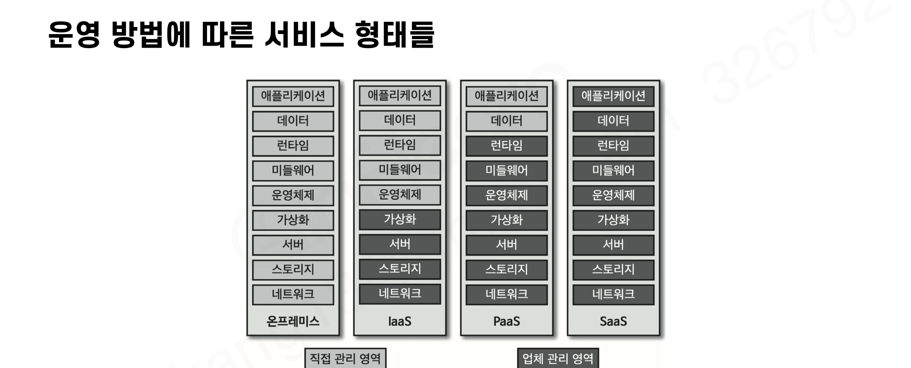

# 카프카 클러스터를 운영하는 방법

카프카 클러스터를 서버에 **직접 설치하고 운영하는 것**이 가장 전통적이고 기본적인 방법이다. 
각종 설정을 직접 컨트롤하여 최고의 성능으로 최적의 클러스터를 활용할 수 있지만, 그만큼 **노하우**가 필요해 수많은 시행착오를 거쳐야 한다. 이런 시행착오를 줄이면서 빠르게 설치하고 안전하게 운영하기 위해 **SaaS(Software-as-a-Service)** 를 도입할 수 있다.

## 운영 방법에 따른 서비스 형태

| 서비스 종류 | 특징 |
| --- | --- |
| 온프레미스(on-premise) | 자체 보유한 전산실 서버에 직접 설치해 운영. 하드웨어 커스터마이징 가능. 초기 도입/유지보수 비용 발생 |
| IaaS (Infrastructure-as-a-Service) | 물리/가상 컴퓨팅 리소스를 발급받아 사용. OS, 애플리케이션은 사용자가 직접 설정·배포·운영 |
| PaaS (Platform-as-a-Service) | 애플리케이션 개발/실행 환경을 제공. 컴퓨팅 리소스 관리를 신경 쓰지 않아도 됨 |
| SaaS (Software-as-a-Service) | 소프트웨어의 배포·실행을 업체에서 관리. 소프트웨어 관리를 위임하고 기능만 사용할 때 유용 |

### 서비스 형태별 카프카 운영 방법

- **온프레미스** : 물리장비 구매·네트워크 구성 → OS 설치 → 오픈소스 카프카(또는 컨플루언트 플랫폼 등 기업용 카프카) 설치·운영
- **IaaS** : AWS, GCP 등에서 컴퓨팅 리소스를 발급받아 오픈소스 카프카(또는 기업용 카프카) 설치·운영
- **SaaS** : 컨플루언트 클라우드, AWS MSK가 대표적. 다양한 주변 생태계(ksqlDB, 모니터링 도구 등)를 옵션으로 제공

# 오픈소스 카프카를 직접 설치하여 운영하는 경우

IaaS 또는 온프레미스 환경에 직접 설치하는 것이 가장 흔한 운영 방식이다. 카프카는 데이터를 모두 파일 시스템에 저장하고 대규모 데이터 통신이 일어나므로 **고성능 하드웨어**를 사용해야 한다.

### 컨플루언트 권장 브로커 하드웨어 (상용 환경)

- **메모리** : 32GB 머신에 **힙 메모리는 6GB만** 설정. 나머지는 **OS의 페이지 캐시 영역으로 활용**
    - 카프카는 자체 캐시 대신 OS 페이지 캐시에 올라타는 구조라, 힙을 크게 잡으면 오히려 페이지 캐시가 줄어 성능이 나빠진다
- **CPU** : 24core. SSL 같은 보안 설정을 사용하면 더 높은 사양 필요
- **디스크** : RAID 10으로 설정된 디스크 사용. **NAS는 사용하면 안 됨**
- **네트워크** : 데이터 통신량에 따라 다름
- **파일시스템** : XFS 또는 ext4

| 항목 | 개발용 클러스터 | 상용 환경 클러스터 |
| --- | --- | --- |
| 브로커 개수 | 5개 | 10개 |
| 메모리 | 16GB (heap 6GB) | 32GB (heap 6GB) |
| CPU | 16core | 24core |
| 디스크 | 사용량에 따라 다름 | 사용량에 따라 다름 |

> **개발용 클러스터의 브로커 개수를 왜 5개나 권장하지?**
> 
> 개발용 클러스터라도 브로커를 1대로 구성하면 복제나 장애 복구, 복제 지연(레플리케이션 랙) 같은 분산 환경에서만 발생하는 동작을 테스트할 수 없다. 
> 따라서 개발용도 **최소 3대 이상**을 권장하며, 5대 또는 그 이상으로 구성하면 더 폭넓은 테스트가 가능하다.

### 힙 메모리는 왜 6GB면 충분할까?

카프카 브로커는 독립적으로 실행되는 자바(JVM) 애플리케이션이지만, **힙에는 레코드(데이터)가 들어가지 않는다.** 힙은 요청 처리를 위한 작업 공간일 뿐이다.

- 힙의 용도 : 네트워크 요청/응답 버퍼, 토픽·파티션 메타데이터, 복제용 작업 버퍼 등 요청 하나를 처리하고 나면 버려지는 단명 객체들 → 트래픽이 많아도 힙 사용량은 일정 수준에서 순환 (대부분 young 영역에서 빨리 죽어 GC 비용도 저렴)
- 데이터의 경로 : 프로듀서가 보낸 레코드는 힙에 캐싱되지 않고 바로 세그먼트 파일로 쓰여 **OS 페이지 캐시**에 얹힌다. 컨슈머에게 보낼 때도 **zero-copy(sendfile)** 로 페이지 캐시 → 네트워크로 힙을 거치지 않고 전송된다
- 힙을 크게 잡으면 오히려 손해
  - 그만큼 페이지 캐시가 줄어 데이터 읽기/쓰기가 느려지고
  - GC 정지 시간이 길어져 브로커가 멈추면 클러스터가 불안정해질 수 있다

**MySQL과의 비교** - MySQL(InnoDB)은 정반대 전략을 쓴다. **버퍼 풀(buffer pool)** 이라는 자체 캐시를 프로세스 메모리에 직접 만들어 서버 메모리의 대부분을 할당하고, OS 페이지 캐시와의 이중 캐싱을 피하려고 페이지 캐시를 우회(O_DIRECT)하기도 한다.

| | 카프카 | MySQL(InnoDB) |
| --- | --- | --- |
| 캐시 전략 | 전부 OS에 위임 (페이지 캐시) | 자체 관리 (버퍼 풀) |
| 메모리 배분 | 힙은 6GB만, 나머지는 OS 몫 | 서버 메모리의 70~80%를 버퍼 풀에 할당 |
| 가능한 이유 | 순차 쓰기 + 최신 데이터 위주 소비라 OS 기본 캐시 정책으로도 적중률이 높음 | 랜덤 액세스가 많고 인덱스 페이지 우선순위 등 세밀한 제어가 필요 |

> **O_DIRECT란?** 리눅스에서 파일을 열 때(`open()`) 주는 옵션으로, "페이지 캐시를 거치지 말고 디스크와 직접 주고받아라"는 뜻이다. MySQL은 버퍼 풀이라는 자체 캐시가 이미 있으므로, 같은 데이터가 버퍼 풀과 페이지 캐시에 모두 올라가는 이중 캐싱 낭비를 막기 위해 사용한다. (`innodb_flush_method=O_DIRECT`)
>
> **주의 - 버퍼 풀도 메모리(RAM)에 있다.** O_DIRECT는 "OS 페이지 캐시"라는 경로를 우회할 뿐, 버퍼 풀 자체는 MySQL 프로세스가 확보한 RAM 공간이다. 따라서 버퍼 풀 히트 시에는 디스크에 가지 않고 메모리 속도로 동작하며, 미스일 때만 디스크에 접근한다(페이지 캐시와 동일한 구조). 즉 두 시스템의 차이는 캐시의 속도가 아니라 **캐시를 누가 관리하느냐(OS vs 자기 자신)** 이다.

# SaaS형 아파치 카프카

### 컨플루언트(Confluent)

카프카를 최초로 설계·개발한 **제이 크렙스(링크드인 데이터 인프라 아키텍트)와 동료들이 설립한 회사**이다. 스키마 레지스트리, ksqlDB 등을 오픈소스로 공개하며 카프카 생태계 발전에 선구적인 역할을 하고 있다.

| 컨플루언트 클라우드 | 컨플루언트 플랫폼 |
| --- | --- |
| 클라우드 기반 카프카 클러스터 (SaaS) | 온프레미스 기반 설치형 카프카 클러스터 |
| 요구사항에 따라 자동으로 늘려주는 리소스 제공 | 서버를 내부에서 발급하여 직접 설치 |
| GCP, AWS 등 설치 위치(리전 단위) 지정 가능 | 필요에 따라 컨플루언트 팀의 지원·학습 제공 |
| 120개 넘는 커넥터, ksqlDB, 스키마 레지스트리 제공 | 단계별 스토리지(Tiered-storage) 제공 |
| 99.95% SLA, 엔터프라이즈 보안, 데이터 적재 제한 없음 | GUI 기반 모니터링 시스템 제공 |

### AWS MSK (Managed Streaming for Apache Kafka)

AWS에서 제공하는 SaaS형 카프카 서비스이다.

- 클러스터 생성·업데이트·삭제 등 운영 요소를 대시보드로 제공, TLS 인증 보안 설정 가능
- **아파치 카프카 버전을 직접 선택**할 수 있어 기존 카프카 클라이언트와 버전 차이로 인한 연동 이슈 없이 사용 가능
- AWS에서 운영하는 애플리케이션과 쉽게 연동되므로 AWS 사용 기업은 아키텍처에 포함시키기 쉬움

# SaaS로 카프카 클러스터를 운영할 경우 장단점

### 장점

1. **인프라 관리의 효율화**
    - 브로커가 올라가는 서버가 자동으로 관리된다. 브로커에 이슈가 생기면 SaaS가 감지해서 신규 장비로 클러스터를 복구
    - 데이터 사용량이 급증해도 대시보드에서 브로커 개수만 설정하면 쉽게 스케일 아웃
2. **모니터링 대시보드 제공**
    - 직접 운영하면 어떤 지표를 수집할지 막막하고, 지표 저장소·대시보드용 추가 플랫폼도 설치·운영해야 함
    - SaaS는 운영에 필요한 지표를 수집해 그래프로 보여주는 옵션을 기본 제공
3. **보안 설정 기본 제공**
    - 보안 설정이 없는 클러스터는 호스트와 포트만 알면 모든 토픽 데이터를 가져갈 수 있고 어드민 API로 공격도 가능
    - 카프카는 SSL, SASL, ACL 등 다양한 보안 방안을 제공하지만 직접 고르고 설정·운영하기는 어려움 → SaaS는 클러스터 접속 시 보안 설정을 기본 제공

### 단점

1. **서비스 사용 비용**
    - 직접 설치하면 서버 사용 비용만 들지만, SaaS는 업체 지정 요금제를 사용해야 하며 현저히 비쌈
    - 예) AWS MSK 브로커 3대(kafka.m5.xlarge): 월 1,080달러 vs 동일 사양 EC2 직접 운영: 월 504달러 → **직접 운영이 2배 이상 저렴** (+ 스토리지·데이터 전송 요금 별도)
2. **커스터마이징의 제한**
    - 인프라부터 설치까지 자동화되어 업체의 아키텍처를 따라가므로 상세 설정이나 아키텍처 변경이 매우 어려움
    - **멀티 클라우드**(퍼블릭 클라우드 2개 이상)나 **하이브리드 클라우드**(사내 서버 + 퍼블릭 클라우드) 구성이 불가능
3. **클라우드의 종속성**
    - 클러스터를 운영하는 순간 프로듀서·컨슈머를 포함한 모든 애플리케이션이 해당 서비스에 종속됨
    - 더 저렴한 업체로 옮기거나 온프레미스로 이전해야 할 상황이 오면 문제가 매우 복잡해짐

### 그럼에도 SaaS형 카프카가 나은 경우

- **운영 노하우가 부족한 상태에서 빠르게 클러스터 인프라를 구축**해야 할 때 최고의 선택지
- 다만 SaaS도 결국 카프카이므로, 노하우가 없으면 세세한 운영에서 어려움을 겪을 수 있다. **카프카에 대한 이해를 충분히 가진 상태에서 사용하면 더 효과적**
- 도입 시 인력의 카프카 운영 이해도, 클러스터 구축 비용, 추후 운영상 이슈를 다각도로 검토해야 한다

# 정리

- 카프카는 직접 설치하거나 SaaS형으로 운영하는 방법이 있다
- 서비스 운영 형태는 온프레미스, IaaS, PaaS, SaaS가 있다
- 온프레미스 또는 IaaS에서 오픈소스 카프카를 설치하거나 기업용 설치형 카프카를 사용할 수 있다
- 대표적인 카프카 SaaS 서비스로 AWS MSK와 컨플루언트 클라우드가 있다
- SaaS 장점: 인프라 관리 효율화, 모니터링 대시보드, 기본 보안 설정
- SaaS 단점: 서비스 사용 비용, 커스터마이징 제한, 클라우드 종속성
