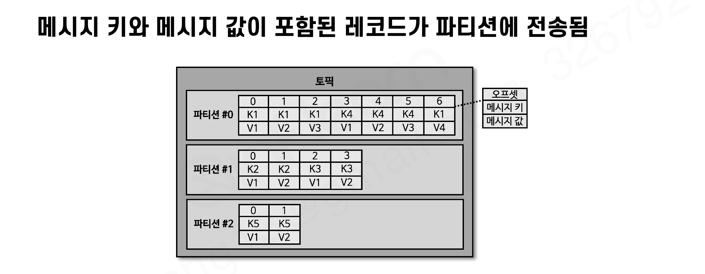
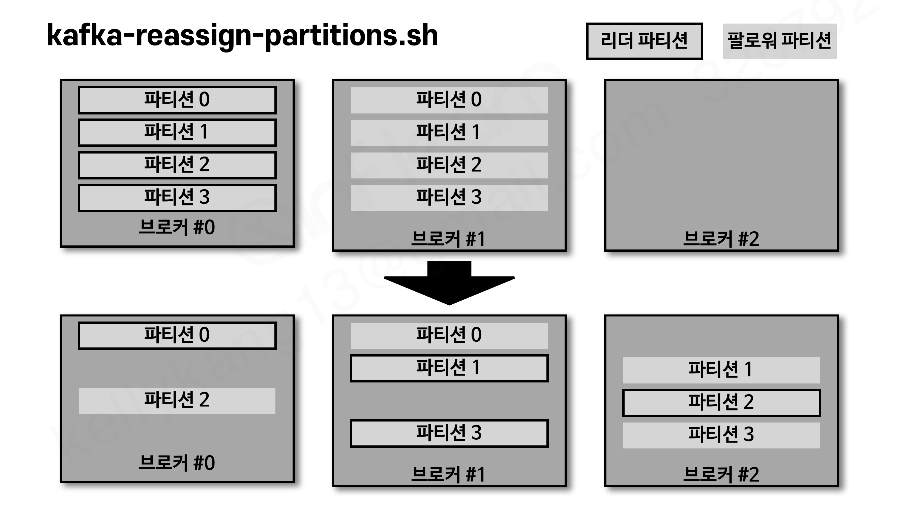

# 카프카 커맨드 라인 툴

카프카에서 제공하는 **커맨드 라인 툴(command-line tool)은 카프카를 운영할 때 가장 많이 접하는 도구**다. 토픽 생성이나 파티션 개수 변경 같은 명령을 실행해야 하는 경우가 자주 발생하므로, 각 툴과 툴별 옵션을 알고 있어야 한다.

- 커맨드 라인 툴에는 **필수 옵션과 선택 옵션**이 있다.
- 선택 옵션은 지정하지 않으면 **브로커에 설정된 기본값 또는 커맨드 라인 툴의 기본값**으로 대체된다. → 사용 전에 현재 브로커에 옵션이 어떻게 설정되어 있는지 확인하고 사용하면 실수할 확률이 줄어든다.

# 로컬 카프카 설치 및 실행

```bash
# 1) 카프카 바이너리 다운로드 & 압축 해제 (kafka_2.12-2.5.0.tgz)
#    https://kafka.apache.org/downloads

# 2) 데이터 디렉토리 생성 후 server.properties의 log.dirs 지정
$ mkdir data

# 3) 주키퍼 실행 (2.5.0은 주키퍼 필수)
$ bin/zookeeper-server-start.sh config/zookeeper.properties

# 4) 카프카 브로커 실행
$ bin/kafka-server-start.sh config/server.properties
# [KafkaServer id=0] started 로그가 보이면 정상 기동

# 5) 정상 실행 여부 확인
$ bin/kafka-broker-api-versions.sh --bootstrap-server localhost:9092
$ bin/kafka-topics.sh --bootstrap-server localhost:9092 --list
```

- 테스트 편의를 위해 `/etc/hosts`에 `127.0.0.1 my-kafka`를 등록해서 실습에 활용한다.

# kafka-topics.sh

### 토픽 생성 & 조회

```bash
# 클러스터 정보와 토픽 이름만으로 생성 (나머지는 브로커 기본값)
$ bin/kafka-topics.sh --create \
  --bootstrap-server my-kafka:9092 \
  --topic hello.kafka

# 상세 조회
$ bin/kafka-topics.sh --bootstrap-server my-kafka:9092 --topic hello.kafka --describe

# 파티션 개수, 복제 개수, 데이터 유지 기간을 지정하여 생성
$ bin/kafka-topics.sh --create \
  --bootstrap-server my-kafka:9092 \
  --partitions 10 \
  --replication-factor 1 \
  --topic hello.kafka2 \
  --config retention.ms=172800000

# 토픽 이름 목록 조회
$ bin/kafka-topics.sh --bootstrap-server my-kafka:9092 --list
```

### 파티션 개수 변경 (--alter)

```bash
$ bin/kafka-topics.sh --bootstrap-server my-kafka:9092 --topic test \
  --alter --partitions 4
```

- 파티션 개수는 **늘릴 수만 있고 줄일 수는 없다.** 줄이는 명령을 내리면 `InvalidPartitionsException`이 발생한다.
- 분산되어 저장된 데이터를 재분산하는 로직이 매우 복잡하기 때문에 카프카는 줄이는 로직을 제공하지 않는다. 줄여야 한다면 **토픽을 새로 만드는 편이 좋다.**

# kafka-configs.sh

```bash
# 토픽별 옵션 설정 (예: min.insync.replicas)
$ bin/kafka-configs.sh --bootstrap-server my-kafka:9092 \
  --alter \
  --add-config min.insync.replicas=2 \
  --topic test

# 브로커에 설정된 각종 기본값 조회
$ bin/kafka-configs.sh --bootstrap-server my-kafka:9092 \
  --broker 0 \
  --all \
  --describe
```

> **min.insync.replicas란?**
>
> **"쓰기를 성공으로 인정하기 위해 최소 몇 개의 레플리카에 데이터가 들어가 있어야 하는가"** 의 하한선이다. ISR 개수가 이 값 미만으로 떨어지면 프로듀서의 쓰기 요청이 거부된다(NotEnoughReplicas 에러).
>
> - 프로듀서의 `acks=all`은 "ISR의 팔로워까지 복제되면 성공"인데, 브로커 장애로 **ISR에 리더만 남으면 리더에만 써도 성공**이 되어버린다. 이 구멍을 막는 옵션이다.
> - 값을 높이면 유실 방지 우선(복제본이 부족하면 쓰기 중단), 낮추면 서비스 지속 우선 → `unclean.leader.election.enable`과 같은 **가용성 vs 내구성 트레이드오프**
> - 실무 정석 조합: **복제 개수 3 + min.insync.replicas=2 + acks=all** (브로커 1대가 죽어도 쓰기가 계속되면서 항상 최소 2곳에 데이터 보장)

# kafka-console-producer.sh

### 메시지 값만 전송

```bash
$ bin/kafka-console-producer.sh --bootstrap-server my-kafka:9092 \
  --topic hello.kafka
>hello
>kafka
```

- 키보드로 문자를 작성하고 엔터를 누르면 별다른 응답 없이 전송된다. (메시지 키는 null)

### 메시지 키 + 메시지 값 전송

```bash
$ bin/kafka-console-producer.sh --bootstrap-server my-kafka:9092 \
  --topic hello.kafka \
  --property "parse.key=true" \
  --property "key.separator=:"
>key1:no1
>key2:no2
```

- `key.separator`를 선언하지 않으면 기본 구분자는 **Tab(\t)** 이다.



- 메시지 키가 **null**이면 → 레코드 배치 단위로 **라운드 로빈** 전송
- 메시지 키가 **존재**하면 → 키의 **해시값으로 파티션 중 하나에 할당** → **동일한 키는 동일한 파티션으로** 전송된다

# kafka-console-consumer.sh

```bash
# 가장 처음 데이터부터 출력 (--from-beginning)
$ bin/kafka-console-consumer.sh --bootstrap-server my-kafka:9092 \
  --topic hello.kafka --from-beginning

# 메시지 키와 값을 함께 확인
$ bin/kafka-console-consumer.sh --bootstrap-server my-kafka:9092 \
  --topic hello.kafka \
  --property print.key=true \
  --property key.separator="-" \
  --from-beginning

# 최대 컨슘 메시지 개수 제한
$ bin/kafka-console-consumer.sh --bootstrap-server my-kafka:9092 \
  --topic hello.kafka \
  --from-beginning \
  --max-messages 1

# 특정 파티션만 컨슘
$ bin/kafka-console-consumer.sh --bootstrap-server my-kafka:9092 \
  --topic hello.kafka \
  --partition 2 \
  --from-beginning

# 컨슈머 그룹 기반으로 컨슘 (읽은 오프셋이 브로커에 커밋됨)
$ bin/kafka-console-consumer.sh --bootstrap-server my-kafka:9092 \
  --topic hello.kafka \
  --group hello-group \
  --from-beginning
```

- `--group` 옵션을 사용하면 **컨슈머 그룹** 기반으로 동작하며, **어느 레코드까지 읽었는지(오프셋 커밋) 데이터가 카프카 브로커에 저장**된다. (= `__consumer_offsets` 토픽)

# kafka-consumer-groups.sh

```bash
# 컨슈머 그룹 목록 조회 (그룹은 별도 생성 명령 없이 컨슈머 동작 시 지정하면 생성됨)
$ bin/kafka-consumer-groups.sh --bootstrap-server my-kafka:9092 --list

# 그룹 상태 상세 조회
$ bin/kafka-consumer-groups.sh --bootstrap-server my-kafka:9092 \
  --group hello-group --describe
GROUP        TOPIC        PARTITION  CURRENT-OFFSET  LOG-END-OFFSET  LAG ...
hello-group  hello.kafka  2          5               5               0
```

- `--describe`로 파티션 번호, 현재까지 가져간 오프셋(CURRENT-OFFSET), 파티션 마지막 레코드의 오프셋(LOG-END-OFFSET), **컨슈머 랙(LAG)**, 컨슈머 ID, 호스트를 알 수 있어 **컨슈머 상태를 조회할 때 유용**하다.

### 오프셋 리셋

```bash
$ bin/kafka-consumer-groups.sh --bootstrap-server my-kafka:9092 \
  --group hello-group \
  --topic hello.kafka \
  --reset-offsets --to-earliest --execute
```

| 리셋 옵션 | 의미 |
| --- | --- |
| --to-earliest | 가장 처음 오프셋(작은 번호)으로 리셋 |
| --to-latest | 가장 마지막 오프셋(큰 번호)으로 리셋 |
| --to-current | 현 시점 기준 오프셋으로 리셋 |
| --to-datetime {YYYY-MM-DDTHH:mmSS.sss} | 특정 일시로 리셋 (레코드 타임스탬프 기준) |
| --to-offset {long} | 특정 오프셋으로 리셋 |
| --shift-by {+/- long} | 현재 오프셋에서 앞뒤로 옮겨서 리셋 |

# 그 외 커맨드 라인 툴

### kafka-producer-perf-test.sh / kafka-consumer-perf-test.sh

- 프로듀서/컨슈머로 **퍼포먼스를 측정**할 때 사용 (records/sec, 평균/최대 지연 시간 등)
- consumer-perf-test는 브로커와 컨슈머 간의 **네트워크를 체크**할 때도 활용할 수 있다

### kafka-reassign-partitions.sh



- **리더 파티션과 팔로워 파티션의 위치를 변경**할 수 있다. 특정 브로커에 리더 파티션이 쏠린 경우 사용
- 브로커에는 `auto.leader.rebalance.enable` 옵션(기본값 true)이 있어, 백그라운드 스레드가 일정 간격으로 리더 위치를 파악하고 필요시 **리더 리밸런싱**을 자동 수행한다

### kafka-delete-records.sh

- 특정 오프셋 이전의 레코드를 삭제한다.`"offset": 5`로 실행하면 오프셋 0~4가 삭제되고 low_watermark가 5가 된다.

> **주의 - 레코드를 개별로 물리 삭제하는 게 아니라 "논리적 삭제"다**
>
> 섹션3에서 "삭제는 세그먼트(파일) 단위로만 가능하다"고 배웠는데, 이 명령은 그 원칙과 모순되지 않는다. 실제로는 파일을 건드리지 않고 **log start offset(low watermark) 포인터만 옮기는 것**이기 때문이다.
>
> - **log start offset** : 파티션에서 현재 읽을 수 있는 가장 작은 오프셋(파티션의 논리적 시작점). 리텐션에 의해 세그먼트가 삭제되거나, 이 명령으로 수동으로 옮길 때만 커진다.
> - 포인터가 옮겨지면 그 이전 오프셋은 **즉시 조회 불가**(논리적 삭제)가 되지만, 세그먼트 파일 안에는 그대로 남아있다.
> - **물리 삭제는 여전히 세그먼트 통째로만** 일어난다. 브로커의 백그라운드 스레드가 ① 리텐션 시간/용량 초과 또는 ② **세그먼트 전체가 log start offset 아래로 내려간 경우**에 파일 단위로 삭제한다. 즉 이 명령으로 완전히 가려진 세그먼트는 리텐션 기간이 안 지나도 조기 삭제된다.
> - **컨슈머가 다 읽었는지와는 무관하다.** 카프카는 "모든 그룹이 읽었으니 삭제"라는 판단을 절대 하지 않는다(소비 후 삭제는 RabbitMQ 방식). 이 명령은 **관리자가 "여기까지는 버려도 된다"고 명시적으로 선언하는 수동 삭제 도구**이며, 아직 안 읽은 구간을 지우면 그 데이터는 컨슘하지 못하고 사라지므로 신중하게 사용해야 한다.

### kafka-dump-log.sh

- 세그먼트 파일(.log)의 내용을 덤프해서 확인할 수 있다 (오프셋, 타임스탬프, 배치 정보 등) — 섹션3에서 배운 로그와 세그먼트를 직접 눈으로 확인해볼 수 있는 도구

# 토픽을 생성하는 두 가지 방법

1. 컨슈머 또는 프로듀서가 **생성되지 않은 토픽에 데이터를 요청**할 때 자동 생성
2. 커맨드 라인 툴로 **명시적으로 생성**

**토픽을 효과적으로 유지보수하기 위해서는 명시적으로 생성하는 것을 추천**한다. 토픽마다 처리해야 하는 데이터 특성이 다르기 때문이다. (동시 처리량이 많아야 하면 파티션 100개, 단기간 처리만 필요하면 보관기간을 짧게 등)

# 카프카 브로커와 CLI 버전을 맞춰야 하는 이유

- 브로커 버전이 업그레이드됨에 따라 **커맨드 라인 툴의 상세 옵션이 달라지기 때문에** 버전 차이로 명령이 정상 실행되지 않을 수 있다.
- **브로커 버전과 커맨드 라인 툴 버전을 반드시 맞춰서** 사용하는 것을 권장한다. (실습은 카프카 2.5.0 기준)

# 정리

- 카프카를 실행하려면 바이너리 파일을 다운로드 받아야 한다
- 카프카 브로커와 커맨드 라인 툴 버전을 맞춰 실행해야 한다
- `kafka-topics.sh` : 토픽 생성, 수정, 삭제
- `kafka-console-producer.sh` : 토픽에 데이터 전송
- `kafka-console-consumer.sh` : 토픽의 데이터 확인
- `kafka-consumer-groups.sh` : 컨슈머 그룹 조회, 수정(오프셋 리셋)
