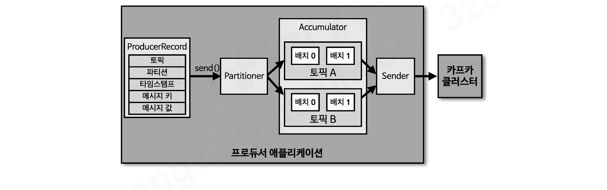
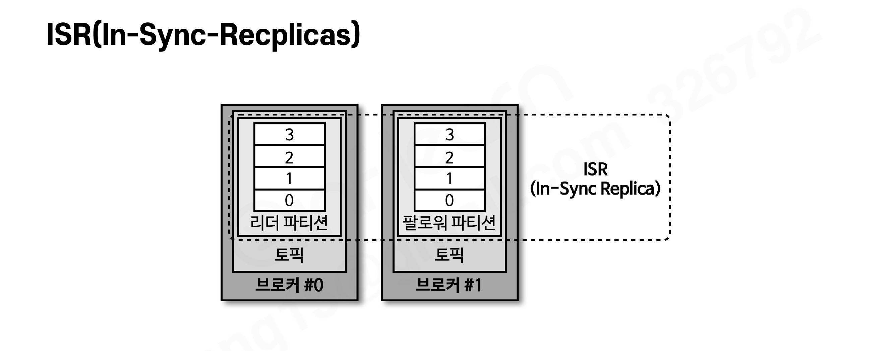
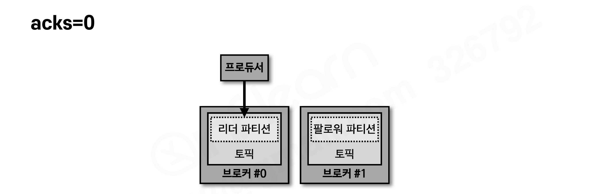
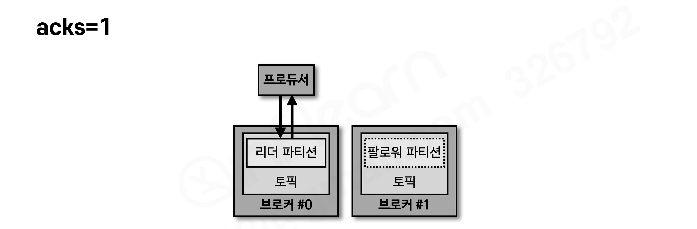
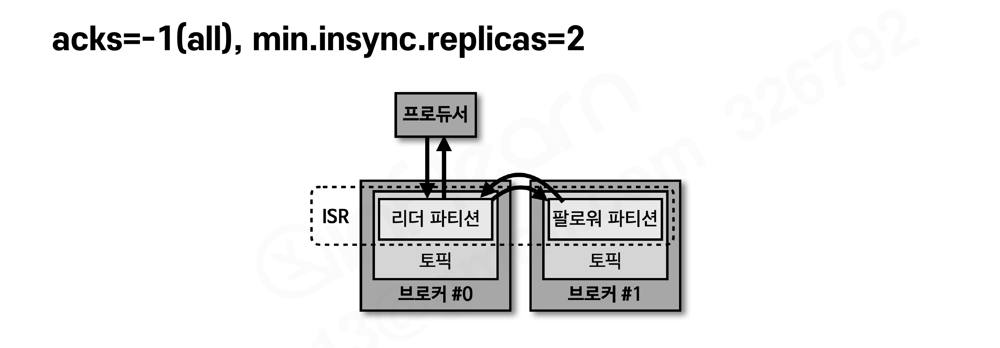

# 프로듀서 소개

**카프카에서 데이터의 시작점은 프로듀서**다. 프로듀서 애플리케이션은 카프카에 필요한 데이터를 선언하고 브로커의 특정 토픽의 파티션에 전송한다.

- 프로듀서는 데이터를 전송할 때 **리더 파티션을 가지고 있는 브로커와 직접 통신**한다.
- 브로커로 데이터를 전송할 때 내부적으로 **파티셔너, 배치 생성 단계**를 거친다.

# 프로듀서 내부 구조



| 구성 요소 | 역할 |
| --- | --- |
| ProducerRecord | 프로듀서에서 생성하는 레코드. **오프셋은 미포함** (오프셋은 브로커 적재 시 지정) |
| send() | 레코드 전송 요청 메서드 |
| Partitioner | 어느 파티션으로 전송할지 지정. 기본값 DefaultPartitioner |
| Accumulator | **배치로 묶어 전송할 데이터를 모으는 버퍼** |
| Sender | 어큐뮬레이터에 쌓인 배치 데이터를 가져가 카프카 브로커로 전송하는 스레드 |

- `send()`를 호출해도 즉시 전송되는 게 아니라, 파티셔너가 파티션을 정하고 → 어큐뮬레이터에 배치로 쌓였다가 → 센더 스레드가 브로커로 보내는 구조다. (배치 전송으로 처리량을 높이는 카프카 설계의 핵심)

# 프로듀서의 파티셔너

## 기본 파티셔너

프로듀서 API는 `UniformStickyPartitioner`와 `RoundRobinPartitioner` 2개를 제공한다. **카프카 클라이언트 라이브러리 2.5.0에서 파티셔너를 지정하지 않으면 UniformStickyPartitioner가 기본 설정**된다.

### 메시지 키가 있을 경우 (둘 다 동일하게 동작)

- 메시지 키의 **해시값과 파티션을 매칭**하여 레코드 전송
- **동일한 메시지 키는 동일한 파티션 번호로** 전달됨
- 만약 **파티션 개수가 변경될 경우 메시지 키와 파티션 번호 매칭은 깨지게 됨** → 파티션을 늘릴 때 신중해야 하는 이유

### 메시지 키가 없을 경우 (여기서 둘이 갈림)

| RoundRobinPartitioner | UniformStickyPartitioner |
| --- | --- |
| ProducerRecord가 들어오는 대로 파티션을 순회하며 전송 | 어큐뮤레이터에서 레코드들이 **배치로 묶일 때까지 기다렸다가** 전송 |
| 어큐뮤레이터에서 묶이는 정도가 적어 전송 성능이 낮음 | 배치로 묶일 뿐 결국 파티션을 순회하며 보내므로 모든 파티션에 분배됨 |
| | RoundRobinPartitioner의 단점을 개선 → **향상된 성능** |

## 커스텀 파티셔너

특정 데이터를 특정 파티션으로 보내야 할 때 **Partitioner 인터페이스**를 구현한 사용자 정의 파티셔너를 만들 수 있다.

```java
public class CustomPartitioner implements Partitioner {

    @Override
    public int partition(String topic, Object key, byte[] keyBytes,
                         Object value, byte[] valueBytes, Cluster cluster) {
        if (keyBytes == null) {
            throw new InvalidRecordException("Need message key");
        }
        if (((String)key).equals("Pangyo"))
            return 0;   // Pangyo 키는 무조건 0번 파티션으로

        List<PartitionInfo> partitions = cluster.partitionsForTopic(topic);
        int numPartitions = partitions.size();
        return Utils.toPositive(Utils.murmur2(keyBytes)) % numPartitions;
    }
    ...
}
```

```java
configs.put(ProducerConfig.PARTITIONER_CLASS_CONFIG, CustomPartitioner.class);
```

- 기본 파티셔너는 해시값 매칭이라 어느 파티션에 들어가는지 알 수 없지만, 커스텀 파티셔너를 쓰면 **파티션 개수가 변경되더라도** 특정 키(Pangyo)의 데이터는 항상 지정 파티션(0번)에 적재된다.

# 프로듀서 주요 옵션

> 아래 옵션과 기본값은 **카프카 클라이언트 2.5.0 기준**이다. 버전에 따라 기본값이 달라진 옵션들이 있으므로(예: enable.idempotence는 3.0부터 기본값 true) 사용하는 버전의 공식 문서를 확인하자.

### 필수 옵션

- `bootstrap.servers` : 전송 대상 카프카 클러스터 브로커의 호스트:포트 1개 이상. **2개 이상 입력하면 일부 브로커에 이슈가 생겨도 접속에 문제가 없다**
- `key.serializer` : 메시지 키를 직렬화하는 클래스
- `value.serializer` : 메시지 값을 직렬화하는 클래스

### 선택 옵션 (기본값이 있는 옵션)

| 옵션 | 설명 | 기본값 |
| --- | --- | --- |
| acks | 전송한 데이터가 브로커에 정상 저장되었는지 확인 (0, 1, -1(all)) | 1 |
| linger.ms | 배치를 전송하기 전까지 기다리는 최소 시간 | 0 |
| retries | 브로커로부터 에러를 받은 뒤 재전송 시도 횟수 | 2147483647 |
| max.in.flight.requests.per.connection | 한 번에 요청하는 최대 커넥션 개수(동시 전달 요청 수) | 5 |
| partitioner.class | 파티셔너 클래스 지정 | DefaultPartitioner |
| enable.idempotence | 멱등성 프로듀서로 동작할지 여부 | false |
| transactional.id | 레코드를 트랜잭션 단위로 묶을지 여부 | null |

- `transactional.id`에 값을 설정하면 **enable.idempotence는 자동으로 true로 동작**한다. 트랜잭션 프로듀서는 멱등성 프로듀서를 기반으로 동작하기 때문이다. (자세한 내용은 섹션8에서)

# ISR과 acks 옵션

### ISR(In-Sync-Replicas) 복습



- ISR은 **리더 파티션과 팔로워 파티션이 모두 싱크가 된 상태**. 리더의 모든 데이터가 팔로워에 복제되어야 동기화 완료다.
- ISR이라는 용어가 나온 이유: 팔로워가 리더의 데이터를 복제하는 데에 **시간이 걸리기 때문**. 복제 시간차 때문에 리더와 팔로워 간 오프셋 차이가 발생하고, 이를 상태로 구분하기 위함이다.

### acks별 동작 (복제 개수 2 이상 기준)

프로듀서가 보낸 데이터가 **얼마나 신뢰성 높게 저장될지**를 지정한다. 신뢰도와 성능은 트레이드오프.

**acks=0** — 확인 안 함



- 리더 파티션에 데이터가 저장되었는지 **응답을 받지 않는다** (몇 번째 오프셋에 저장됐는지도 모름)
- 전송 속도는 가장 빠름. **일부 유실이 발생해도 전송 속도가 중요한 경우** 사용
    - 예) GPS(네비게이션) 데이터: 위치 데이터가 몇 건 유실되더라도 이슈가 없고, 전체 데이터를 빠르게 처리하는 것이 더 중요한 경우

**acks=1** — 리더만 확인 (기본값)



- 보낸 데이터가 **리더 파티션에만** 정상 적재되었는지 확인 (적재 실패 시 재시도 가능)
- 그러나 리더 적재를 보장해도 유실될 수 있다: **팔로워가 복제하기 직전에 리더 브로커에 장애가 발생**하면 동기화되지 못한 데이터가 유실됨

**acks=-1(all)** — 리더 + 팔로워 확인


- 리더와 팔로워 파티션에 **모두 정상 적재되었는지 확인**하므로 0, 1보다 느리다
- 대신 일부 브로커에 장애가 발생해도 안전하게 데이터 전송·저장을 보장
- acks=all의 실질 신뢰도는 **토픽 단위로 설정하는 `min.insync.replicas` 값에 따라 달라진다**

### acks=all과 min.insync.replicas

- `min.insync.replicas=1`이면 ISR 중 1개만 적재 확인 → **ISR에서 가장 먼저 적재가 완료되는 파티션은 리더**이므로 사실상 acks=1과 동일한 동작
- **`min.insync.replicas=2`부터 acks=all의 의미가 있다.** 최소한 리더 + 팔로워 1개에 적재 완료를 보장하기 때문



- 실제 클러스터 운영 시 브로커 2개가 동시에 중단되는 일은 극히 드물기 때문에, 리더와 팔로워 중 1개에 적재 완료되었다면 데이터는 유실되지 않는다고 볼 수 있다.

# 프로듀서 애플리케이션 개발하기

아파치 카프카는 공식 라이브러리로 **자바 라이브러리**를 지원한다. IntelliJ에서 Gradle 프로젝트를 만들고 `build.gradle`에 의존성을 추가한다.

```groovy
dependencies {
    compile 'org.apache.kafka:kafka-clients:2.5.0'  // 브로커와 동일 버전
    compile 'org.slf4j:slf4j-simple:1.7.30'
}
```

### 기본 프로듀서 (SimpleProducer)

```java
public class SimpleProducer {
    private final static String TOPIC_NAME = "test";
    private final static String BOOTSTRAP_SERVERS = "my-kafka:9092";

    public static void main(String[] args) {
        Properties configs = new Properties();
        configs.put(ProducerConfig.BOOTSTRAP_SERVERS_CONFIG, BOOTSTRAP_SERVERS);
        configs.put(ProducerConfig.KEY_SERIALIZER_CLASS_CONFIG, StringSerializer.class.getName());
        configs.put(ProducerConfig.VALUE_SERIALIZER_CLASS_CONFIG, StringSerializer.class.getName());

        KafkaProducer<String, String> producer = new KafkaProducer<>(configs);

        String messageValue = "testMessage";
        ProducerRecord<String, String> record = new ProducerRecord<>(TOPIC_NAME, messageValue);
        producer.send(record);

        producer.flush();
        producer.close();
    }
}
```

### 메시지 키를 가진 레코드 전송

토픽 이름, 메시지 키, 메시지 값 순서로 파라미터를 넣어 생성한다.

```java
ProducerRecord<String, String> record = new ProducerRecord<>(TOPIC_NAME, "Pangyo", "Pangyo");
producer.send(record);
```

### 파티션 번호를 직접 지정한 레코드 전송

토픽 이름, 파티션 번호, 메시지 키, 메시지 값 순서. 파티션 번호는 토픽에 존재하는 번호여야 한다.

```java
int partitionNo = 0;
ProducerRecord<String, String> record =
        new ProducerRecord<>(TOPIC_NAME, partitionNo, "Pangyo", "Pangyo");
producer.send(record);
```

### 레코드 전송 결과를 동기적으로 확인

`send()`는 **Future 객체를 반환**한다. `get()`을 호출하면 브로커 적재 결과(RecordMetadata)를 동기적으로 받을 수 있다.

```java
RecordMetadata metadata = producer.send(record).get();
logger.info(metadata.toString());   // 예: test-2@1 → test 토픽 2번 파티션, 오프셋 1
```

### 프로듀서의 안전한 종료

```java
producer.close();
```

- `close()`를 호출해 **어큐뮤레이터에 저장되어 있는 모든 데이터를 카프카 클러스터로 전송**한 후 종료해야 한다. (배치로 쌓여있던 미전송 데이터가 유실되지 않도록)

# 정리

- 프로듀서는 데이터를 카프카 클러스터로 보낸다
- 데이터는 **파티셔너 → 어큐뮤레이터 → 센더**를 지나 카프카 클러스터로 보내진다
- 기본 파티셔너는 UniformStickyPartitioner(2.5.0 기본)와 RoundRobinPartitioner가 있다
- 메시지 키가 있을 경우 두 파티셔너의 동작은 동일하다 (키 해시 매칭)
- UniformStickyPartitioner는 RoundRobinPartitioner를 개선한 파티셔너다 (배치 단위 전송)
- ISR은 리더와 팔로워 파티션의 레코드가 모두 동일한 개수로 동기화 완료된 묶음을 뜻한다
- acks는 0, 1, all(-1)로 설정할 수 있으며 데이터 저장 신뢰도를 정할 때 사용된다
- **min.insync.replicas는 acks가 all(-1)일 때 유효한 설정이다**
