# 컨슈머 소개

프로듀서가 전송한 데이터는 브로커에 적재되고, **컨슈머는 적재된 데이터를 사용하기 위해 브로커로부터 데이터를 가져와서 필요한 처리**를 한다.

# 컨슈머 그룹

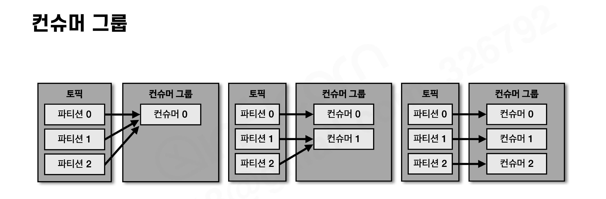

- 컨슈머 그룹으로 묶인 컨슈머들은 토픽의 1개 이상 파티션들에 할당되어 데이터를 가져갈 수 있다.
- **1개의 컨슈머는 여러 개의 파티션에 할당될 수 있지만, 1개의 파티션은 그룹 내 최대 1개의 컨슈머에만 할당**된다.
- 그러므로 컨슈머 그룹의 컨슈머 개수는 **파티션 개수보다 같거나 작아야** 최대의 효율을 낸다.

### 컨슈머가 파티션 개수보다 많을 경우

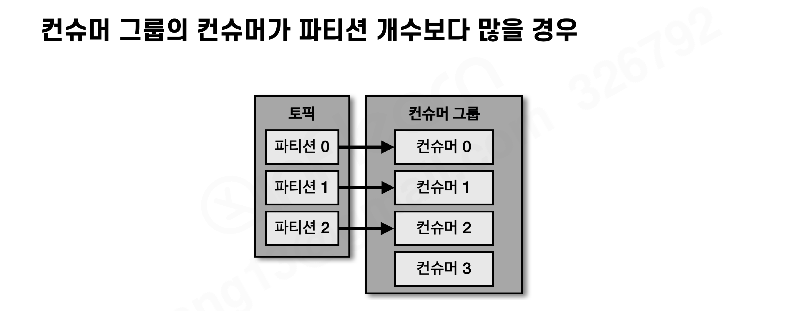

- 파티션을 할당받지 못한 컨슈머는 **유휴 상태**로 남는다. 스레드만 차지하고 실질적인 데이터 처리를 못 하므로 **불필요한 컨슈머를 늘려서 배포할 필요가 없다.**

### 컨슈머 그룹을 활용하는 이유

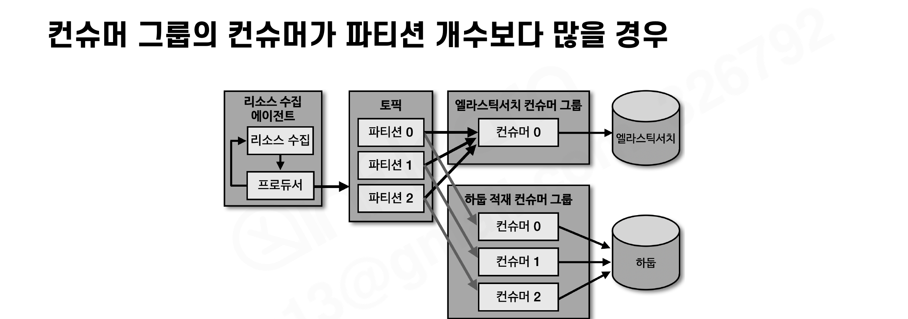

- 예) 서버 리소스(CPU, 메모리)를 수집하는 에이전트가 데이터를 토픽에 전송하고, **엘라스틱서치 적재 컨슈머 그룹**과 **하둡 적재 컨슈머 그룹**이 각각 토픽을 구독
- **서로 다른 컨슈머 그룹은 서로의 데이터 처리에 영향을 미치지 않는다.** 엘라스틱서치 장애로 해당 그룹이 중단돼도 하둡 적재는 계속된다 (동기적으로 강결합된 파이프라인과의 차이)

# 리밸런싱(Rebalancing)

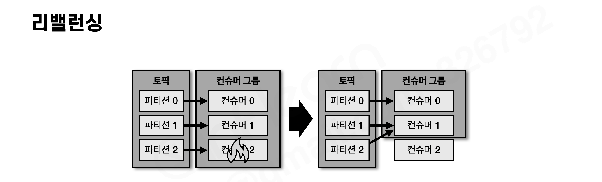

**컨슈머 그룹의 컨슈머 중 일부에 장애가 발생하거나, 컨슈머가 추가/제거되면 파티션을 컨슈머에 재할당하는 과정**이 일어난다. 이를 리밸런싱이라고 부른다.

- 리밸런싱은 언제든 발생할 수 있으므로 **대응하는 코드(리밸런스 리스너)를 작성해야 한다**
- 리밸런싱이 일어나는 동안 그룹의 컨슈머들은 데이터를 읽을 수 없으므로(일시 중단) **자주 일어나지 않도록 운영**해야 한다

# 커밋(Commit)

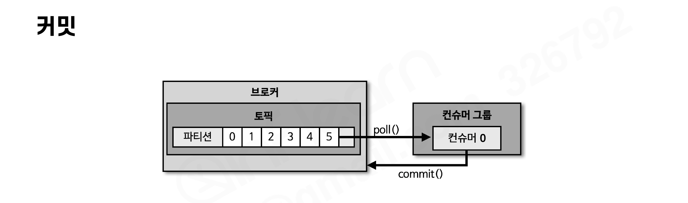

- 컨슈머는 브로커로부터 데이터를 어디까지 가져갔는지 **커밋을 통해 기록**한다.
- 커밋한 오프셋은 브로커의 내부 토픽 **`__consumer_offsets`**에 저장된다.
- 오프셋 커밋이 기록되지 못하면 데이터 처리의 **중복이 발생**할 수 있다. → 컨슈머 애플리케이션은 오프셋 커밋을 정상 처리했는지 검증해야 한다.

# 어사이너(Assignor)

컨슈머와 파티션 할당 정책은 어사이너로 결정된다.

| 어사이너 | 동작 |
| --- | --- |
| RangeAssignor (2.5.0 기본값) | 각 토픽에서 파티션을 숫자로 정렬, 컨슈머를 사전 순서로 정렬하여 할당 |
| RoundRobinAssignor | 모든 파티션을 컨슈머에 번갈아가며 할당 |
| StickyAssignor | 최대한 파티션을 균등하게 배분하면서 할당 |

# 컨슈머 주요 옵션

> 아래 옵션과 기본값은 **카프카 클라이언트 2.5.0 기준**이다.

### 필수 옵션

- `bootstrap.servers` : 연결할 카프카 클러스터 브로커의 호스트:포트
- `key.deserializer` / `value.deserializer` : 메시지 키/값을 **역직렬화**하는 클래스 (프로듀서가 직렬화한 포맷과 맞춰야 한다)

### 선택 옵션 (기본값이 있는 옵션)

| 옵션 | 설명 | 기본값 |
| --- | --- | --- |
| group.id | 컨슈머 그룹 id. `subscribe()`로 토픽을 구독할 경우 필수 | null |
| auto.offset.reset | 저장된 컨슈머 오프셋이 없을 때 어느 오프셋부터 읽을지 | latest |
| enable.auto.commit | 자동 커밋 / 수동 커밋 여부 | true |
| auto.commit.interval.ms | 자동 커밋일 경우 커밋 간격 | 5000 (5초) |
| max.poll.records | poll() 호출로 반환되는 레코드의 최대 개수 | 500 |
| session.timeout.ms | 컨슈머가 브로커와 연결이 끊기는 최대 시간 (이 시간 내에 하트비트가 없으면 리밸런싱 시작) | 10000 (10초) |
| heartbeat.interval.ms | 하트비트를 전송하는 시간 간격 | 3000 (3초) |
| max.poll.interval.ms | poll() 호출 간격의 최대 시간 (초과 시 비정상으로 판단, 리밸런싱 시작) | 300000 (5분) |
| isolation.level | 트랜잭션 프로듀서의 레코드를 읽는 수준 (read_committed / read_uncommitted) | read_uncommitted |

### auto.offset.reset

컨슈머 그룹이 특정 파티션을 읽을 때 **저장된 컨슈머 오프셋이 없는 경우** 어느 오프셋부터 읽을지 선택하는 옵션. **이미 오프셋이 있다면 이 옵션값은 무시된다.**

- `latest` : 가장 높은(최근에 넣은) 오프셋부터 읽기 시작 (기본값)
- `earliest` : 가장 낮은(오래전에 넣은) 오프셋부터 읽기 시작
- `none` : 커밋 기록이 없으면 오류 반환, 있다면 기존 커밋 기록 이후부터 읽기

# 컨슈머 애플리케이션 개발하기

```groovy
dependencies {
    compile 'org.apache.kafka:kafka-clients:2.5.0'
    compile 'org.slf4j:slf4j-simple:1.7.30'
}
```

### 기본 컨슈머 (SimpleConsumer)

```java
public class SimpleConsumer {
    private final static String TOPIC_NAME = "test";
    private final static String BOOTSTRAP_SERVERS = "my-kafka:9092";
    private final static String GROUP_ID = "test-group";

    public static void main(String[] args) {
        Properties configs = new Properties();
        configs.put(ConsumerConfig.BOOTSTRAP_SERVERS_CONFIG, BOOTSTRAP_SERVERS);
        configs.put(ConsumerConfig.GROUP_ID_CONFIG, GROUP_ID);
        configs.put(ConsumerConfig.KEY_DESERIALIZER_CLASS_CONFIG, StringDeserializer.class.getName());
        configs.put(ConsumerConfig.VALUE_DESERIALIZER_CLASS_CONFIG, StringDeserializer.class.getName());

        KafkaConsumer<String, String> consumer = new KafkaConsumer<>(configs);
        consumer.subscribe(Arrays.asList(TOPIC_NAME));   // 토픽 구독

        while (true) {   // 지속적으로 반복 호출 (폴링 루프)
            ConsumerRecords<String, String> records = consumer.poll(Duration.ofSeconds(1));
            for (ConsumerRecord<String, String> record : records) {
                logger.info("record:{}", record);
            }
        }
    }
}
```

- `poll(Duration)` : Duration은 브로커로부터 데이터를 가져올 때의 타임아웃 간격. 컨슈머는 poll()을 **반복 호출(폴링 루프)**하면서 데이터를 가져간다.

# 수동 커밋 컨슈머 (enable.auto.commit=false)

### 동기 오프셋 커밋 — commitSync()

```java
while (true) {
    ConsumerRecords<String, String> records = consumer.poll(Duration.ofSeconds(1));
    for (ConsumerRecord<String, String> record : records) {
        logger.info("record:{}", record);
    }
    consumer.commitSync();   // poll()로 받은 마지막 레코드의 오프셋 기준으로 커밋
}
```

- **모든 레코드의 처리가 끝난 이후** commitSync()를 호출해야 한다.
- 커밋 응답을 기다리는 동안 데이터 처리가 일시 중단된다.

### 동기 오프셋 커밋 — 레코드 단위

```java
Map<TopicPartition, OffsetAndMetadata> currentOffset = new HashMap<>();
for (ConsumerRecord<String, String> record : records) {
    logger.info("record:{}", record);
    currentOffset.put(
            new TopicPartition(record.topic(), record.partition()),
            new OffsetAndMetadata(record.offset() + 1, null));   // 현재 오프셋 + 1
    consumer.commitSync(currentOffset);   // 레코드 하나 처리할 때마다 커밋
}
```

- `record.offset() + 1`을 커밋하는 이유: 컨슈머가 재시작하면 **커밋된 오프셋부터** 읽기 시작하므로, "다음에 읽을 위치"를 커밋해야 한다.

### 비동기 오프셋 커밋 — commitAsync()

```java
consumer.commitAsync();   // 커밋 응답을 기다리지 않고 계속 데이터 처리
```

- 동기 커밋의 일시 중단 문제를 해소해 **더 많은 데이터를 처리**할 수 있다.
- 커밋 결과를 알고 싶다면 **OffsetCommitCallback**을 넘겨 `onComplete()`에서 성공/실패를 확인한다.

# 리밸런스 리스너를 가진 컨슈머

리밸런스 발생을 감지하기 위해 **ConsumerRebalanceListener 인터페이스**를 지원한다.

```java
public class RebalanceListener implements ConsumerRebalanceListener {
    public void onPartitionsAssigned(Collection<TopicPartition> partitions) {
        logger.warn("Partitions are assigned");   // 리밸런스 끝난 뒤 파티션 할당 완료 시 호출
    }

    public void onPartitionsRevoked(Collection<TopicPartition> partitions) {
        logger.warn("Partitions are revoked");    // 리밸런스 시작 직전에 호출
    }
}
```

- **onPartitionsRevoked()가 리밸런스 시작 직전에 호출**되므로, 마지막으로 처리한 레코드 기준으로 커밋을 하려면 **이 메서드에 커밋을 구현**하면 중복 처리를 최소화할 수 있다.

# 파티션 할당 컨슈머 (assign)

`subscribe()` 대신 `assign()`을 사용하면 컨슈머 그룹 없이 **특정 토픽의 특정 파티션을 직접 할당**받아 컨슘할 수 있다.

```java
consumer.assign(Collections.singleton(new TopicPartition(TOPIC_NAME, PARTITION_NUMBER)));
```

# 컨슈머의 안전한 종료

정상적으로 종료되지 않은 컨슈머는 **세션 타임아웃이 발생할 때까지 컨슈머 그룹에 남아** 파티션의 데이터가 소모되지 못하고 컨슈머 랙이 늘어난다.

- `wakeup()` 메서드 실행 이후 `poll()`이 호출되면 **WakeupException**이 발생 → catch에서 자원 해제
- **셧다운 훅(Runtime.getRuntime().addShutdownHook)**에 wakeup()을 넣어 안전하게 종료한다

```java
public static void main(String[] args) {
    Runtime.getRuntime().addShutdownHook(new ShutdownThread());   // 셧다운 훅 등록
    ...
    try {
        while (true) {
            ConsumerRecords<String, String> records = consumer.poll(Duration.ofSeconds(1));
            for (ConsumerRecord<String, String> record : records) {
                logger.info("{}", record);
            }
        }
    } catch (WakeupException e) {
        logger.warn("Wakeup consumer");
    } finally {
        consumer.close();
    }
}

static class ShutdownThread extends Thread {
    public void run() {
        logger.info("Shutdown hook");
        consumer.wakeup();
    }
}
```

# 멀티스레드 컨슈머

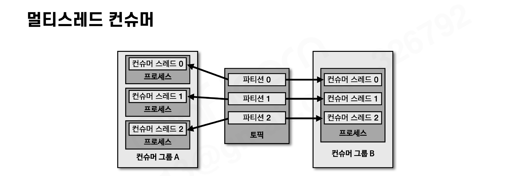

- 파티션 개수가 n개라면 동일 컨슈머 그룹으로 묶인 **컨슈머 스레드를 최대 n개** 운영할 수 있다.
- n개의 스레드를 가진 1개의 프로세스로 운영하거나, 1개의 스레드를 가진 프로세스를 n개 운영하는 방법이 있다.

# 컨슈머 랙(Consumer LAG)

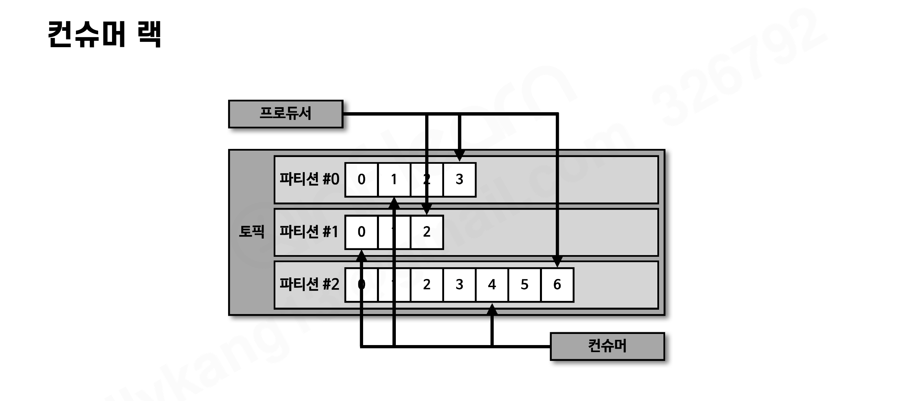

**컨슈머 랙은 파티션의 최신 오프셋(LOG-END-OFFSET)과 컨슈머 오프셋(CURRENT-OFFSET) 간의 차이**다. 컨슈머가 정상 동작하는지 확인할 수 있기 때문에 **컨슈머 애플리케이션을 운영한다면 필수적으로 모니터링해야 하는 지표**다.

- 컨슈머 랙은 **컨슈머 그룹과 토픽, 파티션별로 생성**된다. 파티션 3개인 토픽을 1개 컨슈머 그룹이 구독하면 컨슈머 랙은 총 3개.

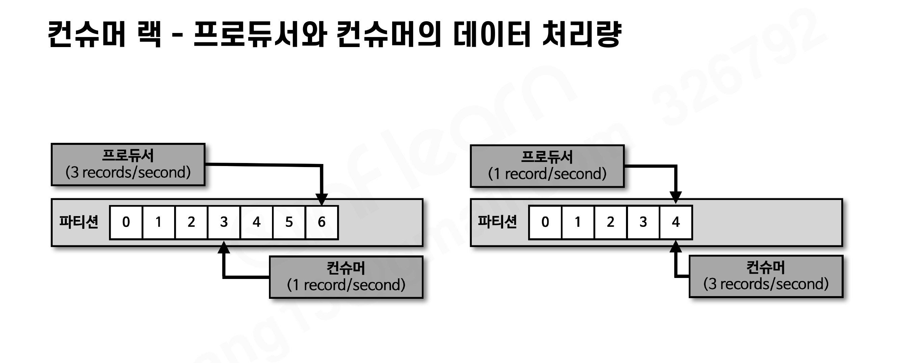

- 프로듀서 전송량 > 컨슈머 처리량 → 랙 증가 / 반대면 랙 감소 (최솟값 0 = 지연 없음)

### 컨슈머 랙 모니터링으로 알 수 있는 것

1. **처리량 이슈** — 명절처럼 프로듀서의 데이터양이 급증하면 컨슈머 최대 처리량은 한정되어 있어 랙이 발생 → **파티션 개수와 컨슈머 개수를 늘려** 병렬처리량을 늘린다
2. **파티션 이슈** — 프로듀서가 보내는 데이터양은 동일한데 특정 파티션의 랙만 늘어난다면 **해당 파티션에 할당된 컨슈머에 이슈가 발생**했음을 유추할 수 있다

### 컨슈머 랙을 확인하는 방법 3가지

| 방법 | 특징 | 한계 |
| --- | --- | --- |
| kafka-consumer-groups.sh | 가장 기초적인 방법 (섹션5에서 실습) | 일회성에 그쳐 지속 모니터링에 부적합. 테스트용 카프카에서 주로 사용 |
| KafkaConsumer의 metrics() 메서드 | records-lag-max, records-lag, records-lag-avg 3가지 지표 확인 | ① 컨슈머가 정상 동작할 때만 확인 가능 ② 모든 컨슈머 애플리케이션에 코드 중복 작성 ③ 서드 파티 애플리케이션은 모니터링 불가 |
| **외부 모니터링 툴 (최선)** | 데이터독, 컨플루언트 컨트롤 센터, **버로우(Burrow)** | 클러스터와 연동되어 컨슈머 동작에 영향 없이 전체 컨슈머·토픽의 랙을 한번에 모니터링 |

# 카프카 버로우(Burrow)

링크드인에서 개발하여 오픈소스로 공개한 **컨슈머 랙 체크 툴**. REST API를 통해 컨슈머 그룹별 컨슈머 랙을 확인할 수 있다. (1주차 무료 강의에서 소개된 그 도구)

- 다수의 카프카 클러스터를 동시에 연결하여 한 번의 설정으로 여러 클러스터의 컨슈머 랙을 확인할 수 있다.
- REST API 예: `GET /v3/kafka/{클러스터 이름}/consumer/{컨슈머 그룹 이름}/lag` → 컨슈머 그룹의 파티션 정보, 상태, 컨슈머 랙 조회

### 임계치가 아닌 "컨슈머 랙 평가(Evaluation)"

- 랙이 특정 시점에 임계치(threshold)를 넘었다고 해서 이슈라고 단정할 수 없다. **프로듀서가 데이터를 많이 보내면 일시적으로 임계치가 넘을 수 있기 때문**. 임계치 도달 때마다 알람을 받는 것은 무의미하다.
- 버로우는 **슬라이딩 윈도우(sliding window) 계산**으로 파티션과 컨슈머의 상태를 평가한다.
    - 파티션 상태: **OK / STALLED / STOPPED**
    - 컨슈머 상태: **OK / WARNING / ERROR**

**정상적인 경우** — 랙이 늘었다 줄었다 하며 0으로 수렴. 파티션 OK, 컨슈머 OK

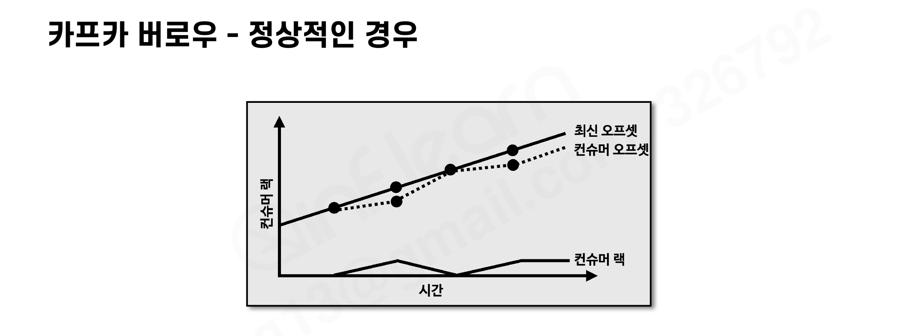

**컨슈머 처리량 이슈** — 최신 오프셋을 컨슈머 오프셋이 따라가지 못해 랙이 지속 증가. 파티션 OK, **컨슈머 WARNING** (처리량 부족)

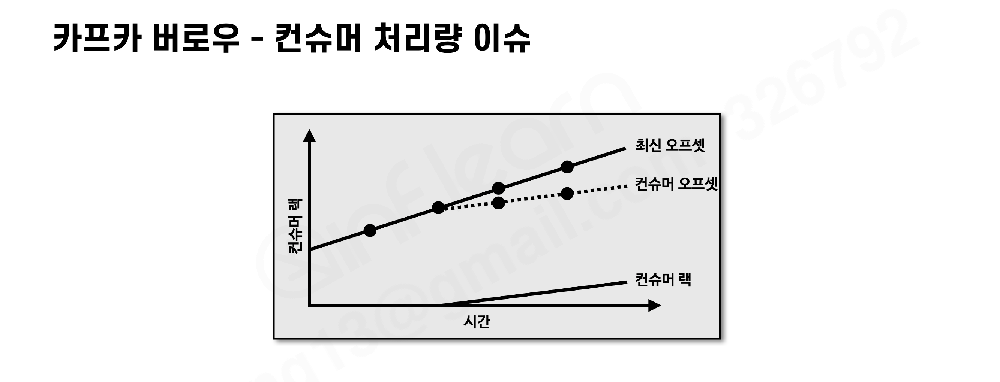

**컨슈머 이슈** — 최신 오프셋은 증가하는데 **컨슈머 오프셋이 멈춤**. 파티션 **STALLED**, **컨슈머 ERROR** → 확실한 비정상 동작이므로 이메일, SMS, 슬랙 등으로 알람 받고 즉각 조치

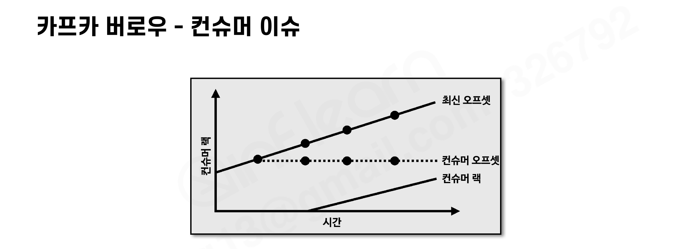

### 컨슈머 랙 모니터링 아키텍처

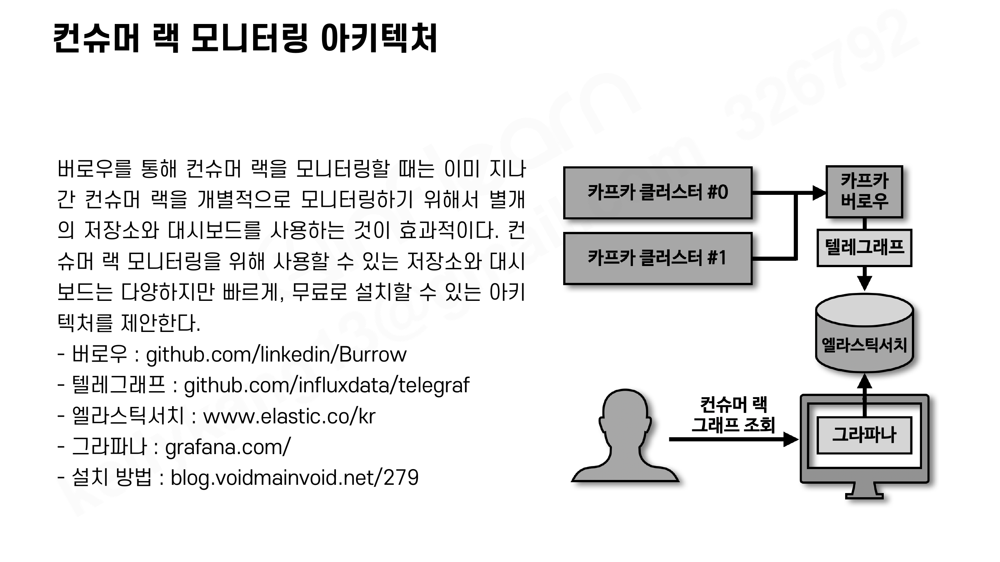

- 지나간 컨슈머 랙을 개별 모니터링하려면 별개의 저장소와 대시보드가 효과적: **버로우(수집) → 텔레그래프(전달) → 엘라스틱서치(저장) → 그라파나(대시보드)**

# 정리

- 컨슈머는 토픽에 저장된 데이터를 가져가서 처리하는 용도로 활용된다
- 컨슈머 그룹의 컨슈머 개수는 파티션 개수와 같거나 적어야 최대의 효율을 낸다
- 서로 다른 컨슈머 그룹은 데이터 처리에 영향을 미치지 않는다
- 컨슈머와 파티션의 재할당 과정을 리밸런싱이라 부르며, 대응 코드는 리밸런스 리스너로 작성한다
- 컨슈머가 어느 레코드까지 읽었는지 기록하기 위해 오프셋을 커밋한다
- 안정적인 데이터 처리를 위해 session.timeout.ms > heartbeat.interval.ms 여야 하고, 안전한 종료에는 wakeup()을 사용한다
- 컨슈머 랙은 파티션의 최신 오프셋과 컨슈머 오프셋 간의 차이로, 컨슈머 그룹·토픽·파티션별로 생성되며 반드시 모니터링해야 한다
- 컨슈머 랙 모니터링의 최선책은 외부 모니터링 툴(버로우 등)이며, 버로우는 임계치가 아닌 슬라이딩 윈도우로 랙을 평가한다
