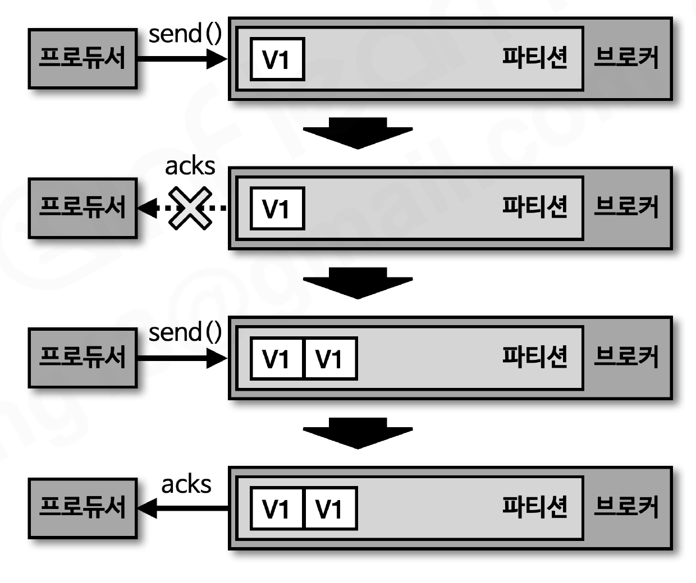
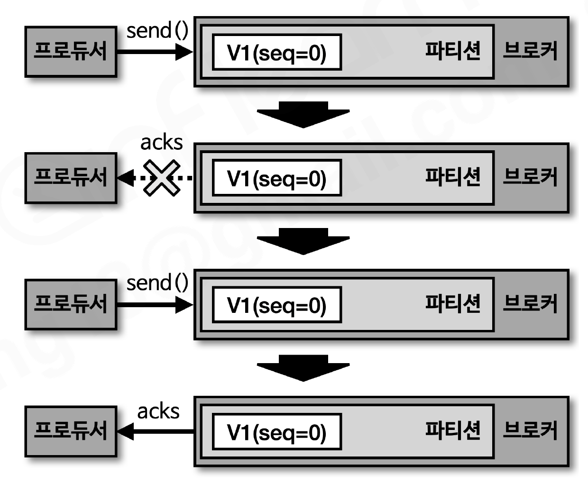
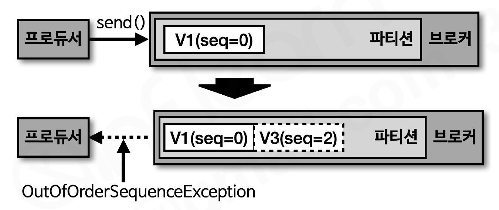
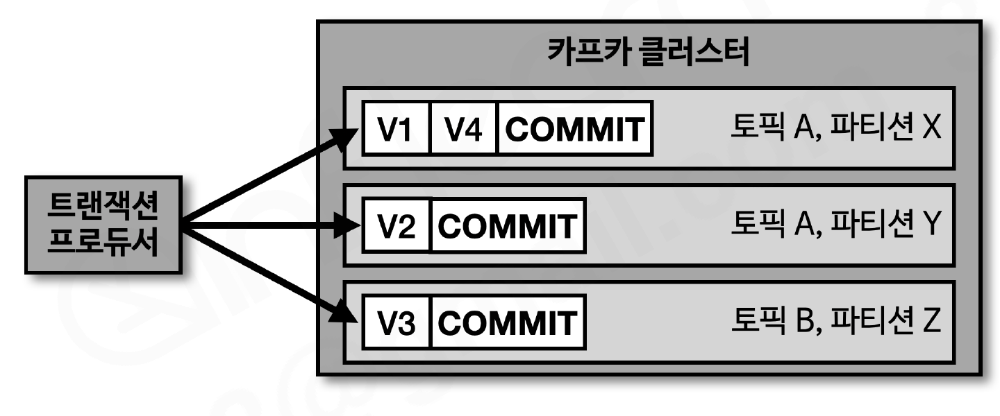
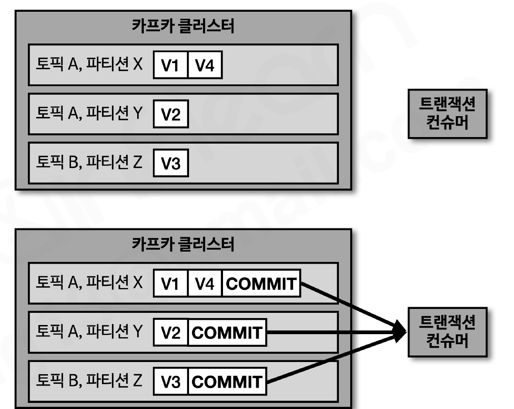

# 전달 신뢰성

**멱등성이란 여러 번 연산을 수행하더라도 동일한 결과를 나타내는 것**을 뜻한다. 멱등성 프로듀서는 동일한 데이터를 여러 번 전송하더라도 카프카 클러스터에 **단 한 번만 저장**됨을 의미한다.

| 전달 방식 | 의미 |
| --- | --- |
| At least once (적어도 한번) | 데이터가 유실되지 않음을 보장하지만, 두 번 이상 적재될 가능성이 있어 **중복 발생 가능** (기본 프로듀서의 동작 방식) |
| At most once (최대 한번) | 중복은 없지만 유실될 수 있음 |
| Exactly once (정확히 한번) | 유실도 중복도 없음 |

# 멱등성 프로듀서

프로듀서가 보내는 데이터의 중복 적재를 막기 위해 0.11.0 버전부터 `enable.idempotence` 옵션으로 **정확히 한번 전달(exactly once delivery)** 을 지원한다.

```java
configs.put(ProducerConfig.ENABLE_IDEMPOTENCE_CONFIG, true);
```

- 2.5.0 기준 기본값은 false → true로 설정하면 멱등성 프로듀서로 동작
- **카프카 3.0.0부터는 기본값이 true(acks=all)로 변경**

### 멱등성 프로듀서의 동작

멱등성 프로듀서는 데이터를 브로커로 전달할 때 **PID와 시퀀스 넘버를 함께 전달**한다. 브로커는 PID와 시퀀스 넘버를 확인하여 **동일한 메시지의 적재 요청이 오더라도 단 한 번만 적재**한다.

- **PID(Producer unique ID)** : 프로듀서의 고유한 ID
- **SID(Sequence ID)** : 레코드의 전달 번호 ID (0부터 시작해 1씩 증가)

**멱등성 프로듀서가 아닌 경우** — acks 응답이 유실되면 프로듀서가 재전송하여 V1이 두 번 적재됨 (at least once)



**멱등성 프로듀서인 경우** — 재전송이 와도 브로커가 같은 PID + seq=0임을 확인하고 적재하지 않음 (exactly once)



> 즉, 멱등성 프로듀서는 "정말로 한 번만 전송"하는 것이 아니다. 상황에 따라 **여러 번 전송하되, 브로커가 중복된 데이터를 확인하고 적재하지 않는 것**이다.

### 멱등성 프로듀서의 한계

- 멱등성 프로듀서는 **동일한 세션(= PID의 생명주기)에서만** 정확히 한번 전달을 보장한다.
- 프로듀서 애플리케이션에 이슈가 발생해 **재시작하면 PID가 달라진다.** 동일한 데이터를 보내도 브로커는 다른 프로듀서가 보낸 것으로 판단하므로, **장애가 발생하지 않을 경우에만** 정확히 한번 적재가 보장된다.

### 멱등성 프로듀서로 설정할 경우 강제되는 옵션

`enable.idempotence=true`로 설정하면 정확히 한번 적재 로직이 성립되도록 일부 옵션이 강제 설정된다.

- `retries` = Integer.MAX_VALUE
- `acks` = all
- 이유: 프로듀서가 **적어도 한 번 이상** 브로커에 데이터를 보내야, 브로커의 중복 확인 로직과 결합해 **단 한 번 적재**가 보장되기 때문

### 멱등성 프로듀서 사용시 오류 확인 — OutOfOrderSequenceException



- 브로커가 **예상한 시퀀스 넘버와 다른 번호**의 적재 요청이 오면 발생한다 (예: seq=0 다음에 seq=2가 도착)
- 시퀀스 넘버의 역전 현상이 발생할 수 있으므로, **순서가 중요한 데이터를 전송하는 프로듀서는 이 Exception에 대응하는 방안**을 고려해야 한다.

> **이때 seq=2는 적재되고 예외만 반환될까? — 아니다, 적재 자체가 거부된다**
>
> 브로커는 레코드를 로그에 적재하기 **전에** PID/시퀀스를 검증하고, 통과한 레코드만 적재한다(다이어그램의 점선 박스 = 거부당한 요청). 구멍(seq=1 유실)을 허용하면 유실이 조용히 묻히고 순서 보장도 깨지기 때문에, 파티션 로그에는 항상 시퀀스가 연속된 레코드만 존재하도록 유지하는 것이다.
>
> **후속 레코드(seq=3, 4, ...)가 줄줄이 거절당하는 것도 아니다.** 순서 꼬임이 일시적(네트워크 유실)이라면 프로듀서 클라이언트가 내부적으로 ack 못 받은 배치를 재전송해 자동 복구하고, 후속 배치들은 전송 큐에서 순서대로 대기한다(멱등성 프로듀서가 retries=MAX를 강제하는 이유). 재시도로도 전달에 실패해 유실이 확정되면 프로듀서가 오류 상태로 전환되어 이후 send()는 로컬에서 즉시 실패하며, 이때 애플리케이션은 ① 프로듀서 재생성 후 미확인 데이터 재전송(컨슈머 멱등 처리와 세트) ② 파이프라인 중단 + 알람 ③ 트랜잭션 프로듀서 도입 등을 요구 수준에 맞게 선택한다.

# 트랜잭션 프로듀서, 컨슈머

### 트랜잭션 프로듀서의 동작

카프카에서 트랜잭션은 **다수의 파티션에 데이터를 저장할 경우 모든 데이터에 대해 동일한 원자성(atomic)을 만족**시키기 위해 사용된다. 원자성이란 다수의 데이터를 동일 트랜잭션으로 묶어 **전체를 처리하거나 전체를 처리하지 않도록** 하는 것이다.



- 트랜잭션 프로듀서는 사용자가 보낸 데이터를 레코드로 파티션에 저장할 뿐만 아니라, **트랜잭션의 시작과 끝을 표현하는 트랜잭션 레코드(COMMIT)를 한 개 더 보낸다.**

### 트랜잭션 컨슈머의 동작



- 트랜잭션 컨슈머는 파티션에 저장된 **트랜잭션 레코드(COMMIT)를 보고 트랜잭션이 완료되었음을 확인한 후** 데이터를 가져간다. COMMIT 레코드가 적재되기 전까지는 데이터가 있어도 가져가지 않는다.
- 트랜잭션 레코드는 실질적인 데이터는 갖고 있지 않으며, **트랜잭션이 끝난 상태를 표시하는 정보만** 가진다. (파티션의 오프셋은 하나 차지)

### 트랜잭션 프로듀서 설정

`transactional.id`를 설정해야 한다(프로듀서별로 고유한 값). **init → begin → commit 순서**로 수행한다.

```java
configs.put(ProducerConfig.TRANSACTIONAL_ID_CONFIG, UUID.randomUUID());

Producer<String, String> producer = new KafkaProducer<>(configs);

producer.initTransactions();     // 트랜잭션 준비

producer.beginTransaction();     // 트랜잭션 시작
producer.send(new ProducerRecord<>(TOPIC, "전달하는 메시지 값"));
producer.commitTransaction();    // 트랜잭션 커밋

producer.close();
```

- `transactional.id`를 설정하면 `enable.idempotence`는 자동으로 true로 동작한다 — 트랜잭션은 멱등성 프로듀서 기반 (섹션6에서 보충했던 내용)

### 트랜잭션 컨슈머 설정

커밋이 완료된 레코드만 읽기 위해 `isolation.level`을 **read_committed**로 설정한다.

```java
configs.put(ConsumerConfig.ISOLATION_LEVEL_CONFIG, "read_committed");
KafkaConsumer<String, String> consumer = new KafkaConsumer<>(configs);
```

- 기본값 `read_uncommitted` : 커밋 여부와 상관없이 모든 레코드를 읽음
- `read_committed` : **커밋이 완료된 레코드만** 읽어 처리

> **프로듀서가 커밋 전에 죽으면 컨슈머는 무한 대기할까? — 아니다, 코디네이터가 직권으로 abort한다**
>
> read_committed 컨슈머는 **LSO(Last Stable Offset, 아직 끝나지 않은 트랜잭션의 첫 레코드 위치)**까지만 읽는다. 순서대로 읽어야 하므로 미완료 트랜잭션 뒤에 적재된 다른 프로듀서의 레코드도 함께 막힌다.
>
> - 브로커의 **트랜잭션 코디네이터**가 진행 중인 트랜잭션을 감시하다가, `transaction.timeout.ms`(기본 1분) 동안 커밋/abort가 없으면 **직권으로 ABORT 마커를 기록**한다 → LSO가 전진하고 컨슈머는 abort된 레코드를 건너뛰고 컨슘을 재개한다 (대기는 최대 타임아웃까지로 유한)
> - 죽었던 프로듀서가 같은 transactional.id로 되살아나면 `initTransactions()` 시 **에포크(세대 번호)가 올라가고** 이전 세대의 미완료 트랜잭션이 정리되며, 구세대 인스턴스의 커밋 시도는 `ProducerFencedException`으로 거부된다(좀비 펜싱). transactional.id가 프로듀서별 고유값이어야 하는 이유.

# 정리

- 전달 신뢰성은 적어도 한번(at least once), 최대 한번(at most once), 정확히 한번(exactly once)이 있다
- 멱등성 프로듀서를 사용하면 프로듀서에서 브로커로 딱 1번 레코드를 전송할 수 있다 (PID + 시퀀스 넘버로 브로커가 중복 적재를 방지)
- 단, 동일 세션(PID 생명주기)에서만 보장되며, 애플리케이션 재시작 시 PID가 달라진다
- 트랜잭션 프로듀서·컨슈머를 사용하면 여러 레코드를 하나의 원자(atomic)로 묶어 보낼 수 있다
- 트랜잭션 프로듀서는 COMMIT 레코드를 추가로 적재하고, read_committed 컨슈머는 커밋 완료된 데이터만 읽는다
