# 카프카 스트림즈란?

카프카 스트림즈(Kafka Streams)는 **카프카에 저장된 데이터를 실시간으로 변환하고, 다른 토픽에 저장하는 라이브러리**다.

프로듀서와 컨슈머를 직접 조합해 데이터를 처리할 수도 있지만, 스트림 데이터 처리에 필요한 필터링·변환·조인·윈도우 처리 등을 스트림즈 DSL로 간단하게 구현할 수 있다.

카프카 스트림즈는 카프카 클러스터와 별도의 서버 애플리케이션이 아니라 **카프카 클라이언트 애플리케이션 내부에서 동작**한다.

- 입력 토픽의 데이터를 읽는다.
- 스트림즈 애플리케이션에서 데이터를 처리한다.
- 처리 결과를 출력 토픽에 저장한다.
- 처리 상태는 로컬 상태 저장소와 카프카의 내부 토픽을 활용해 관리한다.

### 프로듀서와 컨슈머를 직접 조합하지 않고 스트림즈를 사용하는 이유

스트림 데이터 처리에 필요한 기능을 프로듀서와 컨슈머 API만으로 구현하면 데이터 변환, 상태 관리, 장애 복구, 스케일 아웃 등을 애플리케이션에서 직접 관리해야 한다.

카프카 스트림즈는 이러한 기능을 라이브러리로 제공하므로 **카프카의 특징을 유지하면서도 스트림 처리 로직을 애플리케이션 코드로 구현**할 수 있다.

- 카프카 클러스터를 중심으로 동작하므로 별도의 처리 클러스터가 필요하지 않다.
- 카프카의 파티션과 컨슈머 그룹을 이용해 병렬 처리와 스케일 아웃을 지원한다.
- 장애가 발생해도 상태 저장소와 카프카 토픽을 이용해 복구할 수 있다.
- 입력 토픽과 출력 토픽을 연결한 처리 과정을 토폴로지로 표현할 수 있다.

# 카프카 스트림즈 내부 구조

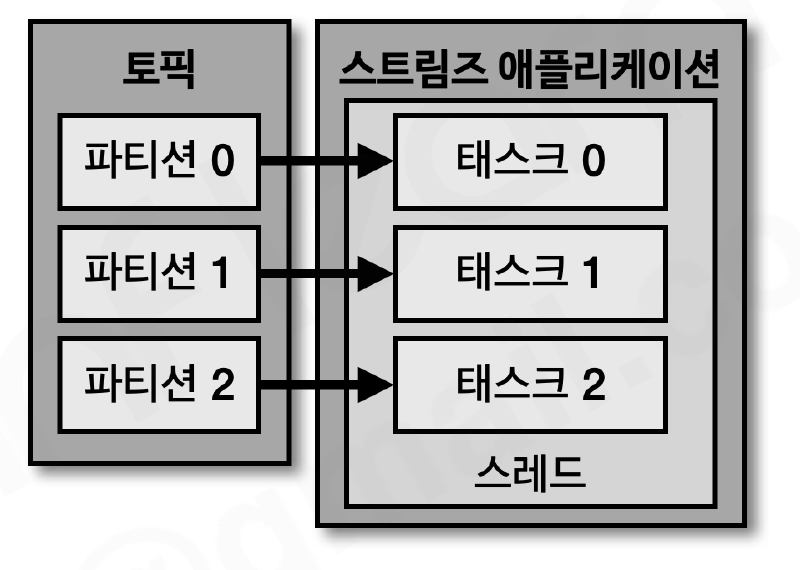

스트림즈 애플리케이션은 1개 이상의 **스트림즈 태스크(Stream task)**로 구성된다. 스트림즈 애플리케이션이 처리할 입력 토픽의 파티션 개수만큼 태스크가 생성될 수 있으며, 각 태스크는 할당받은 파티션의 데이터를 처리한다.

- **스트림즈 애플리케이션**: 스트림 처리 로직을 실행하는 애플리케이션
- **스트림즈 태스크**: 실제 데이터를 처리하는 최소 단위
- **스트림 스레드**: 하나 이상의 태스크를 실행하는 스레드
- **토폴로지(Topology)**: 프로세서들이 연결된 데이터 처리 구조

### 스트림즈 애플리케이션 스케일 아웃

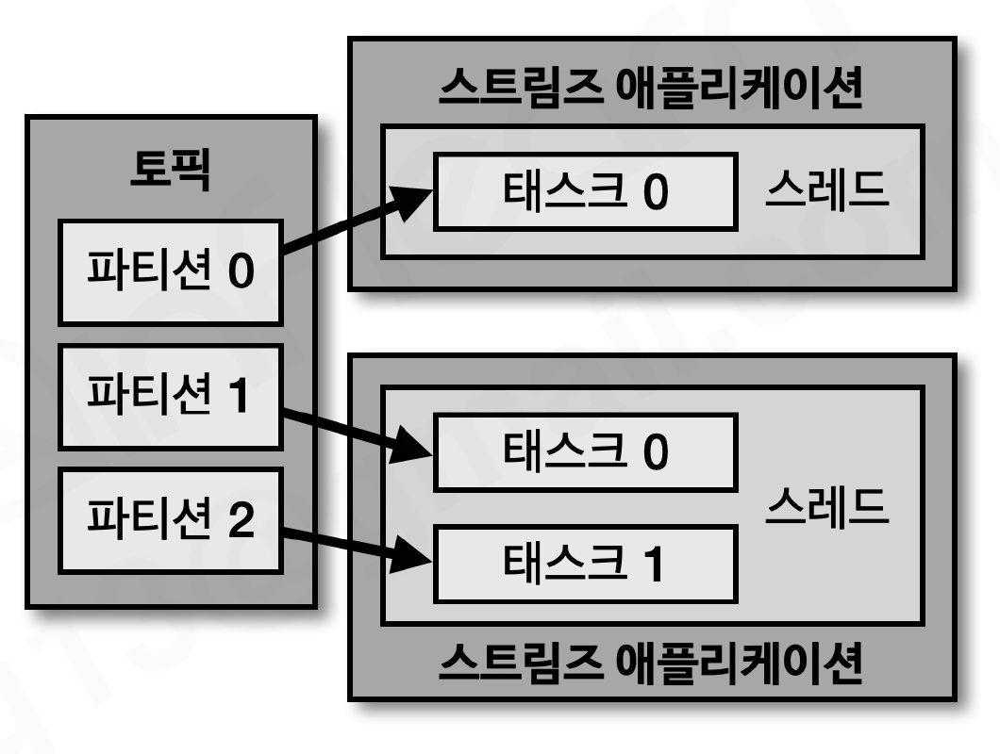

스트림즈 애플리케이션은 동일한 `application.id`를 사용하면 하나의 카프카 컨슈머 그룹처럼 동작한다. 입력 토픽의 파티션은 여러 스트림즈 애플리케이션 인스턴스에 나누어 할당된다.

- 입력 토픽의 파티션보다 많은 인스턴스를 실행하면 일부 인스턴스는 유휴 상태가 된다.
- 여러 인스턴스가 동일한 애플리케이션 ID로 실행되면 태스크가 분산된다.
- 한 인스턴스 안에서도 `num.stream.threads` 옵션으로 스트림 스레드 개수를 지정할 수 있다.
- 장애가 발생한 인스턴스의 태스크는 다른 인스턴스에 재할당되어 처리를 이어간다.

### 토폴로지(Topology)

토폴로지는 스트림즈 애플리케이션의 데이터 처리 흐름을 정의한 구조다. 토픽에서 데이터를 읽는 **소스 프로세서**, 데이터를 변환하는 **스트림 프로세서**, 처리 결과를 토픽에 저장하는 **싱크 프로세서**로 구성된다.

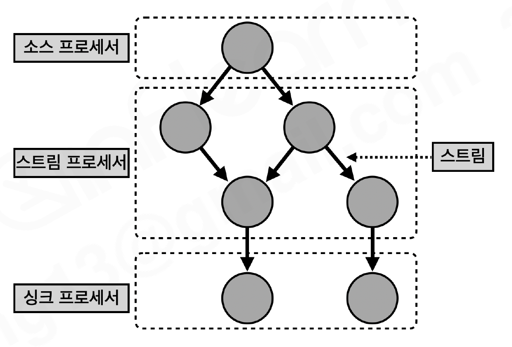

- **소스 프로세서(Source processor)**: 카프카 토픽에서 데이터를 읽어오는 시작점
- **스트림 프로세서(Stream processor)**: 필터링·변환·집계·조인 등 데이터를 처리하는 노드
- **싱크 프로세서(Sink processor)**: 처리한 데이터를 특정 카프카 토픽에 저장하는 끝점
- **스트림(Stream)**: 토폴로지를 통과하는 레코드의 흐름

### 스트림즈 DSL과 Processor API

스트림즈는 **스트림즈 DSL**과 **Processor API** 두 가지 방식으로 개발할 수 있다.

| 구분 | 스트림즈 DSL | Processor API |
| --- | --- | --- |
| 추상화 수준 | 높음 | 낮음 |
| 사용 방법 | 미리 제공되는 연산자 조합 | 프로세서와 처리 로직 직접 구현 |
| 장점 | 짧고 읽기 쉬운 코드, 빠른 개발 | 세밀한 제어와 사용자 정의 로직 |
| 적합한 경우 | 필터·변환·집계·조인 등 일반적인 처리 | DSL로 구현하기 어려운 특수한 처리 |

스트림즈 DSL은 `KStream`, `KTable`, `GlobalKTable`을 중심으로 동작한다. Processor API는 토폴로지의 노드와 데이터 처리 방법을 직접 정의한다.

# 스트림즈 DSL

스트림즈 DSL로 구성된 애플리케이션은 레코드의 흐름을 추상화한 3가지 개념을 사용한다.

## KStream

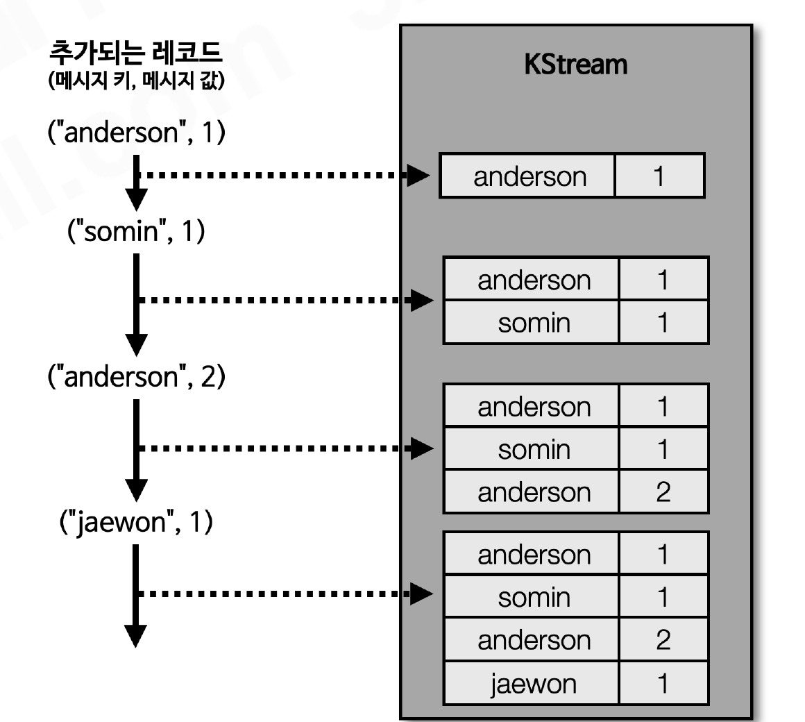

KStream은 **레코드의 흐름을 표현하는 추상화 객체**다. 동일한 키를 가진 레코드가 여러 번 들어오면 각각의 레코드가 모두 의미를 가진다.

예를 들어 `order` 토픽에 주문 생성 이벤트가 들어온다면, 주문 이벤트 하나하나를 독립적인 데이터로 처리할 때 KStream을 사용한다.

- 레코드가 추가될 때마다 이벤트로 처리한다.
- 동일한 키의 레코드도 모두 보존한다.
- 필터링, 변환, 집계, 조인 등의 스트림 연산에 사용한다.

## KTable

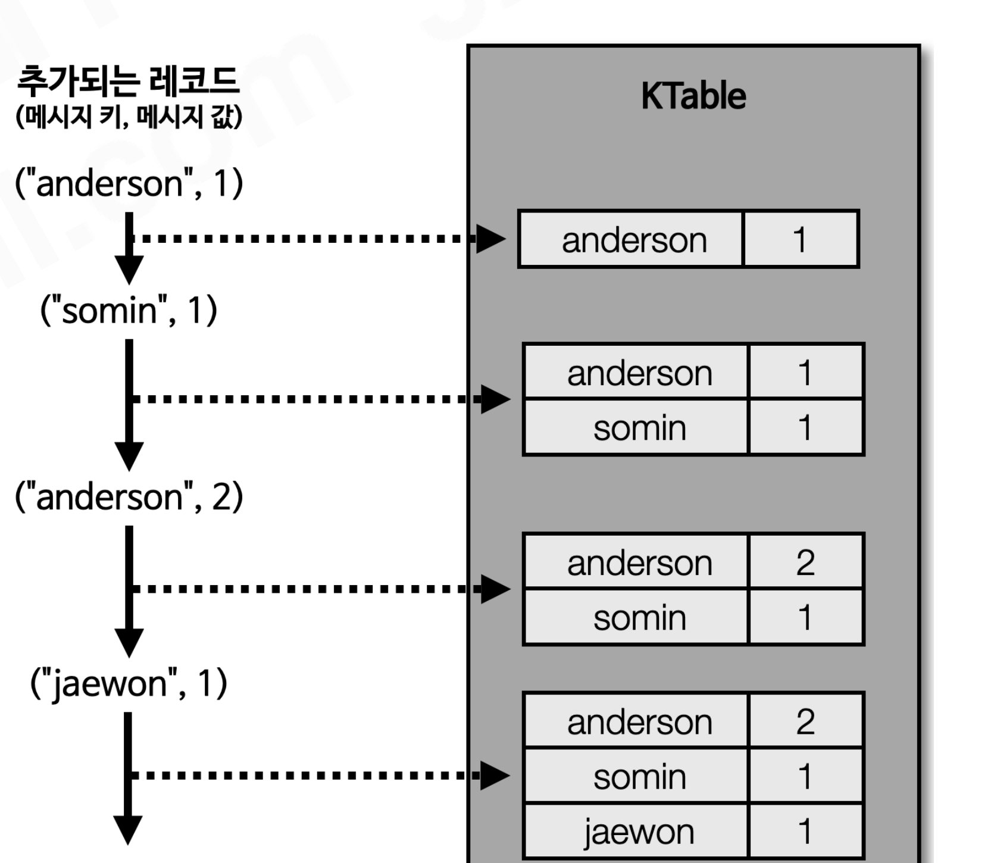

KTable은 **메시지 키를 기준으로 가장 최신의 레코드만 유지하는 테이블 형태의 추상화 객체**다.

동일한 키를 가진 레코드가 새로 들어오면 기존 값이 새로운 값으로 변경된다. 따라서 KTable은 데이터의 변경 이력보다 현재 상태를 표현할 때 적합하다.

예를 들어 `user` 키의 주소가 여러 번 변경되면 KTable에는 해당 사용자의 가장 최신 주소가 남는다.

| 구분 | KStream | KTable |
| --- | --- | --- |
| 의미 | 이벤트의 연속 | 최신 상태의 테이블 |
| 같은 키의 여러 레코드 | 모두 별개의 이벤트로 처리 | 최신 레코드가 이전 값을 대체 |
| 적합한 데이터 | 주문 생성, 로그, 클릭 이벤트 | 사용자 주소, 상품 재고, 계정 잔액 |

## GlobalKTable

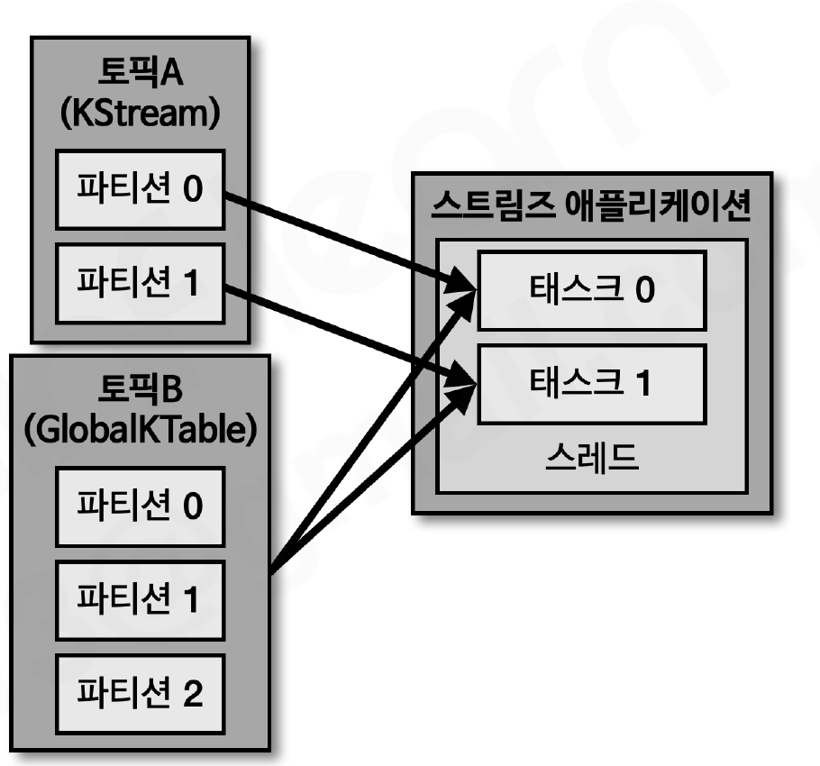

GlobalKTable은 KTable과 비슷하게 최신 상태를 유지하지만, **토픽의 모든 파티션 데이터를 각 스트림즈 인스턴스에 복제**한다.

- 각 인스턴스가 전체 데이터를 가지고 있으므로 조인 시 코파티셔닝이 필요하지 않다.
- 모든 인스턴스가 전체 데이터를 저장하므로 데이터가 큰 토픽에는 적합하지 않다.
- 변경이 자주 발생하지 않고, 비교적 작은 참조 데이터와 조인할 때 유용하다.

# 스트림즈 주요 옵션

> 아래 옵션과 기본값은 카프카 클라이언트 2.5.0 기준이다.

### 필수 옵션

- `bootstrap.servers` : 데이터를 전송할 카프카 클러스터 브로커의 호스트 이름과 포트
- `application.id` : 스트림즈 애플리케이션의 고유 ID. 같은 ID를 사용하는 인스턴스는 하나의 애플리케이션으로 묶인다.

`application.id`는 내부 토픽과 상태 저장소의 이름에도 사용되므로 **서로 다른 스트림즈 애플리케이션은 서로 다른 값을 사용해야 한다.**

### 주요 선택 옵션

| 옵션 | 설명 | 기본값 |
| --- | --- | --- |
| `default.key.serde` | 레코드 키를 직렬화·역직렬화하는 클래스 | 바이트 배열 기반 Serde |
| `default.value.serde` | 레코드 값을 직렬화·역직렬화하는 클래스 | 바이트 배열 기반 Serde |
| `num.stream.threads` | 실행할 스트림 스레드 개수 | 1 |
| `state.dir` | 상태 저장소를 저장할 로컬 디렉터리 | `/tmp/kafka-streams` |

# 스트림즈 애플리케이션 개발하기

### 스트림즈 DSL 라이브러리 추가

```groovy
dependencies {
    compile 'org.apache.kafka:kafka-streams:2.5.0'
    compile 'org.slf4j:slf4j-simple:1.7.30'
}
```

## 필터링 스트림즈 애플리케이션

토픽으로 들어온 문자열 데이터 중 길이가 5보다 큰 데이터만 필터링하여 다른 토픽으로 전달할 수 있다.

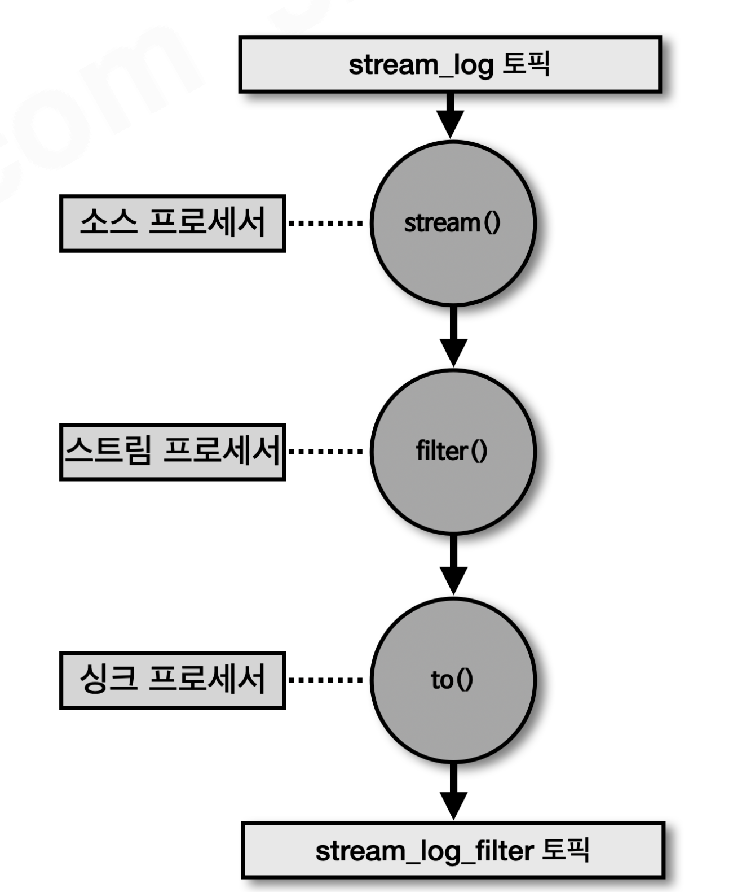

```java
public class StreamsFilter {
    private static final String STREAM_LOG = "stream_log";
    private static final String STREAM_LOG_FILTER = "stream_log_filter";

    public static void main(String[] args) {
        Properties props = new Properties();
        props.put(StreamsConfig.APPLICATION_ID_CONFIG, "streams-filter-application");
        props.put(StreamsConfig.BOOTSTRAP_SERVERS_CONFIG, "my-kafka:9092");
        props.put(StreamsConfig.DEFAULT_KEY_SERDE_CLASS_CONFIG, Serdes.String().getClass());
        props.put(StreamsConfig.DEFAULT_VALUE_SERDE_CLASS_CONFIG, Serdes.String().getClass());

        StreamsBuilder builder = new StreamsBuilder();
        KStream<String, String> streamLog = builder.stream(STREAM_LOG);

        streamLog.filter((key, value) -> value.length() > 5)
                 .to(STREAM_LOG_FILTER);

        KafkaStreams streams = new KafkaStreams(builder.build(), props);
        streams.start();
    }
}
```

- `StreamsBuilder` : 스트림즈 토폴로지를 구성하는 빌더
- `builder.stream()` : 입력 토픽을 KStream으로 가져온다.
- `filter()` : 조건에 맞는 레코드만 통과시킨다.
- `to()` : 처리 결과를 출력 토픽에 저장한다.
- `KafkaStreams.start()` : 구성한 토폴로지를 실행한다.

# KTable과 KStream 조인

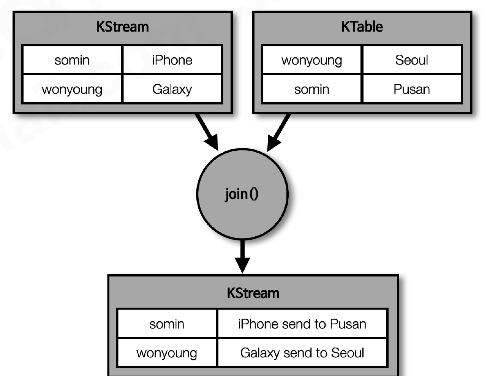

KTable과 KStream은 메시지 키를 기준으로 조인할 수 있다. 예를 들어 `order` 토픽의 주문 이벤트와 `address` 토픽의 주소 상태를 조인하면 주문 정보에 최신 주소를 붙일 수 있다.

```java
KTable<String, String> addressTable = builder.table("address");
KStream<String, String> orderStream = builder.stream("order");

orderStream.join(
        addressTable,
        (order, address) -> order + " send to " + address
).to("order_join");
```

### 조인 시 코파티셔닝(Co-partitioning)

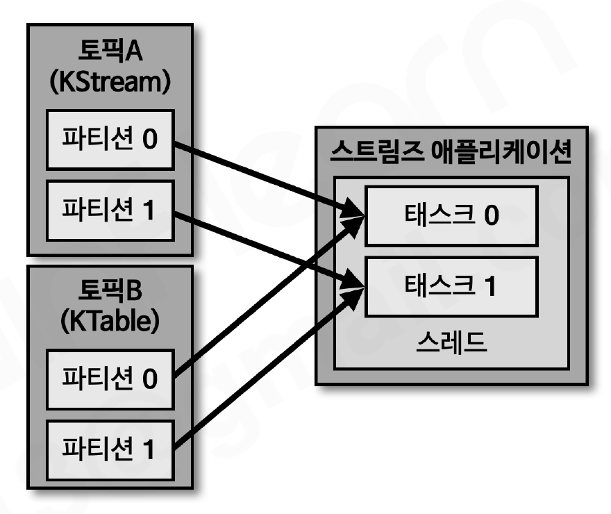

코파티셔닝은 **조인하는 두 토픽의 파티션 개수와 파티션 배치 기준이 동일한 상태**를 의미한다. 같은 키를 가진 레코드가 동일한 태스크에서 처리되어야 조인이 가능하다.

- 조인 대상 토픽의 파티션 개수가 같아야 한다.
- 같은 키가 양쪽 토픽에서 같은 파티션으로 매핑되어야 한다.
- 기본 파티셔너를 사용한다면 같은 키를 기준으로 같은 파티션에 저장된다.
- 코파티셔닝이 되지 않은 토픽을 조인하면 `TopologyException`이 발생할 수 있다.

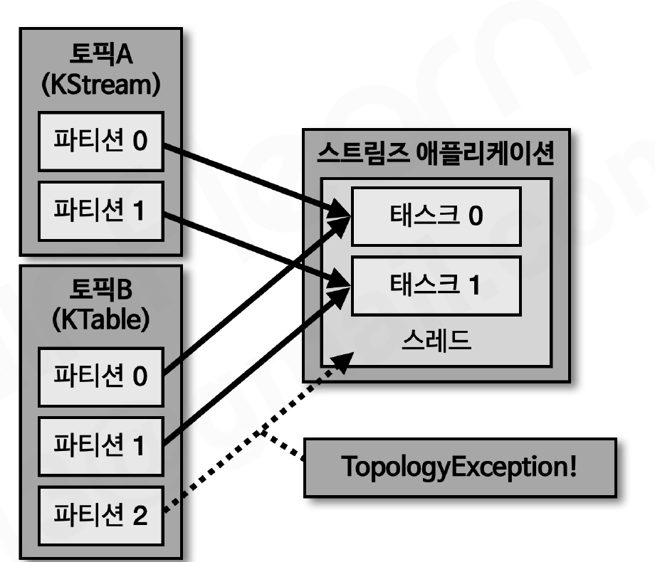

코파티셔닝이 필요한 두 토픽의 파티션 수가 다르면 스트림즈 애플리케이션이 정상적으로 실행되지 않는다. 이 경우 토픽의 파티션 구조를 맞추거나, 조인 전에 재파티셔닝하는 방법을 고려해야 한다.

### KTable과 KStream 조인의 특징

KTable은 최신 상태를 유지하므로 KStream의 이벤트가 들어오는 시점에 KTable에서 같은 키의 최신 값을 조회해 조인한다.

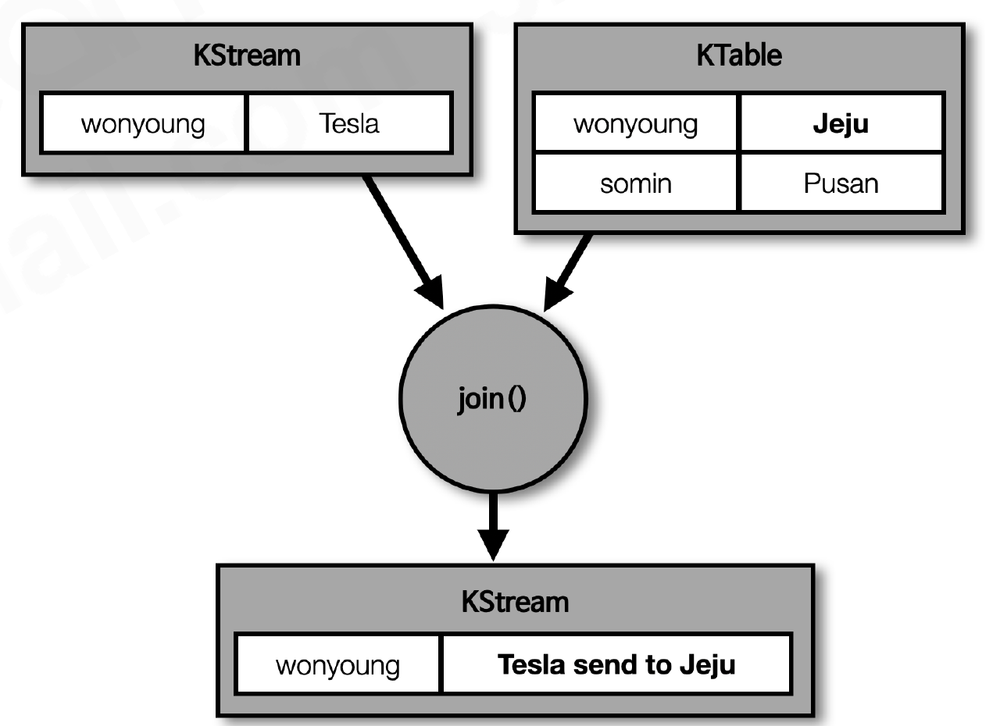

이미 처리된 KStream 이벤트의 결과가 KTable 값 변경만으로 자동으로 다시 계산되는 것은 아니다. 이후 새로운 KStream 이벤트가 들어올 때 변경된 KTable 값이 사용된다.

## KStream과 GlobalKTable 조인

코파티셔닝되지 않은 토픽을 조인해야 한다면 GlobalKTable을 사용할 수 있다. GlobalKTable은 모든 파티션의 데이터를 각 스트림즈 인스턴스에 복제하므로, KStream의 레코드가 어느 파티션에 있든 로컬에서 전체 참조 데이터를 조회할 수 있다.

```java
GlobalKTable<String, String> addressTable =
        builder.globalTable("address_global");
KStream<String, String> orderStream = builder.stream("order");

orderStream.join(
        addressTable,
        (orderKey, order) -> orderKey,
        (order, address) -> order + " send to " + address
).to("order_join");
```

| 구분 | KTable 조인 | GlobalKTable 조인 |
| --- | --- | --- |
| 코파티셔닝 | 필요 | 불필요 |
| 데이터 저장 | 파티션별로 분산 | 각 인스턴스에 전체 복제 |
| 적합한 경우 | 크기가 크거나 변경이 많은 데이터 | 작고 자주 변경되지 않는 참조 데이터 |

# 스트림즈 DSL의 윈도우 프로세싱

스트림 데이터는 계속 들어오므로 특정 시간 범위의 데이터를 기준으로 집계해야 하는 경우가 많다. 스트림즈는 윈도우를 사용해 **시간 범위에 포함되는 레코드를 묶어 처리**한다.

지원하는 대표적인 윈도우는 텀블링, 호핑, 슬라이딩, 세션 윈도우다.

## 텀블링 윈도우(Tumbling Window)

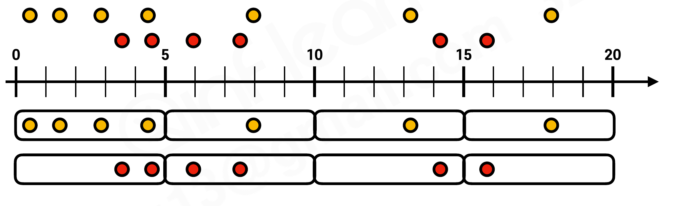

텀블링 윈도우는 서로 겹치지 않는 고정 시간 간격으로 데이터를 처리한다.

- 윈도우 사이에 중복되는 데이터가 없다.
- 5분 윈도우라면 0~5분, 5~10분처럼 구간이 나뉜다.
- 특정 시간 동안 발생한 이벤트 수를 집계할 때 사용한다.

```java
KTable<Windowed<String>, Long> countTable =
        stream.groupByKey()
              .windowedBy(TimeWindows.of(Duration.ofSeconds(5)))
              .count();
```

## 호핑 윈도우(Hopping Window)

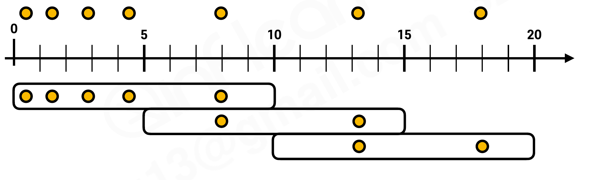

호핑 윈도우는 윈도우 크기와 이동 간격을 각각 지정한다. 이동 간격이 윈도우 크기보다 작으면 윈도우가 서로 겹친다.

- 윈도우 크기: 데이터를 포함할 전체 시간
- 이동 간격: 새로운 윈도우를 시작하는 주기
- 최근 일정 시간 동안의 데이터를 반복적으로 집계할 때 사용한다.

## 슬라이딩 윈도우(Sliding Window)

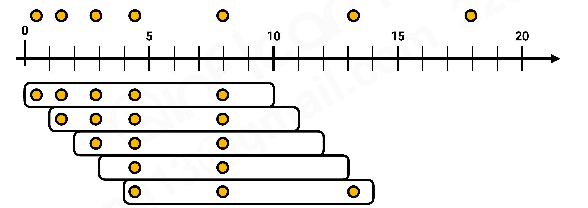

슬라이딩 윈도우는 레코드의 타임스탬프를 기준으로 지정한 시간 범위에 함께 들어오는 레코드를 묶는다. 이벤트가 발생할 때마다 윈도우가 움직이므로, 고정된 주기로 생성되는 윈도우와 동작 방식이 다르다.

## 세션 윈도우(Session Window)

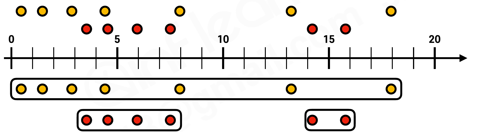

세션 윈도우는 **일정 시간 동안 이벤트가 들어오지 않는 구간을 기준으로 세션을 구분**한다.

- 사용자 활동처럼 이벤트 발생 간격이 일정하지 않은 데이터에 적합하다.
- 지정한 `inactivityGap` 동안 새로운 이벤트가 없으면 세션이 종료된다.
- 새로운 이벤트가 다시 들어오면 새로운 세션이 시작된다.

### 윈도우 연산 시 주의할 점

카프카 스트림즈는 윈도우가 종료된 시점에만 결과를 출력하는 것이 아니라, 윈도우에 레코드가 추가될 때마다 집계 결과를 갱신할 수 있다. 따라서 같은 윈도우에 대한 결과가 여러 번 출력될 수 있다.

또한 이벤트 시간과 실제 처리 시간에는 차이가 있을 수 있으므로, 지연 도착 데이터와 윈도우 종료 시점을 고려해야 한다. 늦게 도착한 데이터가 윈도우 결과에 반영되는 범위는 `grace` 설정과 스트림즈 버전에 따라 달라진다.

```java
KTable<Windowed<String>, Long> countTable =
        stream.groupByKey()
              .windowedBy(TimeWindows.of(Duration.ofSeconds(5)))
              .count();
```

# Queryable Store

카프카 스트림즈는 KTable의 상태를 로컬 상태 저장소에 저장한다. 이 상태 저장소를 `QueryableStore`로 구성하면 스트림즈 애플리케이션 외부에서 특정 키의 현재 상태를 조회할 수 있다.

```java
KTable<String, String> addressTable = builder.table(
        "address",
        Materialized.as("address-store")
);

ReadOnlyKeyValueStore<String, String> store =
        streams.store(
                StoreQueryParameters.fromNameAndType(
                        "address-store",
                        QueryableStoreTypes.keyValueStore()
                )
        );

String address = store.get("mijin");
```

- `Materialized.as()` : 상태 저장소 이름을 지정하고 조회 가능하게 만든다.
- `ReadOnlyKeyValueStore` : 키를 기준으로 값을 읽는 읽기 전용 저장소다.
- 상태 저장소는 각 스트림즈 인스턴스에 로컬로 존재한다.
- 특정 키가 어느 인스턴스에 있는지 확인하려면 메타데이터 조회와 요청 라우팅을 함께 구현해야 한다.

# Processor API

Processor API는 스트림즈 DSL보다 낮은 수준에서 프로세서와 토폴로지를 직접 구성하는 API다.

Processor API를 사용하려면 `Processor` 또는 `Transformer` 인터페이스를 구현한다.

- `Processor` : 입력 레코드를 직접 처리하고 다음 프로세서로 전달
- `Transformer` : 레코드의 키·값을 변환하거나 상태 저장소를 활용
- `ProcessorContext` : 현재 레코드 정보, 다음 노드 전달, 예약 작업 등의 기능 제공

```java
public class FilterProcessor implements Processor<String, String> {
    private ProcessorContext context;

    @Override
    public void init(ProcessorContext context) {
        this.context = context;
    }

    @Override
    public void process(String key, String value) {
        if (value.length() > 5) {
            context.forward(key, value);
        }
        context.commit();
    }

    @Override
    public void close() {
    }
}
```

```java
Topology topology = new Topology();
topology.addSource("Source", "stream_log")
        .addProcessor("Process", FilterProcessor::new, "Source")
        .addSink("Sink", "stream_log_filter", "Process");

KafkaStreams streams = new KafkaStreams(topology, props);
streams.start();
```

일반적인 필터링·변환·집계는 스트림즈 DSL로 구현하는 편이 간단하다. DSL만으로 구현하기 어려운 사용자 정의 프로세서, 세밀한 상태 관리, 예약 처리 등이 필요할 때 Processor API를 사용한다.

# 카프카 스트림즈와 스파크 스트리밍 비교

| 구분 | 카프카 스트림즈 | 스파크 스트리밍(Structured Streaming) |
| --- | --- | --- |
| 배포 단위 | 자바 애플리케이션 | 스파크 클러스터 작업(Job) |
| 데이터 소스 | 카프카 토픽 중심 | HDFS, 파일, 카프카 등 |
| 실행 모델 | 카프카 파티션·태스크 기반 | 드라이버와 익스큐터 기반 |
| 상태 저장 | 로컬 상태 저장소와 카프카 토픽 | 체크포인트와 상태 저장소 |
| 적합한 경우 | 카프카 중심의 실시간 이벤트 처리 | 대규모 데이터 처리와 다양한 입력 소스 |

- 카프카 스트림즈: 카프카 토픽을 입력으로 하는 경량 스트림 처리 애플리케이션 개발
- 스파크 스트리밍: 카프카를 포함한 여러 데이터 소스를 사용하는 분산 데이터 처리

# 정리

- 카프카 스트림즈는 카프카에 저장된 데이터를 실시간으로 처리하고 다른 토픽에 저장하는 라이브러리다.
- 스트림즈 애플리케이션은 스트림 스레드와 태스크로 구성되며, 카프카 파티션을 기준으로 병렬 처리하고 스케일 아웃한다.
- 토폴로지는 소스 프로세서, 스트림 프로세서, 싱크 프로세서가 연결된 데이터 처리 구조다.
- 스트림즈 DSL은 `KStream`, `KTable`, `GlobalKTable`을 사용해 필터링·변환·집계·조인을 구현한다.
- `KStream`은 이벤트의 흐름, `KTable`은 키별 최신 상태, `GlobalKTable`은 모든 파티션을 각 인스턴스에 복제한 상태를 표현한다.
- KStream과 KTable을 조인할 때는 코파티셔닝이 필요하며, 코파티셔닝이 어려우면 GlobalKTable을 고려할 수 있다.
- 텀블링·호핑·슬라이딩·세션 윈도우로 시간 범위에 따른 스트림 데이터를 집계할 수 있다.
- Queryable Store를 사용하면 스트림즈 애플리케이션의 KTable 상태를 외부에서 조회할 수 있다.
- Processor API는 DSL보다 세밀한 제어가 필요할 때 사용하며, 일반적인 처리는 스트림즈 DSL로 구현하는 것이 효율적이다.
