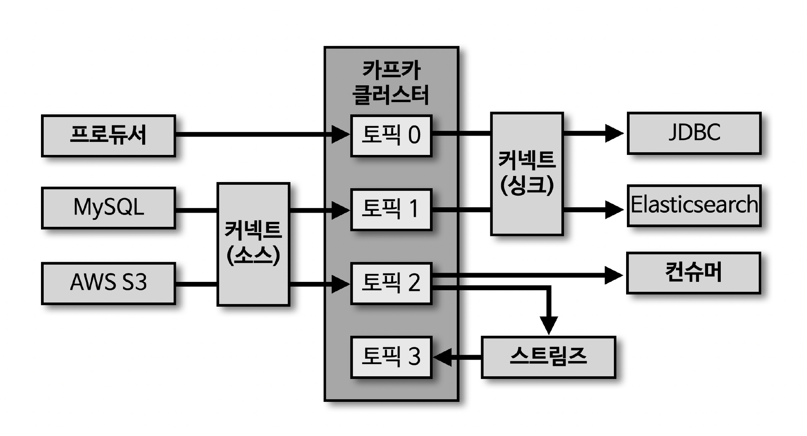
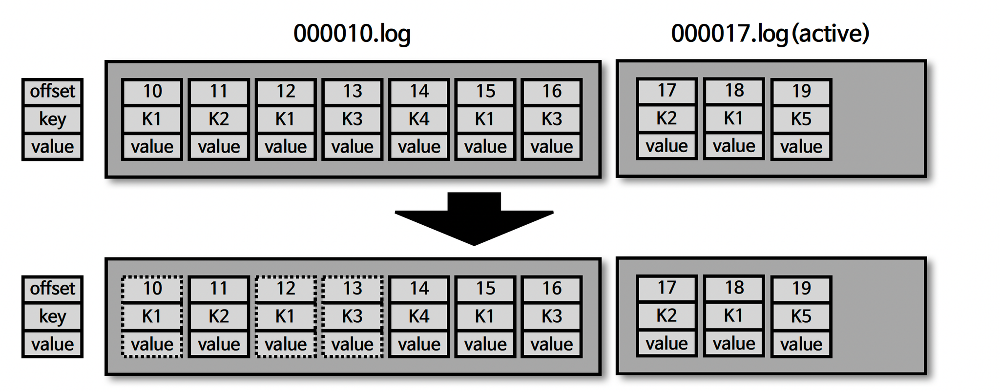

# 섹션 3. 카프카 기본 개념 설명

## 1. 카프카 생태계



- **프로듀서**: 데이터를 토픽으로 전송
- **컨슈머**: 토픽의 데이터를 가져가 사용
- **카프카 클러스터**: 여러 개의 브로커로 구성
- **커넥트(소스)**: MySQL, AWS S3 등 외부 저장소 → 토픽으로 데이터 적재
- **커넥트(싱크)**: 토픽 → JDBC, Elasticsearch 등 외부 저장소로 전송
- **스트림즈**: 토픽의 데이터를 가공해 다시 다른 토픽으로 적재 (토픽 2 → 스트림즈 → 토픽 3)

---

## 2. 카프카 브로커·클러스터·주키퍼

### 브로커와 클러스터

- **카프카 브로커**: 카프카 클라이언트와 데이터를 주고받기 위해 사용하는 주체이자, 데이터를 **분산 저장**하여 장애가 발생해도 안전하게 사용할 수 있도록 도와주는 애플리케이션
- 하나의 서버에는 **한 개의 카프카 브로커 프로세스**가 실행됨
- 브로커 1대로도 기본 기능은 동작하지만, 안전한 보관·처리를 위해 **3대 이상의 브로커 서버를 1개의 클러스터로 묶어 운영**
- 클러스터로 묶인 브로커들은 프로듀서가 보낸 데이터를 **분산 저장하고 복제**하는 역할 수행

### 여러 개의 카프카 클러스터가 연결된 주키퍼

- 카프카 클러스터를 실행하려면 **주키퍼가 필요**
- 주키퍼의 **서로 다른 znode에 클러스터를 지정**하면 하나의 주키퍼 앙상블로 여러 클러스터 운영 가능
- root znode에 클러스터별 znode를 생성하고, 클러스터 실행 시 root가 아닌 **하위 znode로 설정**
- **카프카 3.0부터는 주키퍼 없이도 클러스터 동작 가능** (KRaft)

---

## 3. 브로커의 역할1: 컨트롤러 / 데이터 삭제

### 컨트롤러

- 클러스터의 여러 브로커 중 **한 대가 컨트롤러 역할**을 수행
- 다른 브로커들의 상태를 체크하고, 브로커가 클러스터에서 이탈하면 **해당 브로커의 리더 파티션을 재분배**
- 컨트롤러 역할을 하는 브로커에 장애가 생기면 **다른 브로커가 컨트롤러 역할을 이어받음**

### 데이터 삭제

- 카프카는 **컨슈머가 데이터를 가져가도 토픽의 데이터가 삭제되지 않음**
- 오직 **브로커만이 데이터를 삭제할 수 있음**
- 삭제는 **파일 단위(세그먼트 단위)** 로 이루어짐 → 레코드 단위 개별 삭제는 불가능

---

## 4. 브로커의 역할2: 컨슈머 오프셋 저장 / 코디네이터

### 컨슈머 오프셋 저장

- 컨슈머 그룹은 토픽의 어느 레코드까지 가져갔는지 확인하기 위해 **오프셋을 커밋**
- 커밋된 오프셋은 **`__consumer_offsets` 토픽**에 저장됨
- 저장된 오프셋을 기준으로 다음 레코드를 가져감

### 코디네이터

- 클러스터의 브로커 중 한 대가 **코디네이터(coordinator)** 역할 수행
- 컨슈머 그룹의 상태를 체크하고, **파티션을 컨슈머와 매칭되도록 분배**
- 컨슈머가 그룹에서 이탈하면 매칭되지 않은 파티션을 정상 컨슈머에게 재할당 → **리밸런스(rebalance)**

---

## 5. 데이터 저장 구조

### 브로커의 데이터 저장 위치

- 카프카 설정 파일의 **`log.dir`** 옵션에 정의한 디렉토리에 데이터를 저장
- 토픽 이름과 파티션 번호의 조합으로 하위 디렉토리를 생성해 저장

```
/tmp/kafka-logs/hello.kafka-0
```

- 해당 디렉토리에는 `.index`, `.log`, `.timeindex`, `leader-epoch-checkpoint` 등이 존재
  - `.log` : 메시지와 메타데이터 저장
  - `.index` : 메시지의 오프셋을 물리적 위치로 매핑한 인덱스
  - `.timeindex` : 타임스탬프 기준으로 메시지를 찾기 위한 인덱스

### 로그와 세그먼트

- 파티션의 로그는 여러 개의 **세그먼트 파일**로 나뉘어 저장됨 (`000000.log`, `000010.log`, `000020.log` …)
- **`log.segment.bytes`** : 바이트 단위의 최대 세그먼트 크기 지정. 기본값 **1GB**
- **`log.roll.ms(hours)`** : 세그먼트가 신규 생성된 이후 다음 파일로 넘어가는 시간 주기. 기본값 **7일**

### 액티브 세그먼트

- 가장 마지막 세그먼트 파일(**현재 쓰기가 일어나고 있는 파일**)을 액티브 세그먼트라고 함
- 액티브 세그먼트는 **브로커의 삭제 대상에서 제외**
- 액티브 세그먼트가 아닌 세그먼트만 **retention 옵션에 따라 삭제 대상**으로 지정됨

---

## 6. 데이터 정리 정책 (cleanup.policy)

### cleanup.policy=delete: 세그먼트와 삭제 주기

- **`retention.ms(minutes, hours)`** : 세그먼트를 보유할 최대 기간. 기본값 **7일**
- **`retention.bytes`** : 파티션당 로그 적재 바이트 값. 기본값 **1**(지정하지 않음)
- **`log.retention.check.interval.ms`** : 세그먼트가 삭제 영역에 들어왔는지 확인하는 간격. 기본값 **5분**

### 세그먼트의 삭제

- 카프카에서 데이터 삭제는 **세그먼트 단위**로 발생 → **로그(레코드) 단위 개별 삭제는 불가능**
- 또한 이미 적재된 레코드의 **메시지 키, 메시지 값, 오프셋, 헤더 등은 수정 불가능**
- 따라서 데이터를 **적재할 때(프로듀서) 또는 사용할 때(컨슈머) 검증하는 것이 좋음**

### cleanup.policy=compact



- 여기서 말하는 압축은 zip 같은 **압축(compression)과는 다른 개념**
- **메시지 키 별로, 해당 키의 레코드 중 오래된 데이터를 삭제**하는 정책
- delete 정책과 달리 **일부 레코드만 삭제**될 수 있음
- 압축 대상은 **액티브 세그먼트를 제외한 데이터**

### 테일/헤드 영역, 클린/더티 로그

| 영역 | 설명 |
| --- | --- |
| **테일(tail) 영역** | 압축 정책에 의해 압축이 완료된 레코드들. **클린(clean) 로그**라고도 부름. 중복 메시지 키가 **없음** |
| **헤드(head) 영역** | 아직 압축되지 않은 레코드들. **더티(dirty) 로그**라고도 부름. 중복 메시지 키가 **있음** |

### min.cleanable.dirty.ratio

- 데이터의 **압축 시작 시점**을 결정하는 옵션
- 액티브 세그먼트를 제외한 세그먼트에서 **테일 영역 레코드 개수 대비 헤드 영역 레코드 개수의 비율**
- 값을 **크게(예: 0.9)** 설정하면
  - 한 번 압축할 때 많은 데이터가 줄어들어 **압축 효과가 좋음**
  - 다만 비율에 도달할 때까지 용량을 차지하므로 **용량 효율은 떨어짐**
- 값을 **작게(예: 0.1)** 설정하면
  - 압축이 자주 일어나 **최신 데이터만 유지** 가능
  - 다만 압축이 잦아 **브로커에 부담**을 줄 수 있음
- 예) 0.5로 설정 → 테일 영역 레코드 개수와 헤드 영역 레코드 개수가 같아질 때 압축 실행

---

## 7. 브로커의 역할3: 복제(Replication)

### 복제의 개념

- 데이터 복제(replication)는 카프카를 **장애 허용 시스템(fault tolerant system)** 으로 동작하게 하는 원동력
- 이유: 클러스터로 묶인 브로커 중 일부에 장애가 발생하더라도 **데이터를 유실하지 않고 안전하게 사용**하기 위함
- 카프카의 데이터 복제는 **파티션 단위**로 이루어짐
- 토픽 생성 시 **복제 개수(replication factor)** 를 함께 설정. 지정하지 않으면 브로커에 설정된 옵션 값을 따라감
- 복제 개수 **최솟값은 1(복제 없음)**, **최댓값은 브로커 개수**

### 리더 파티션과 팔로워 파티션

- 복제된 파티션은 **리더(leader)** 와 **팔로워(follower)** 로 구성
- **리더 파티션**: 프로듀서 또는 컨슈머와 **직접 통신**하는 파티션
- **팔로워 파티션**: 나머지 복제 데이터를 가지고 있는 파티션
- 팔로워 파티션은 리더 파티션의 오프셋을 확인해, 차이가 나면 리더로부터 데이터를 가져와 자신의 파티션에 저장 → 이 과정이 **복제**

### 복제의 트레이드오프

- 단점: 복제 개수만큼 **저장 용량이 증가**
- 그러나 **복제를 통해 데이터를 안전하게 사용할 수 있다는 강력한 장점 때문에, 운영 시 복제 개수를 2 이상으로 정하는 것이 중요**
- 기업용 서버라도 해커 침입, 디스크 오류, 네트워크 연결 장애 등으로 **언제든 장애가 발생할 수 있음**

### 브로커에 장애가 발생한 경우

- 브로커가 다운되면 해당 브로커의 리더 파티션은 사용 불가 → **팔로워 파티션 중 하나가 리더 파티션 지위를 넘겨받음**
- 이를 통해 데이터 유실 없이 컨슈머·프로듀서와 통신 지속 가능
- 운영 가이드
  - 데이터 종류마다, 상황에 따라 **토픽마다 다른 복제 개수** 설정
  - 일부 유실되어도 무관하고 **처리 속도가 중요**하면 → 복제 개수 **1 또는 2**
  - 금융 정보처럼 **유실되면 안 되는 데이터** → 복제 개수 **3**

### ISR(In-Sync-Replicas)

- **리더 파티션과 팔로워 파티션이 모두 싱크된 상태**를 뜻함
- 예) 복제 개수 2인 토픽 → 리더 파티션 1개 + 팔로워 파티션 1개
  - 리더에 오프셋 0~3이 있다면, 팔로워도 0~3까지 존재해야 동기화 완료
- 동기화 완료 = 리더 파티션의 **모든 데이터가 팔로워에 복제된 상태**

### unclean.leader.election.enable

- 싱크가 되지 않은(ISR이 아닌) 팔로워 파티션이 리더로 선출되면 **데이터 유실 발생 가능**
- 유실이 발생하더라도 서비스를 중단하지 않고 토픽을 계속 사용하고 싶다면 ISR이 아닌 팔로워도 리더로 선출되도록 설정 가능

| 설정값 | 동작 |
| --- | --- |
| `unclean.leader.election.enable=true` | 유실을 감수함. 복제가 안 된 팔로워 파티션을 **리더로 승급** |
| `unclean.leader.election.enable=false` | 유실을 감수하지 않음. 해당 브로커가 **복구될 때까지 중단** |

---

## 8. 토픽과 파티션

### 토픽과 파티션의 관계

- **토픽**: 카프카에서 데이터를 구분하기 위해 사용하는 단위. **1개 이상의 파티션을 소유**
- **파티션**: 프로듀서가 보낸 데이터가 저장되는 곳. 저장된 데이터를 **레코드(record)** 라고 부름
- 파티션은 자료구조의 **큐(queue)** 와 비슷한 구조 — FIFO(First-in-first-out)
- 다만 일반 큐와 달리, 컨슈머가 데이터를 가져가도(pop) **삭제하지 않음**
- 파티션의 레코드는 **컨슈머가 가져가는 것과 별개로 관리**됨
- 이 특징 덕분에 **여러 컨슈머 그룹이 같은 토픽의 데이터를 여러 번 가져갈 수 있음**

### 토픽 생성 시 파티션이 배치되는 방법

- 파티션이 5개인 토픽을 생성하면 **0번 브로커부터 시작해 round-robin 방식으로 리더 파티션이 배치**됨
- 카프카 클라이언트는 **리더 파티션이 있는 브로커와 통신** → 여러 브로커에 골고루 네트워크 통신이 분산됨
- 효과: 특정 브로커에 통신이 집중되는 **핫스팟(hot spot) 현상을 방지**하고 **선형 확장(linear scale out)** 가능

### 특정 브로커에 파티션이 쏠린 현상

- 리더 파티션이 특정 브로커에 몰리면 해당 브로커에 부하가 집중됨
- **`kafka-reassign-partitions.sh`** 명령으로 파티션을 재분배할 수 있음

### 파티션 개수와 컨슈머 개수의 처리량

- 파티션은 **카프카 병렬 처리의 핵심: **그룹으로 묶인 컨슈머들이 레코드를 병렬 처리하도록 매칭됨
- 컨슈머 처리량이 한정된 상황에서 가장 좋은 방법은 **컨슈머 개수를 늘려 스케일 아웃**하는 것
- 컨슈머 개수를 늘림과 **동시에 파티션 개수도 늘려야** 처리량 증가 효과를 볼 수 있음

### 파티션 개수를 줄이는 것은 불가능

- 카프카는 **파티션 개수를 줄이는 것을 지원하지 않음**
- 따라서 파티션을 늘릴 때는 **신중하게 개수를 정해야 함** (한번 늘리면 토픽을 삭제하고 재생성하는 방법밖에 없음)
- 이유: 파티션 데이터는 세그먼트로 저장되어 있어, 지원한다 해도 여러 브로커에 저장된 데이터를 취합·정렬하는 복잡한 과정이 필요 → **클러스터에 큰 영향**
- **KIP-694** 에서 논의되었으나 더 이상 진행되지 않음

---

## 9. 레코드(Record)

레코드는 **타임스탬프, 헤더, 메시지 키, 메시지 값, 오프셋**으로 구성됨. 프로듀서가 생성한 레코드가 브로커로 전송되면 **오프셋과 타임스탬프가 지정되어 저장**되며, 한번 적재된 레코드는 **수정 불가**하고 로그 리텐션 기간 또는 용량에 따라서만 삭제됨.

### 타임스탬프(timestamp)

- **스트림 프로세싱에서 활용하기 위한 시간**을 저장하는 용도
- 카프카 **0.10.0.0 이후 버전부터 추가**되었으며 Unix timestamp가 포함됨
- 프로듀서에서 따로 설정하지 않으면 기본값으로 **ProducerRecord 생성 시간(CreateTime)** 이 들어감
- 또는 **브로커 적재 시간(LogAppendTime)** 으로 설정 가능
- 해당 옵션은 **토픽 단위로 설정** 가능하며 **`message.timestamp.type`** 을 사용

### 오프셋(offset)

- 프로듀서가 생성한 레코드에는 **존재하지 않음** → 브로커에 적재될 때 지정됨
- **0부터 시작해 1씩 증가**
- 컨슈머는 오프셋을 기반으로 **처리 완료된 데이터와 앞으로 처리할 데이터를 구분**
- 각 메시지는 **파티션별로 고유한 오프셋**을 가지므로, 컨슈머에서 **중복 처리 방지** 목적으로도 사용

### 헤더(headers)

- **0.11부터 제공**된 기능
- key/value 형태의 데이터를 추가할 수 있음
- 레코드의 **스키마 버전이나 포맷** 같은, 데이터 프로세싱에 참고할 만한 정보를 담아 사용

### 메시지 키(key)

- 처리하고자 하는 **메시지 값을 분류하기 위한 용도** → 이를 **파티셔닝(partitioning)** 이라고 부름
- 파티셔닝에 사용하는 메시지 키는 **파티셔너(Partitioner)** 에 따라 토픽의 파티션 번호가 정해짐
- 메시지 키는 **필수 값이 아니며**, 지정하지 않으면 **null**로 설정됨
- 메시지 키가 **null인 레코드** → 특정 토픽의 파티션에 **라운드 로빈**으로 전달
- **null이 아닌 메시지 키** → **해시값에 의해 특정 파티션에 매핑**되어 전달 (기본 파티셔너 기준)

### 메시지 값(value)

- 실질적으로 처리할 데이터가 담기는 공간
- 포맷은 **제네릭으로 사용자가 지정** — `Float`, `Byte[]`, `String` 등 다양한 형태 가능
- 필요에 따라 사용자 지정 포맷으로 **직렬화/역직렬화 클래스**를 만들어 사용 가능
- 브로커에 저장된 값은 **어떤 포맷으로 직렬화되었는지 알 수 없기 때문에**, 컨슈머는 **미리 역직렬화 포맷을 알고 있어야 함**

---

## 10. 토픽 이름 제약 조건과 작명법

### 토픽 이름 제약 조건

- **빈 문자열**은 지원하지 않음
- 마침표 하나(`.`) 또는 둘(`..`)로는 생성 불가
- 토픽 이름 길이는 **249자 미만**
- 영어 대소문자, 숫자 0~9, 마침표(`.`), 언더바(`_`), 하이픈() 조합으로 생성 가능. **그 외 문자는 불가**
- 카프카 내부 로직 관리 목적으로 사용되는 **`__consumer_offsets`, `__transaction_state`** 와 동일한 이름 사용 불가
- 카프카 내부적으로 사용하는 **메트릭 이름 충돌** 때문에, 마침표와 언더바가 동시에 들어간 이름은 권장되지 않음
  - 생성 자체는 되지만 사용 시 이슈가 발생할 수 있음

### 토픽 작명법

- 토픽 이름은 **데이터의 얼굴** — 대충 지으면 나중에 큰 혼란을 부를 수 있음
- 이름만으로 **어떤 용도로 쓰이는지, 어떤 데이터가 들어 있는지** 유추할 수 있어야 함
- 카프카는 **토픽 이름 변경을 지원하지 않음** → 변경하려면 삭제 후 재생성하는 방법뿐
- 따라서 **처음부터 명확한 규칙(의미별 구분자로 구분한 계층형 네이밍)** 을 세워두는 것이 중요
- 자주 쓰이는 패턴 예시
  - `<환경>.<팀명>.<애플리케이션명>.<메시지 타입>`
  - `<프로젝트명>.<서비스명>.<환경>.<이벤트명>`
  - `<환경>.<서비스명>.<JIRA번호>.<메시지 타입>`
  - `<카프카 클러스터명>.<환경>.<서비스명>.<메시지 타입>`

---

## 11. 클라이언트 메타데이터

### 메타데이터가 필요한 이유

- 카프카 클라이언트는 **통신하려는 리더 파티션의 위치를 알아야** 함
- 데이터를 보내기(프로듀서) / 받기(컨슈머) 전에 **브로커로부터 메타데이터를 전달받음**

### 메타데이터 리프레시 옵션

- **`metadata.max.age.ms`** : 메타데이터를 **강제로 리프레시하는 간격**. 기본값 **5분**
- **`metadata.max.idle.ms`** : 프로듀서가 **유휴 상태일 경우 메타데이터를 캐시에 유지하는 기간**. 특정 토픽으로 데이터를 보낸 이후 지정한 시간이 지나면 강제로 리프레시. 기본값 **5분**

### 클라이언트 메타데이터에 이슈가 발생한 경우

- 카프카 클라이언트는 **반드시 리더 파티션과 통신해야 함**
- 메타데이터가 현재 파티션 상태에 맞게 리프레시되지 않은 상태에서 잘못된 브로커로 요청하면 → **`LEADER_NOT_AVAILABLE` 익셉션 발생**
- 이 에러는 클라이언트(프로듀서/컨슈머)가 요청한 브로커에 **리더 파티션이 없을 때** 나타나며, 대부분 **메타데이터 리프레시 이슈**로 발생
- 자주 발생한다면 **메타데이터 리프레시 간격을 확인**하고, 클라이언트가 정상적인 메타데이터를 가지고 있는지 점검해야 함

---

## 섹션 요약

- 카프카 클러스터는 **브로커들의 묶음**이며, 클러스터의 기본 기능은 브로커 1대로도 가능
- 카프카 클러스터를 실행하려면 **주키퍼가 필요**했으나, **3.0부터는 없이도 실행 가능**
- 프로듀서가 전송한 데이터는 브로커의 **파일 시스템에 저장**됨
- 브로커는 **복제, 컨트롤러, 데이터 삭제, 오프셋 저장, 코디네이터** 역할을 수행
- 하나의 주키퍼에 **여러 카프카 클러스터를 연동**할 수 있음
- **토픽은 1개 이상의 파티션**으로 구성됨
- 파티션은 FIFO 구조이지만, **컨슈머가 데이터를 가져가도 삭제되지 않음**
- 컨슈머의 처리량을 늘리려면 **파티션 개수를 늘릴 수 있음**

---
