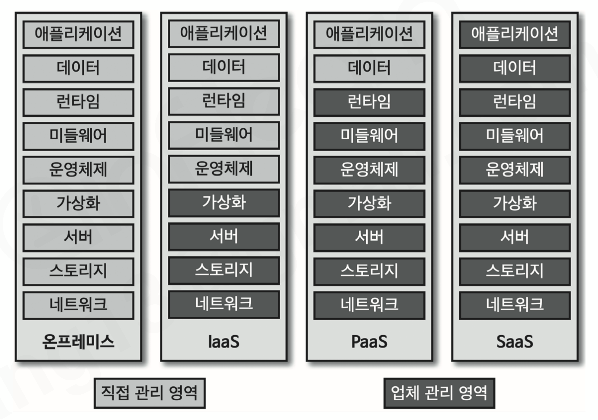
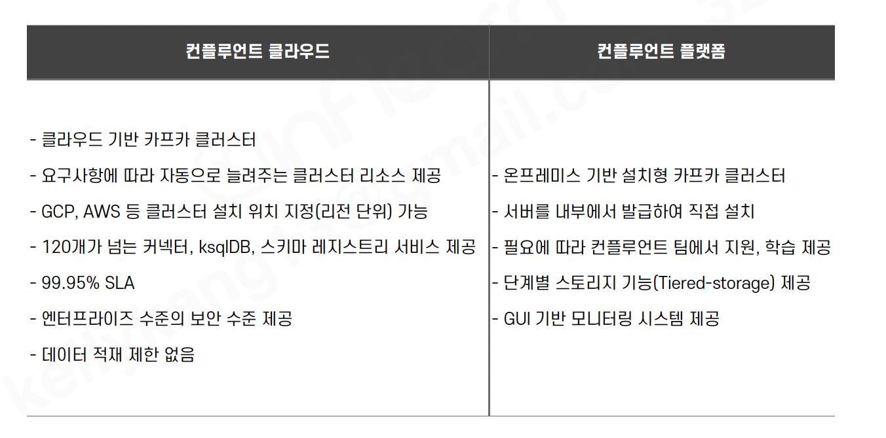

# 섹션 4. 카프카 클러스터 운영

> 📅 학습일: 2026-07-25

## 1. 카프카 클러스터를 운영하는 방법

- 카프카 클러스터를 서버에 **직접 설치**하는 것이 가장 전통적인 방법. 세부 설정을 직접 컨트롤해 최적의 성능을 낼 수 있음
- 다만 최적화하려면 노하우가 필요하고, 보안·모니터링 도구 선택 등에서 시행착오가 많음
- 시행착오를 줄이고 빠르게 안전한 클러스터를 쓰고 싶다면 **SaaS(Software-as-a-Service)** 도입을 고려할 수 있음

---

## 2. 운영 방법에 따른 서비스 형태들

- SaaS: 클라우드 업체가 소프트웨어+인프라를 관리해주는 형태. 사용자는 웹 대시보드/CLI로 세부 설정만 함
- 스택(애플리케이션 ~ 네트워크) 중 **어디까지 직접 관리하고 어디부터 업체가 관리하는지**에 따라 4가지로 구분

| 서비스 종류 | 특징 | 카프카 운영 방법 |
| --- | --- | --- |
| **온프레미스** | 자체 전산실에 직접 설치, 커스터마이징 자유롭지만 초기·유지보수 비용 발생 | 물리장비 구매·OS 설치 후 오픈소스 카프카 또는 기업용 카프카(컨플루언트 플랫폼 등) 직접 설치 |
| **IaaS** | 물리/가상 컴퓨팅 리소스를 발급받아 사용. OS·앱은 사용자가 직접 설정 | AWS·GCP 등에서 리소스 발급 후 오픈소스/기업용 카프카 설치 |
| **PaaS** | 앱 개발·실행 환경 제공, 컴퓨팅 리소스 관리는 신경 쓸 필요 없음 | (카프카 운영에서는 주로 IaaS·SaaS가 논의 대상) |
| **SaaS** | 소프트웨어 배포·실행까지 업체가 관리, 기능만 사용 | **컨플루언트 클라우드**, **AWS MSK**가 대표적. ksqlDB·모니터링 등 주변 생태계도 옵션 제공 |

---

## 3. 오픈 소스 카프카를 직접 설치하여 운영하는 경우

- IaaS/온프레미스 + 오픈소스 카프카 설치가 가장 흔한 방식. 대용량 데이터를 파일 시스템에 저장하므로 **고성능 하드웨어** 필요
- 컨플루언트 권장 상용 환경 스펙: 
  - 메모리 32GB(힙 6GB, 나머지는 페이지 캐시) · CPU 24core(SSL 등 보안 사용 시 더 필요) · 디스크 RAID 10(**NAS 금지**) · 파일시스템 XFS/ext4

| 항목 | 개발용 클러스터 | 상용 클러스터 |
| --- | --- | --- |
| 브로커 개수 | 5개 | 10개 |
| 메모리 | 16GB (heap 6GB) | 32GB (heap 6GB) |
| CPU | 16core | 24core |
| 디스크 | 사용량에 따라 다름 | 사용량에 따라 다름 |

---

## 4. 클라우드 서비스 - 컨플루언트

- **컨플루언트**: 카프카 창시자 **제이 크렙스**가 링크드인 퇴사 후 설립. 기업가치 약 50억 달러(≈6조 원). 스키마 레지스트리, ksqlDB 등 오픈소스로 카프카 생태계 확장을 주도

## 5. 클라우드 서비스 - AWS MSK
- AWS MSK(Managed Streaming for Apache Kafka): AWS의 SaaS형 카프카. 대시보드로 클러스터 생성·업데이트·삭제, TLS 인증 지원
- 카프카 버전을 직접 선택할 수 있어 기존 클라이언트와 버전 이슈 없이 사용 가능
- AWS 인프라 내에 구축되므로 AWS를 이미 쓰는 기업이 연동하기 쉬움

---

## 6. SaaS로 카프카 클러스터를 운영할 경우 장점

### 장점

- **인프라 관리 효율화**: 서버 장애 감지·복구, 브로커 개수 조정(스케일 아웃)을 SaaS가 자동 처리 → 3대 이상 서버를 직접 모니터링할 필요 없음
- **모니터링 대시보드 제공**: 어떤 지표를 어떻게 수집할지 고민할 필요 없이, 자동 수집된 지표를 클릭 몇 번으로 시각화
- **보안 설정**: SSL/SASL/ACL 등을 직접 고르고 설정하는 대신, 클러스터 생성 시 기본 보안 설정을 제공

### 단점

- **서비스 사용 비용**: 업체 요금제 적용으로 직접 서버 운영보다 비용이 높음
  - 예) AWS MSK 3대(`kafka.m5.xlarge`, CPU 4/메모리 16G): 월 약 1,080달러(≈120만 원)
  - 동일 사양 직접 발급(`m5.xlarge`) 3대: 월 약 504달러(≈60만 원) → **직접 운영이 2배 이상 저렴** (스토리지·데이터 전송료는 별도)

- **커스터마이징 제한**: 인프라~설치까지 자동화·표준화되어 있어 세부 설정 변경이 어려움. **멀티 클라우드/하이브리드 클라우드 구성 불가능**

- **클라우드 종속성**: 한번 선택한 업체에 클러스터·애플리케이션이 종속됨. 업체 변경이나 온프레미스 이전 시 비용·리스크 발생

---

## 7. 그럼에도 불구하고 SaaS형 카프카를 사용하는 것이 나은 경우는?

- **운영 노하우가 부족한 상태에서 빠르게 클러스터를 구축**해야 할 때 최선의 선택지가 될 수 있음
- 단, SaaS도 결국 카프카이므로 기본적인 이해 없이는 세부 운영에서 어려움을 겪을 수 있음(카프카에 대한 이해가 있을수록 SaaS도 더 효과적으로 활용 가능)
- 도입 전에 **운영 인력의 이해도, 구축 비용, 향후 운영 이슈**를 다각도로 검토해야 함

---

## 섹션 요약

- 아파치 카프카는 직접 설치하거나 SaaS형으로 운영하는 방법이 있다.
- 서비스 운영 형태는 온프레미스, IaaS, PaaS, SaaS가 있다.
- 온프레미스 또는 IaaS에서 오픈소스 카프카를 설치하거나 기업용 설치형 카프카를 사용할 수 있다.
- 대표적인 카프카 클러스터 SaaS 서비스로 AWS MSK와 컨플루언트 클라우드가 있다.
- SaaS로 운영할 경우 인프라 관리 효율화, 모니터링 대시보드 제공, 기본 보안 설정과 같은 장점이 있다.
- SaaS로 운영할 경우 서비스 사용 비용, 커스터마이징의 제한, 종속성과 같은 단점이 있다.