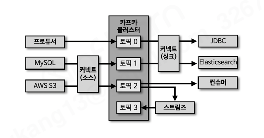
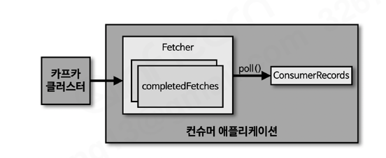
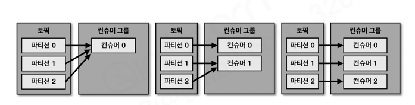
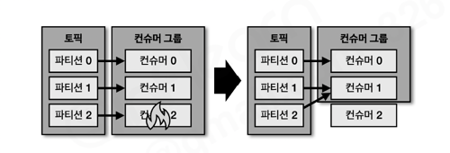
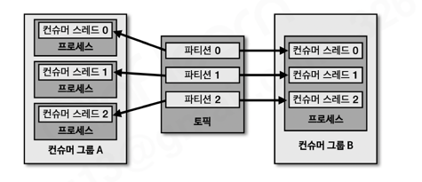
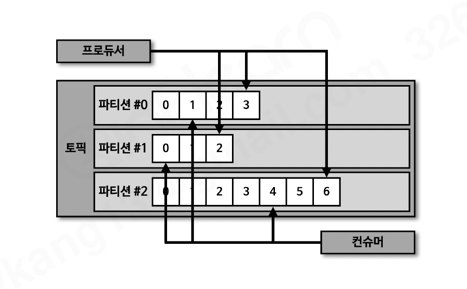
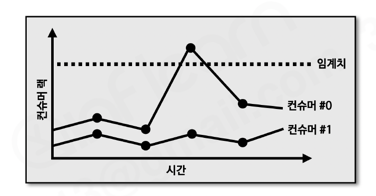
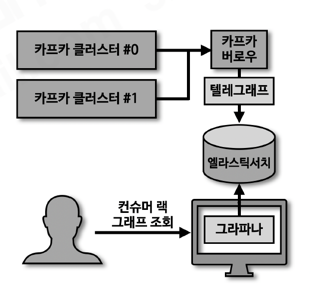

# 섹션 7. 카프카 컨슈머 애플리케이션 개발

> 📅 학습일: 2026-08-02

## 1. 컨슈머 소개

- 프로듀서가 전송한 데이터는 카프카 브로커에 적재됨. 컨슈머는 적재된 데이터를 사용하기 위해 브로커로부터 데이터를 가져와서 필요한 처리를 함
- 예) 마케팅 문자를 고객에게 보내는 기능이 있다면, 컨슈머는 토픽으로부터 고객 데이터를 가져와서 문자 발송 처리를 하게 됨

---

## 2. 컨슈머 내부 구조

- **Fetcher**: 리더 파티션으로부터 레코드들을 미리 가져와서 대기
- **poll()**: Fetcher에 있는 레코드들을 리턴하는 메서드
- **ConsumerRecords**: 처리하고자 하는 레코드들의 모음. 오프셋이 포함되어 있음

---

## 3. 컨슈머 그룹

- 컨슈머 그룹으로 운영하는 방법은 컨슈머를 각 컨슈머 그룹으로부터 격리된 환경에서 안전하게 운영할 수 있도록 도와주는 카프카의 독특한 방식
- 컨슈머 그룹으로 묶인 컨슈머들은 토픽의 1개 이상 파티션에 할당되어 데이터를 가져갈 수 있음. **1개의 파티션은 최대 1개의 컨슈머에만 할당** 가능하고, **1개의 컨슈머는 여러 개의 파티션에 할당**될 수 있음
- 이러한 특징으로 **컨슈머 그룹의 컨슈머 개수는 가져가고자 하는 토픽의 파티션 개수보다 같거나 작아야** 함
  - 컨슈머 개수가 파티션 개수보다 많으면, 초과된 컨슈머는 파티션을 할당받지 못하고 유휴 상태로 남아 스레드만 차지하는 불필요한 컨슈머가 됨
- **컨슈머 그룹을 활용하는 이유**: 서로 다른 컨슈머 그룹으로 묶인 컨슈머는 서로 격리되어 동작함. 예를 들어 같은 토픽을 엘라스틱서치 적재용 컨슈머 그룹과 하둡 적재용 컨슈머 그룹으로 나눠서 구독하면, 한쪽 저장소(예: 엘라스틱서치)에 장애가 발생해도 다른 쪽(하둡) 적재는 영향받지 않고 계속 처리됨. 장애가 해소되면 마지막으로 적재 완료한 데이터 이후부터 다시 적재를 수행해 정상화됨

---

## 4. 리밸런싱

- 컨슈머 그룹으로 이루어진 컨슈머 중 일부에 장애가 발생하면, 장애가 발생한 컨슈머에 할당된 파티션은 장애가 발생하지 않은 컨슈머로 소유권이 넘어감. 이 과정을 **리밸런싱(rebalancing)**이라 부름
- 리밸런싱이 일어나는 두 가지 상황: ① 컨슈머가 추가되는 상황 ② 컨슈머가 제외되는 상황
- 이슈가 발생한 컨슈머를 컨슈머 그룹에서 제외해 모든 파티션이 지속적으로 데이터를 처리할 수 있도록 가용성을 높여줌
- 리밸런싱은 컨슈머가 데이터를 처리하는 도중 언제든지 발생할 수 있으므로, 데이터 처리 중 발생한 리밸런싱에 대응하는 코드를 작성해야 함

---

## 5. 커밋

- 컨슈머는 카프카 브로커로부터 데이터를 어디까지 가져갔는지 **커밋(commit)**을 통해 기록함
- 특정 토픽의 파티션을 어떤 컨슈머 그룹이 몇 번째까지 가져갔는지는 카프카 브로커 내부에서 사용되는 내부 토픽(`__consumer_offsets`)에 기록됨
- 컨슈머 동작 이슈로 `__consumer_offsets` 토픽에 오프셋 커밋이 기록되지 못했다면 데이터 처리의 중복이 발생할 수 있음 → 컨슈머 애플리케이션이 오프셋 커밋을 정상적으로 처리했는지 검증해야 함

---

## 6. 어사이너(Assignor)

- 컨슈머와 파티션의 할당 정책은 컨슈머의 **어사이너**에 의해 결정됨. 카프카는 `RangeAssignor`, `RoundRobinAssignor`, `StickyAssignor`를 제공하며, 카프카 2.5.0 기준 `RangeAssignor`가 기본값
- `RangeAssignor`: 각 토픽에서 파티션을 숫자로 정렬, 컨슈머를 사전 순서로 정렬하여 할당
- `RoundRobinAssignor`: 모든 파티션을 컨슈머에서 번갈아가면서 할당
- `StickyAssignor`: 최대한 파티션을 균등하게 배분하면서 할당

---

## 7. 컨슈머 주요 옵션

### 필수 옵션

- `bootstrap.servers`: 접속할 카프카 클러스터에 속한 브로커의 host:port를 1개 이상 작성. 2개 이상 입력하면 일부 브로커 이슈가 있어도 접속에 문제없도록 설정 가능
- `key.deserializer` / `value.deserializer`: 레코드의 메시지 키 / 메시지 값을 역직렬화하는 클래스를 지정

### 선택 옵션

- `group.id`: 컨슈머 그룹 아이디. `subscribe()` 메서드로 토픽을 구독하여 사용할 때는 필수로 넣어야 함. 기본값 `null`
- `enable.auto.commit`: 자동/수동 커밋 여부 선택. 기본값 `true`
- `auto.commit.interval.ms`: 자동 커밋일 경우 오프셋 커밋 간격. 기본값 `5000`(5초)
- `max.poll.records`: `poll()`을 통해 반환되는 레코드 개수. 기본값 `500`
- `session.timeout.ms`: 컨슈머가 브로커와 연결이 끊기는 최대 시간. 기본값 `10000`(10초)
- `heartbeat.interval.ms`: 하트비트를 전송하는 시간 간격. 기본값 `3000`(3초)
- `max.poll.interval.ms`: `poll()`을 호출하는 간격의 최대 시간. 기본값 `300000`(5분)
- `isolation.level`: 트랜잭션 프로듀서가 레코드를 트랜잭션 단위로 보낼 경우 사용

### auto.offset.reset

컨슈머 그룹이 특정 파티션을 읽을 때 **저장된 컨슈머 오프셋이 없는 경우** 어느 오프셋부터 읽을지 선택하는 옵션 (이미 커밋된 오프셋이 있다면 이 옵션값은 무시됨). 기본값 `latest`

| 값 | 동작 |
| --- | --- |
| `latest` | 가장 높은(가장 최근에 넣은) 오프셋부터 읽기 시작 |
| `earliest` | 가장 낮은(가장 오래전에 넣은) 오프셋부터 읽기 시작 |
| `none` | 컨슈머 그룹의 커밋 기록을 찾아 있으면 그 이후부터, 없으면 오류 반환 |

---

## 8. 컨슈머 애플리케이션 개발하기

컨슈머 API를 사용하려면 카프카 공식 자바 클라이언트 라이브러리(`kafka-clients`)를 프로젝트 의존성으로 추가해야 함.

### 기본 컨슈머

```java
Properties configs = new Properties();
configs.put(ConsumerConfig.BOOTSTRAP_SERVERS_CONFIG, BOOTSTRAP_SERVERS);
configs.put(ConsumerConfig.GROUP_ID_CONFIG, GROUP_ID);
configs.put(ConsumerConfig.KEY_DESERIALIZER_CLASS_CONFIG, StringDeserializer.class.getName());
configs.put(ConsumerConfig.VALUE_DESERIALIZER_CLASS_CONFIG, StringDeserializer.class.getName());

KafkaConsumer<String, String> consumer = new KafkaConsumer<>(configs);
consumer.subscribe(Arrays.asList(TOPIC_NAME));

while (true) {
    ConsumerRecords<String, String> records = consumer.poll(Duration.ofSeconds(1));
    for (ConsumerRecord<String, String> record : records) {
        logger.info("record:{}", record);
    }
}
```

### 수동 커밋 컨슈머

- **동기 오프셋 커밋**: `poll()` 이후 `commitSync()`를 호출해 명시적으로 커밋. 받은 모든 레코드의 처리가 끝난 이후 호출해야 함 (레코드 단위로 커밋하려면 `TopicPartition`/`OffsetAndMetadata`를 담아 `commitSync(Map)` 형태로 호출)
- **비동기 오프셋 커밋**: 동기 커밋은 응답을 기다리는 동안 처리가 일시 중단되므로, 더 많은 데이터를 처리하려면 `commitAsync()` 사용. 콜백(`OffsetCommitCallback`)으로 커밋 성공/실패 여부를 확인 가능

```java
consumer.commitSync();          // 동기
consumer.commitAsync();         // 비동기
```

### 리밸런스 리스너를 가진 컨슈머

- 리밸런스 발생을 감지하기 위해 `ConsumerRebalanceListener` 인터페이스를 지원. 구현 클래스는 `onPartitionsAssigned()`, `onPartitionsRevoked()` 메서드로 구성됨
- `onPartitionsAssigned()`: 리밸런스가 끝난 뒤 파티션 할당이 완료되면 호출
- `onPartitionsRevoked()`: 리밸런스가 시작되기 직전에 호출됨. 마지막으로 처리한 레코드를 기준으로 커밋하려면 이 메서드에 커밋을 구현하면 됨

### 파티션 할당 컨슈머

- `subscribe()` 대신 `assign()`을 사용하면 컨슈머 그룹/리밸런싱 없이 원하는 토픽의 특정 파티션을 직접 지정해서 소비 가능

```java
consumer.assign(Collections.singleton(new TopicPartition(TOPIC_NAME, PARTITION_NUMBER)));
```

### 컨슈머의 안전한 종료

- 정상적으로 종료되지 않은 컨슈머는 세션 타임아웃이 발생할 때까지 컨슈머 그룹에 남게 됨
- `KafkaConsumer`는 `wakeup()` 메서드를 지원. `wakeup()` 실행 후 `poll()`이 호출되면 `WakeupException`이 발생하며, 이 예외를 받은 뒤 사용한 자원을 해제하면 됨 (보통 셧다운 훅에서 `wakeup()`을 호출하고, `try/catch(WakeupException)/finally { consumer.close(); }` 형태로 처리)

## 정리

- 컨슈머는 토픽에 저장된 데이터를 가져가서 처리하는 용도로 활용됨
- 컨슈머 그룹은 1개 이상의 컨슈머로 구성됨
- 컨슈머 그룹의 컨슈머 개수는 파티션 개수와 같거나 적어야 최대의 효율을 낸다
- 서로 다른 컨슈머 그룹은 데이터 처리에 영향을 미치지 않는다
- 컨슈머와 파티션의 재할당 과정을 리밸런싱이라 부른다
- 컨슈머가 어느 레코드까지 읽었는지 기록하기 위해 오프셋을 기록(커밋)한다

---

## 9. 멀티스레드 컨슈머

- 카프카는 처리량을 늘리기 위해 파티션과 컨슈머 개수를 늘려서 운영할 수 있음. 파티션을 여러 개로 운영하는 경우 데이터를 병렬 처리하기 위해서 **파티션 개수와 컨슈머 개수를 동일하게 맞추는 것**이 가장 좋은 방법
- 토픽의 파티션이 n개라면, 동일 컨슈머 그룹으로 묶인 컨슈머 스레드를 최대 n개 운영할 수 있음 → n개의 스레드를 가진 1개의 프로세스를 운영하거나, 1개의 스레드를 가진 프로세스를 n개 운영하는 방법 모두 가능

---

## 10. 컨슈머 랙

- **컨슈머 랙(LAG)**: 파티션의 최신 오프셋(LOG-END-OFFSET)과 컨슈머 오프셋(CURRENT-OFFSET) 간의 차이. 프로듀서는 계속해서 새로운 데이터를 파티션에 저장하고 컨슈머는 자신이 처리할 수 있는 만큼 데이터를 가져감
- 컨슈머 랙은 컨슈머가 정상 동작하는지 여부를 확인할 수 있는 지표이므로, 컨슈머 애플리케이션 운영 시 **필수적으로 모니터링**해야 함
- 컨슈머 랙은 **컨슈머 그룹과 토픽, 파티션별로** 생성됨 (예: 토픽 1개에 파티션 3개, 컨슈머 그룹 1개가 구독 중이면 컨슈머 랙은 총 3개)
- **처리량과의 관계**: 프로듀서가 보내는 데이터양이 컨슈머의 데이터 처리량보다 크면 컨슈머 랙은 늘어나고, 적으면 줄어들며 최솟값은 0(지연 없음)
- 예) 내비게이션 사용자 데이터 프로듀서의 경우, 명절 등 트래픽 급증 시점엔 컨슈머의 최대 처리량이 한정돼 있어 랙이 발생할 수 있음 → 일시적으로 파티션 개수와 컨슈머 개수를 늘려 병렬 처리량을 늘리는 방법으로 지연을 줄일 수 있음
- **처리량이 일정한데도 랙이 증가**한다면 컨슈머 자체의 장애(파티션에 할당된 컨슈머의 이슈)를 의심할 수 있음

---

## 11. 컨슈머 랙을 모니터링하는 방법

1. **카프카 명령어 사용**: `kafka-consumer-groups.sh --group <name> --describe`로 컨슈머 그룹의 랙을 조회. 일회성 확인에 그쳐 지속적인 기록·모니터링에는 부족 → 테스트용으로 주로 사용

   ```
   bin/kafka-consumer-groups.sh --bootstrap-server my-kafka:9092 --group my-group --describe
   ```

2. **`metrics()` 메서드 사용**: 컨슈머 인스턴스의 `metrics()`로 `records-lag-max`, `records-lag`, `records-lag-avg` 지표 확인 가능
   - 단점: 컨슈머가 정상 동작할 때만 호출되므로 비정상 종료 시 모니터링 불가 / 모든 컨슈머 애플리케이션에 모니터링 코드를 중복 작성해야 함 / 서드파티 컨슈머 애플리케이션에는 적용 불가
3. **외부 모니터링 툴 사용**: 데이터 독(Datadog), 컨플루언트 컨트롤 센터 같은 카프카 클러스터 종합 모니터링 툴, 또는 컨슈머 랙 전용 오픈소스 툴인 **버로우(Burrow)** 사용 — 가장 권장되는 방법

---

## 12. 카프카 버로우

- 링크드인에서 개발해 오픈소스로 공개한 **컨슈머 랙 체크 툴**. REST API를 통해 컨슈머 그룹별 컨슈머 랙을 확인 가능
- 여러 카프카 클러스터를 동시에 연결해 랙을 확인할 수 있어, 클러스터를 2개 이상 운영하는 기업 환경에서 한 번의 설정으로 다수 클러스터의 컨슈머 랙을 확인할 수 있는 장점이 있음
- 클러스터와 별개로 지표를 수집하므로 프로듀서·컨슈머 동작에 영향을 주지 않음

### REST API (주요 엔드포인트)

| 메서드 | 경로 | 설명 |
| --- | --- | --- |
| GET | `/burrow/admin` | 버로우 헬스 체크 |
| GET | `/v3/kafka` | 연동 중인 카프카 클러스터 리스트 |
| GET | `/v3/kafka/{클러스터}/consumer` | 클러스터의 컨슈머 그룹 리스트 |
| GET | `/v3/kafka/{클러스터}/consumer/{그룹}` | 컨슈머 그룹의 랙·오프셋 정보 조회 |
| GET | `/v3/kafka/{클러스터}/consumer/{그룹}/lag` | 컨슈머 그룹의 파티션 정보·상태·랙 조회 |
| GET | `/v3/kafka/{클러스터}/topic/{토픽}` | 토픽 상세 조회 |

### 컨슈머 랙 평가(Evaluation)

- 버로우는 단순 임계치(threshold) 대신 **슬라이딩 윈도우(sliding window)** 계산으로 파티션·컨슈머의 상태를 표현 → 일시적으로 임계치를 넘는 것만으로 이슈로 단정하지 않음
- 파티션 상태: `OK`, `STALLED`, `STOPPED` / 컨슈머 상태: `OK`, `WARNING`, `ERROR`

| 상황 | 파티션 상태 | 컨슈머 상태 | 설명 |
| --- | --- | --- | --- |
| 정상 | OK | OK | 랙이 늘었다 줄었다를 반복하며 최솟값 0으로 수렴 |
| 컨슈머 처리량 이슈 | OK | WARNING | 최신 오프셋 증가 속도를 컨슈머 오프셋이 못 따라가 랙이 지속 증가 (컨슈머 처리량 < 프로듀서 전송량) |
| 컨슈머 장애 | STALLED | ERROR | 최신 오프셋은 계속 증가하는데 컨슈머 오프셋이 멈춤 → 컨슈머가 더 이상 데이터를 가져가지 않는 상태. 즉각 알람·조치 필요 |

### 모니터링 아키텍처 예시

버로우가 수집한 랙 데이터를 지속적으로 기록·조회하려면 별도 저장소·대시보드가 필요: **버로우 → 텔레그래프(telegraf) → 엘라스틱서치 → 그라파나**로 이어지는 무료 구성을 활용할 수 있음.

## 정리

- 컨슈머 랙은 파티션의 최신 오프셋과 컨슈머 오프셋 간의 차이다
- 컨슈머 랙은 컨슈머 애플리케이션을 운영할 때 반드시 모니터링 해야한다
- 컨슈머 랙은 파티션 별로 컨슈머 그룹별로 생성된다
- 컨슈머 처리량보다 프로듀서의 전송량이 많을 경우 컨슈머 랙이 반드시 발생한다
- 카프카 명령어 또는 metrics() 메서드를 사용하면 컨슈머 랙을 확인할 수 있다
- 컨슈머 랙을 확인하는 방법 중 하나는 외부 모니터링 툴인 버로우(burrow)를 확인하는 것이다
- 카프카 버로우는 시간 윈도우를 통해 컨슈머 랙을 평가한다
