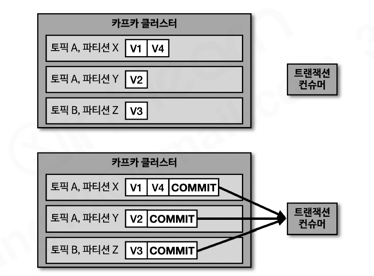

# 섹션 8. 멱등성 프로듀서, 트랜잭션 프로듀서와 컨슈머

> 📅 학습일: 2026-08-09

## 1. 전달 신뢰성

- **멱등성**이란 여러 번 연산을 수행하더라도 동일한 결과를 나타내는 것을 뜻함. 멱등성 프로듀서는 동일한 데이터를 여러 번 전송하더라도 카프카 클러스터에 단 한 번만 저장됨을 의미
- 기본 프로듀서의 동작 방식은 **적어도 한번 전달(at least once delivery)** 을 지원
  - 데이터가 유실되지는 않지만, 두 번 이상 적재될 가능성이 있어 중복이 발생할 수 있음

| 구분 | 의미 |
| --- | --- |
| At least once | 적어도 한번 이상 전달 (유실 없음, 중복 가능) |
| At most once | 최대 한번 전달 (중복 없음, 유실 가능) |
| Exactly once | 정확히 한번 전달 |

---

## 2. 멱등성 프로듀서

- 프로듀서가 보내는 데이터의 중복 적재를 막기 위해 0.11.0 이후 버전부터는 `enable.idempotence` 옵션으로 정확히 한번 전달(exactly once delivery)을 지원
- 기본값은 `false`이며, `true`로 설정하면 멱등성 프로듀서로 동작 (**카프카 3.0.0부터는 기본값이 `true`(`acks=all`)로 변경**되므로 신규 버전에서는 유의)

```java
configs.put(ProducerConfig.ENABLE_IDEMPOTENCE_CONFIG, true);
```

### 동작 방식

- 멱등성 프로듀서는 데이터를 브로커로 전달할 때 **프로듀서 PID(Producer unique ID)** 와 **시퀀스 넘버(sequence number)** 를 함께 전달함
- 브로커는 PID와 시퀀스 넘버를 확인해서, 동일한 메시지의 적재 요청이 다시 오더라도(예: acks 응답 유실로 인한 재전송) 단 한 번만 데이터를 적재함
  - **PID**: 프로듀서의 고유한 ID
  - **SID**: 레코드의 전달 번호 ID
- 즉, 정말 한 번만 전송하는 것이 아니라 프로듀서가 여러 번 전송하되 브로커가 PID+시퀀스 넘버로 중복을 걸러내는 방식

### 한계

- 멱등성 프로듀서는 **동일한 세션(PID의 생명주기)에서만** 정확히 한번 전달을 보장함
- 프로듀서 애플리케이션에 이슈가 발생해 종료되고 재시작하면 PID가 달라짐 → 동일한 데이터를 다시 보내도 브로커는 다른 프로듀서가 보낸 다른 데이터로 판단 → **장애가 발생하지 않을 경우에만** 정확히 한 번 적재를 보장한다는 한계가 있음

### 멱등성 프로듀서로 설정할 경우 옵션

- `enable.idempotence=true`로 설정하면 정확히 한번 적재 로직 성립을 위해 일부 옵션이 강제로 설정됨
  - `retries` 기본값 `Integer.MAX_VALUE`
  - `acks` 값 `all`
- 이는 프로듀서가 적어도 한 번 이상 브로커에 데이터를 보냄으로써 단 한 번만 적재되는 것을 보장하기 위함

### 사용 시 오류 확인

- 멱등성 프로듀서의 시퀀스 넘버는 0부터 시작해 1씩 증가한 값이 전달됨
- 브로커가 PID와 시퀀스 넘버를 확인하는 과정에서 시퀀스 넘버가 예상과 다르면 **`OutOfOrderSequenceException`** 이 발생할 수 있음
- 이 예외가 발생하면 시퀀스 넘버의 역전 현상이 생길 수 있으므로, 순서가 중요한 데이터를 전송하는 프로듀서는 이 예외 발생 시 대응 방안을 고려해야 함

---

## 3. 트랜잭션 프로듀서, 컨슈머

- 카프카에서 **트랜잭션**은 다수의 파티션에 데이터를 저장할 때 모든 데이터에 대해 동일한 **원자성(atomic)** 을 만족시키기 위해 사용됨
- 다수의 데이터를 동일 트랜잭션으로 묶어서 전체를 처리하거나 전체를 처리하지 않도록 함

### 트랜잭션 프로듀서의 동작

- 사용자가 보낸 데이터를 레코드로 파티션에 저장할 뿐 아니라, 트랜잭션의 시작과 끝을 표현하기 위해 **트랜잭션 레코드(COMMIT)** 를 한 개 더 보냄
- 여러 파티션에 나눠 전송한 레코드들 뒤에 각각 COMMIT 레코드가 기록되면 트랜잭션이 완료된 것으로 간주

### 트랜잭션 컨슈머의 동작


- 트랜잭션 컨슈머는 파티션에 저장된 트랜잭션 레코드(COMMIT)를 보고 트랜잭션이 완료(commit)되었음을 확인한 뒤에 데이터를 가져감
- 트랜잭션 레코드는 실질적인 데이터는 가지고 있지 않으며, 트랜잭션이 끝난 상태를 표시하는 정보만 가지고 있음

### 트랜잭션 프로듀서 설정

- `transactional.id`를 설정해야 트랜잭션 프로듀서로 동작 (프로듀서별로 고유한 ID 값 사용). `initTransactions() → beginTransaction() → send() → commitTransaction()` 순서로 수행

```java
configs.put(ProducerConfig.TRANSACTIONAL_ID_CONFIG, UUID.randomUUID());
Producer<String, String> producer = new KafkaProducer<>(configs);

producer.initTransactions();
producer.beginTransaction();
producer.send(new ProducerRecord<>(TOPIC, "전달하는 메시지 값"));
producer.commitTransaction();
producer.close();
```

### 트랜잭션 컨슈머 설정

- 커밋이 완료된 레코드들만 읽기 위해 `isolation.level`을 `read_committed`로 설정해야 함
- 기본값은 `read_uncommitted`로, 트랜잭션 프로듀서가 레코드를 보낸 후 커밋 여부와 상관없이 모두 읽음. `read_committed`로 설정한 컨슈머는 커밋이 완료된 레코드들만 읽어 처리함

```java
configs.put(ConsumerConfig.ISOLATION_LEVEL_CONFIG, "read_committed");
KafkaConsumer<String, String> consumer = new KafkaConsumer<>(configs);
```

---

## 정리

- 전달 신뢰성은 적어도 한번, 최대 한번, 정확히 한번이 있다.
- 멱등성 프로듀서를 사용하면 프로듀서에서 브로커로 딱 1번 레코드를 전송할 수 있다.
- 트랜잭션 프로듀서, 컨슈머를 사용하면 여러 레코드를 하나의 원자(atomic)로 묶어 보낼 수 있다.

---

## 궁금한 점 (Q&A)

**Q. 트랜잭션 컨슈머는 COMMIT 레코드가 없으면 데이터를 안 가져가는데, 프로듀서가 커밋 레코드를 안 붙이고 죽으면 컨슈머는 무한대기할까?**

A. 프로듀서 옵션 `transaction.timeout.ms`(기본값 60초)가 있어서, `beginTransaction()` 이후 이 시간 안에 커밋도 어보트도 안 되면 브로커의 **트랜잭션 코디네이터**가 해당 트랜잭션을 강제로 **abort**시키고 ABORT 마커를 파티션에 기록한다. `read_committed` 컨슈머는 아직 결론 나지 않은 트랜잭션의 오프셋(LSO, Last Stable Offset) 이후 데이터는 넘겨주지 않고 대기하는 구조인데, 이 타임아웃 덕분에 무한정 막히지 않고 어보트 마커가 찍히는 시점에 막혀있던 오프셋이 풀린다. 커밋되지 않은 레코드는 애플리케이션에 전달되지 않고 스킵(폐기)된다.

**Q. 프로듀서가 재시작했을 때, 자신이 이전에 데이터만 넣고 커밋을 안 했다는 사실을 알고 커밋부터 이어서 진행하는지?**

A. 같은 `transactional.id`로 새 프로듀서 인스턴스가 `initTransactions()`를 호출하면, 브로커의 트랜잭션 코디네이터가 해당 ID로 아직 완료되지 않은 트랜잭션이 있는지 확인하고 있다면 **자동으로 abort** 처리한 뒤, 프로듀서 epoch를 올려(이전 죽은 인스턴스를 좀비로 펜싱) 새 트랜잭션을 시작할 수 있게 해준다. 즉 예전에 쓰다 만 데이터를 이어서 커밋하는 게 아니라, 새 인스턴스가 시작될 때 예전 트랜잭션 자체를 통째로 취소하고 새로 시작하는 방식이다. 이는 트랜잭션의 원자성(all or nothing) 원칙에 부합한다.

**Q. 프로듀서는 이전에 트랜잭션을 시작하고 커밋하지 않은 게 있다는 걸 모르고, 이걸 컨트롤 하는 주체는 브로커인가?**

A. 재시작된 프로듀서 인스턴스는 이전 프로세스가 무엇을 하다 죽었는지에 대한 정보를 전혀 갖고 있지 않다. 그냥 새로 뜬 객체일 뿐이다. 트랜잭션 상태(어떤 `transactional.id`가 트랜잭션을 열어놨는지, 현재 epoch, 관련된 파티션 목록, 타임아웃 등)는 전부 브로커 쪽 **트랜잭션 코디네이터** 가 내부 토픽(`__transaction_state`)에 저장·관리한다. 
새 프로듀서는 그저 "나는 `transactional.id=X`다, PID/epoch 달라"라고 요청할 뿐이고, 이전 트랜잭션을 정리(abort)할지 말지는 전적으로 브로커가 서버 사이드에서 판단하고 처리한다. 프로듀서 애플리케이션 코드가 관여하는 부분이 아니다.

**Q. `read_committed` 컨슈머일 때도 파티션 내부에서 데이터는 순서 보장이 되는 건지? (커밋된 데이터만 먼저 골라서 가져가는 방식은 아닌지?)**

A. 파티션 내 순서 보장은 `read_committed`에서도 예외 없이 지켜진다. 다만 그 방식이 "커밋된 것만 먼저 골라 가져간다"가 아니라 "미결 트랜잭션 지점에서 통째로 멈춘다"는 점이 핵심이다.
- `read_committed` 컨슈머는 **LSO(Last Stable Offset)** — 가장 먼저 열려 있는(아직 커밋/어보트되지 않은) 트랜잭션의 시작 오프셋 — 까지만 읽을 수 있다.
- 그 뒤에 이미 커밋된 데이터가 있더라도 순서를 건너뛰어 먼저 가져가지 않고, 앞의 미결 트랜잭션이 커밋되든 어보트되든 결론이 날 때까지 그 지점에서 대기한다.
- 결론이 나면(LSO가 전진하면) 그 뒤 데이터를 원래 오프셋 순서 그대로 전달하고, 어보트된 구간은 애플리케이션에 노출만 안 시킬 뿐 나머지 데이터의 상대적 순서는 그대로 유지된다.
- 즉 "파티션 내부는 순차적으로 쌓인다"는 카프카의 원칙은 트랜잭션 여부와 무관하게 항상 유지되며, 그 대가로 미결 트랜잭션이 있으면 컨슈머가 지연을 감수하는 구조다 (이 지연이 무한정 늘어나지 않도록 막아주는 것이 앞서 나온 `transaction.timeout.ms`).
