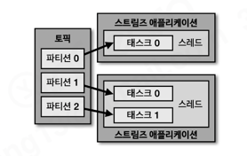
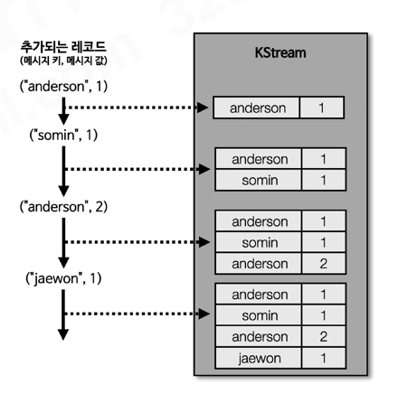
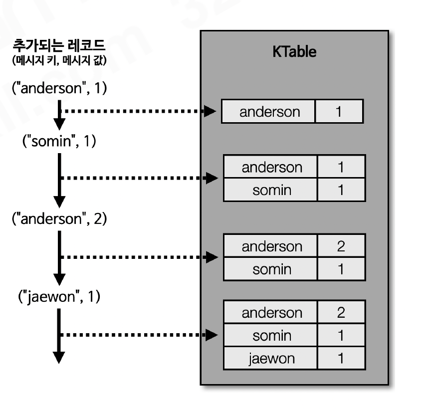
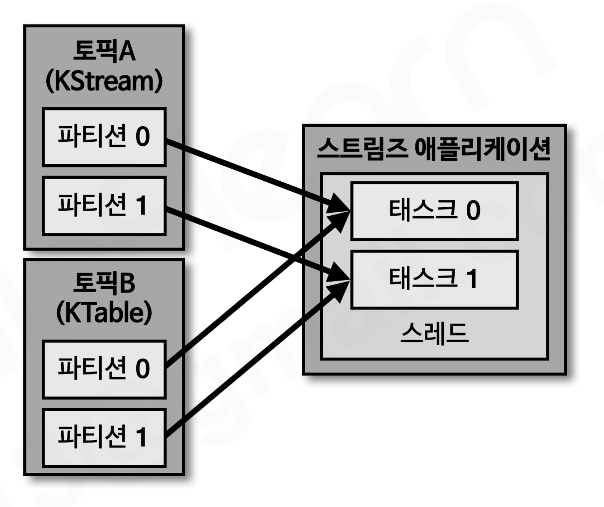
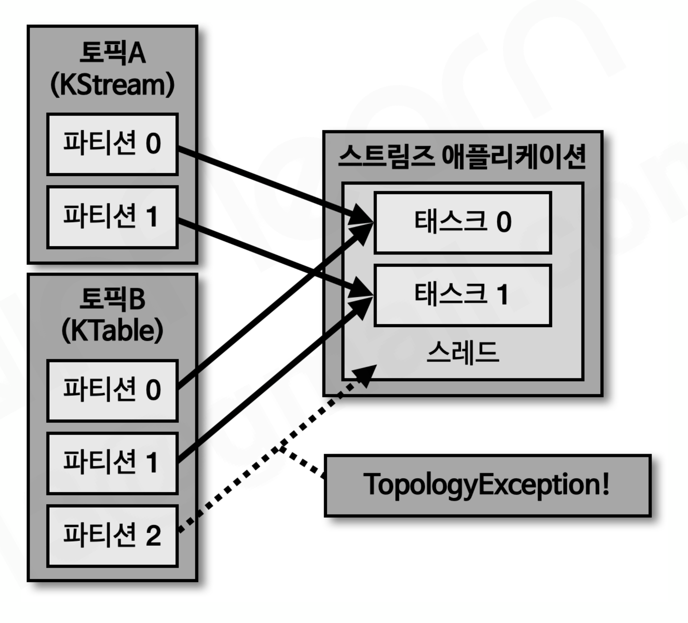
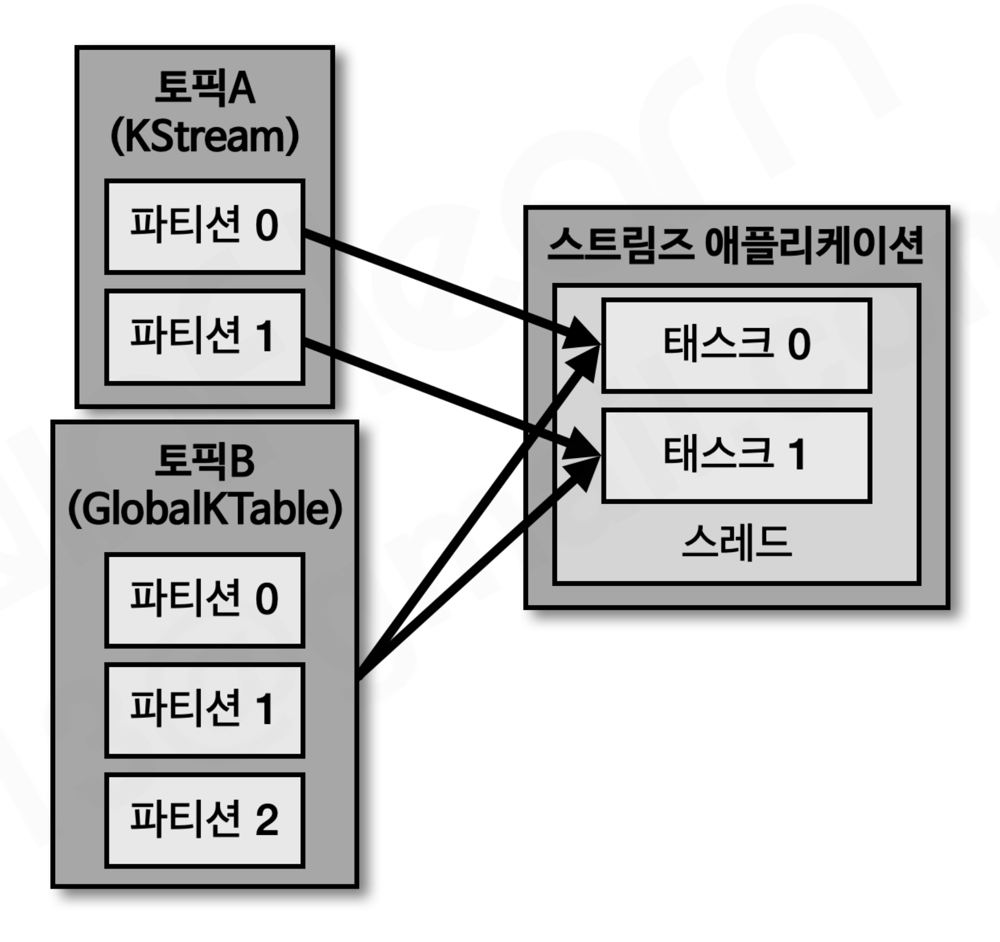

# 섹션 9. 카프카 스트림즈

> 📅 학습일: 2026-08-09

## 1. 카프카 스트림즈

- 토픽의 데이터를 실시간으로 변환해 다른 토픽에 적재하는 **카프카 공식 자바 라이브러리**. 장애가 나도 exactly-once를 보장하는 장애 허용 시스템을 갖춰 안정성이 높음
- 컨슈머+프로듀서 조합으로 비슷하게 만들 수도 있지만, 오프셋 관리·중복 방지·상태 저장 같은 배관 작업을 스트림즈가 대신 처리해줌
- 예외: **소스/싱크 토픽이 서로 다른 카프카 클러스터**에 있는 경우는 스트림즈가 지원하지 않으므로 이때만 컨슈머+프로듀서 조합을 사용

---

## 2. 스트림즈 내부 구조

- 스트림즈 애플리케이션은 스레드를 1개 이상 가지고, 스레드는 1개 이상의 **태스크(task)** 를 가짐
- 태스크는 처리 최소 단위로, **토픽의 파티션 개수만큼 생성**됨
- 컨슈머 스레드를 늘리는 것과 동일하게, **파티션 + 스트림즈 스레드(프로세스) 개수**를 늘려서 스케일 아웃 가능. 운영 환경에서는 장애 대비를 위해 2대 이상의 서버로 구성

---

## 3. 토폴로지와 프로세서

- 스트림즈는 데이터를 **토폴로지(노드+선으로 이루어진 트리 구조)** 로 처리. 
- 스트림즈에서 사용하는 토폴로지는 트리 형태와 유사
- 노드 = **프로세서**, 선 = **스트림**(토픽 데이터)
- 프로세서 3종류: 
    - **소스**(토픽에서 데이터 가져옴) → **스트림**(변환·분기 로직) → **싱크**(결과를 토픽에 저장)

---

## 4. 개발 방법: 스트림즈DSL과  프로세서API

- **스트림즈DSL**: filter, join, count 같은 기능을 API로 제공
    - 메시지 값을 기반으로 토픽 분기 처리
    - 지난 10분간 들어온 데이터의 개수 집계
- **프로세서API**: DSL에 없는 세밀한 로직이 필요할 때만 보완적으로 사용
    - 메시지 값에 따라 토픽을 가변적으로 전송
    - 일정한 시간 간격으로 데이터 처리

---

## 5. KStream, KTable, GlobalKTable

스트림즈DSL에서만 쓰이는, 레코드 흐름을 다루는 3가지 추상화 개념.

### 5-1. KStream

- 토픽의 **모든 레코드**를 이벤트 흐름 그대로 봄 (뉴스피드처럼)
- 메시지 키와 메시지 값으로 구성
- KStream 으로 데이터 조회 시 토픽에 존재하는 모든 레코드가 출력

### 5-2. KTable

- 메시지 키 기준으로 **가장 최신 레코드만** 유지 
- 데이터 적재 시 동일한 키가 있으면 업데이트로 간주

### 5-3. 코파티셔닝

- KStream과 KTable을 조인하려면 반드시 **코파티셔닝**되어 있어야 함
- 코파티셔닝: 조인하는 2개 데이터의 **파티션 개수** 가 동일하고, **파티셔닝 전략** 을 동일하게 맞추는 작업
- 코파티셔닝되어 있으면 동일한 메시지 키가 동일한 태스크에 들어가는 것이 보장되어 조인 가능

### 5-4. 코파티셔닝되지 않은 2개 토픽의 이슈

- 조인하려는 토픽들이 코파티셔닝되어 있음을 보장할 수 없음 (파티션 개수·전략이 다를 수 있음)
- 코파티셔닝되지 않은 토픽을 조인하는 로직을 실행하면 `TopologyException` 발생

### 5-5. GlobalKTable

- 코파티셔닝되지 않은 KStream과 KTable을 조인하고 싶다면 KTable을 **GlobalKTable**로 선언
- GlobalKTable은 데이터가 **모든 태스크에 동일하게 공유**되므로, 코파티셔닝 여부와 무관하게 조인 가능

---

## 6. 스트림즈DSL 주요 옵션

- **필수**: `bootstrap.servers`(클러스터 접속 정보), `application.id`(앱 구분용 고유 ID — 앱마다 달라야 함)
- **선택**: `default.key/value.serde`(직렬화 클래스, 기본 바이트), `num.stream.threads`(스레드 수, 기본 1), `state.dir`(상태 저장 경로, 기본 `/tmp/kafka-streams`)

---

## 7. 윈도우 연산

특정 시간 단위로 취합(집계)할 때 사용. **메시지 키 기준으로 취합**되므로 키가 없으면 사용 불가.

| 종류 | 특징 |
| --- | --- |
| 텀블링(Tumbling) | 겹치지 않는 고정 간격 (예: 매 5분간 접속자 수 측정하여 방문자 추이를 실시간 취합) |
| 호핑(Hopping) | 겹치는 고정 간격 — 같은 데이터가 여러 윈도우에 중복 집계될 수 있음 |
| 슬라이딩(Sliding) | 호핑과 비슷하지만 데이터의 정확한 시간을 바탕으로 윈도우 사이즈에 포함되는 데이터를 모든 연산에 포함 |
| 세션(Session) | 키별로 활동을 세션 단위로 묶음, 만료시간이 지나야 종료·집계 (크기 가변) |

- 주의: 스트림즈는 커밋 간격(기본 30초)마다 **윈도우가 끝나기 전에도 중간 결과를 출력**하므로, 같은 윈도우의 값이 여러 번 나올 수 있음 → 최종 결과가 필요하면 `Windowed` 키 기준으로 **덮어쓰기(upsert)** 방식으로 저장해야 함

---

## 8. 스트림즈DSL - Queryable store

- KTable은 카프카 토픽의 데이터를 내부적으로 로컬 **rocksDB**에 저장되므로, `ReadOnlyKeyValueStore`로 꺼내면 메시지 키로 즉시 조회 가능
- 카프카로 **로컬 캐시**를 구현한 것과 유사하다고 볼 수 있음

---

## 9. 프로세서API

- DSL에 없는 상세 로직이 필요할 때 `Processor`(다음 프로세서로 안 넘김) 또는 `Transformer`(넘김) 인터페이스를 직접 구현
- 단, 프로세서API에는 KStream/KTable/GlobalKTable 개념이 없음
- 다만 스트림즈 DSL과 프로세서API를 함께 구현하여 사용할 때는 활용 가능

---

## 10. 카프카 스트림즈 vs 스파크 스트리밍

- **카프카 스트림즈**: 카프카 토픽만 입력으로 받는 **경량** 프로세싱 (별도 클러스터 불필요, 자바 프로세스로 실행)
- **스파크 스트리밍**: 카프카 토픽을 포함한 하둡 생태계(HDFS, Hive 등) 전체를 입력으로 받는 **복잡한** 프로세싱 (Driver+Executor 클러스터 필요)

---

## 정리

- 카프카 스트림즈는 자바 라이브러리로 상태기반, 비상태기반 데이터 처리에 적합하다
- 상태기반 처리를 위해 rocksDB와 changelog 토픽을 생성한다
- 스트림즈DSL에는 KStream, KTable, GlobalKTable 개념이 포함되어 있다
- 프로세서API는 스트림즈DSL에 없는 기능을 활용하기 위해 사용된다
