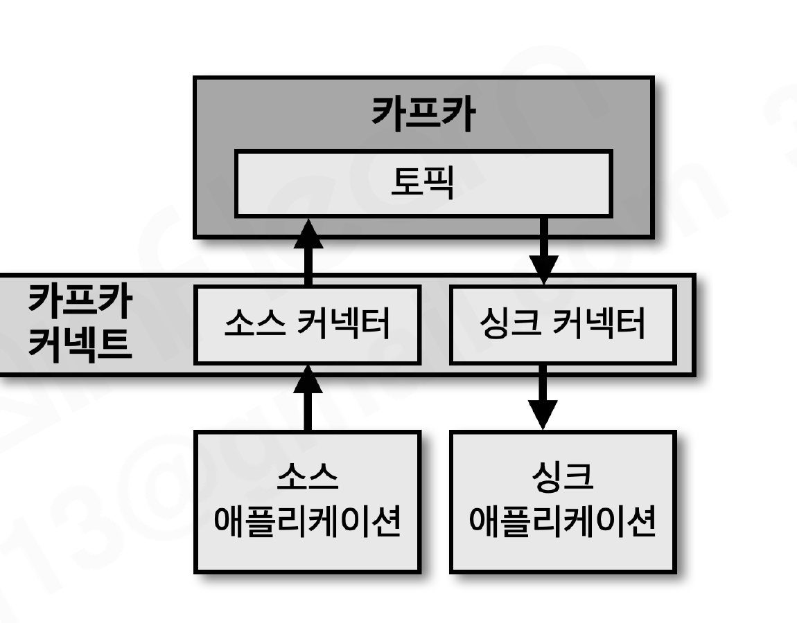
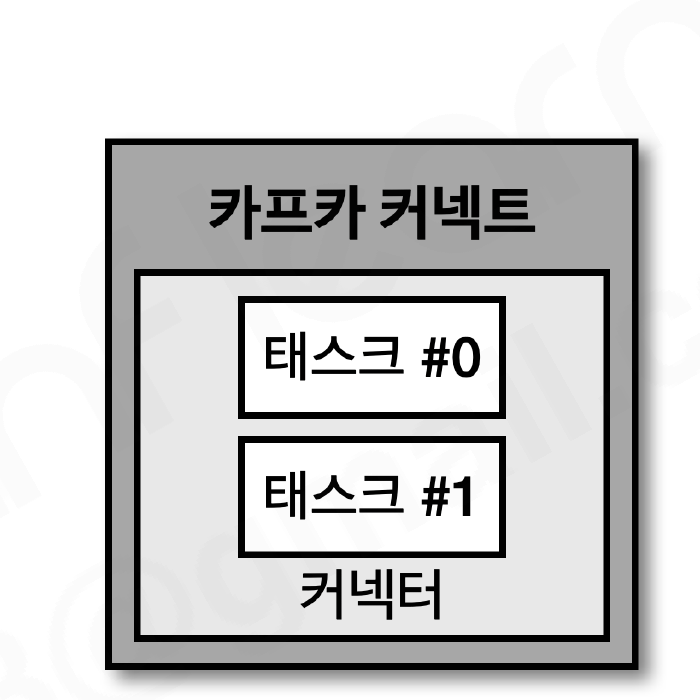
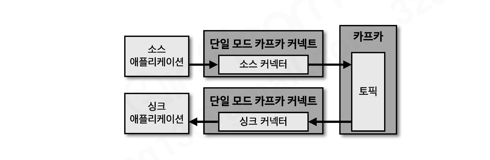
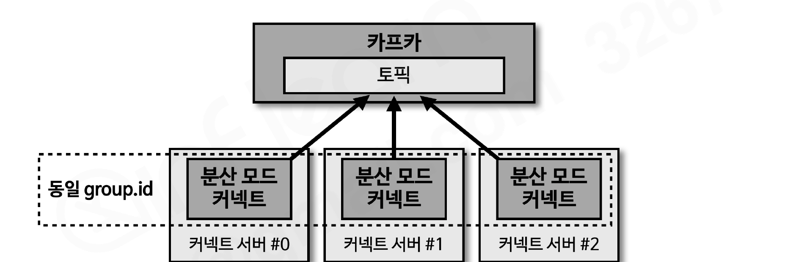
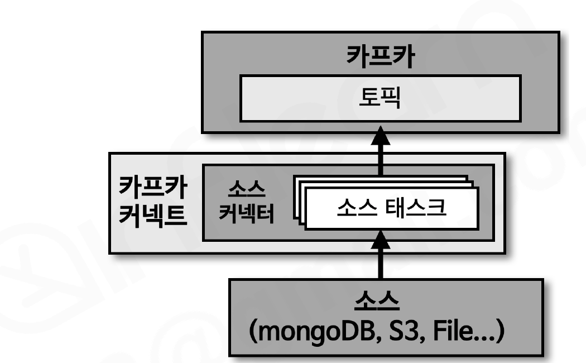
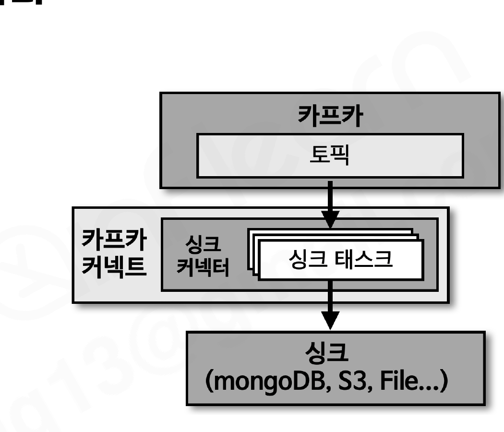

# 섹션 10. 카프카 커넥트

> 📅 학습일: 2026-08-23

## 1. 카프카 커넥트

- **카프카 커넥트(Kafka Connect)** 는 카프카 오픈소스에 포함된 툴로, 데이터 파이프라인 생성 시 반복 작업을 줄이고 효율적인 전송을 이루기 위한 애플리케이션
- 특정한 작업 형태를 템플릿으로 만들어놓은 **커넥터(connector)** 를 실행함으로써 반복적인 프로듀서/컨슈머 개발 작업을 줄일 수 있음



- 커넥터는 프로듀서 역할을 하는 **소스 커넥터(source connector)** 와 컨슈머 역할을 하는 **싱크 커넥터(sink connector)** 2가지로 나뉨
  - 소스 커넥터: 소스 애플리케이션(파일, DB 등)의 데이터를 카프카 토픽으로 전송 (프로듀서 역할)
  - 싱크 커넥터: 토픽의 데이터를 타깃 애플리케이션/파일로 저장 (컨슈머 역할)
- 예) MySQL ↔ 카프카 데이터 이동 시 JDBC 커넥터 하나로 소스/싱크 파이프라인을 모두 구성 가능

---

## 2. 커넥트 내부 구조



- 사용자가 커넥트에 커넥터 생성 명령을 내리면 커넥트는 내부에 **커넥터**와 **태스크**를 생성
- **커넥터**: 태스크들을 관리(운영)하는 역할
- **태스크**: 커넥터에 종속되어 실질적인 데이터 처리(프로듀싱/컨슈밍)를 수행 → 데이터 처리가 정상적인지 확인하려면 각 태스크의 상태를 확인해야 함

---

## 3. 커넥터 플러그인

- 카프카에 포함된 커넥트는 기본적으로 미러메이커2 커넥터, 파일 소스/싱크 커넥터만 플러그인으로 제공
- 추가 커넥터가 필요하면 
  - 커넥터를 구현한 클래스를 빌드한 **jar 파일**을 플러그인 형태로 추가해서 사용
  - 인터넷상에 존재하는 커넥터 플러그인을 가져다 쓸 수 있음

### 오픈소스 커넥터

- 직접 만들 필요 없이 jar 파일을 다운로드해 사용. HDFS, AWS S3, JDBC, 엘라스틱서치 등 100개 이상의 커넥터가 이미 공개되어 있음 (컨플루언트 허브에서 검색 가능)
- 오픈소스라고 전부 무제한 무료는 아니므로 라이선스를 확인한 뒤 사용 범위를 정해야 함

---

## 4. 컨버터, 트랜스폼

파이프라인 생성 시 선택적으로 추가할 수 있는 옵션. 필수는 아니지만 데이터 처리를 더 풍부하게 해줌.

| 구분 | 역할 |
| --- | --- |
| 컨버터(converter) | 데이터 처리 전에 스키마를 변경. JsonConverter, StringConverter, ByteArrayConverter 기본 제공, 커스텀 컨버터도 작성 가능 |
| 트랜스폼(transform) | 메시지 단위로 데이터를 간단히 변환 (예: 특정 키 삭제/추가). 기본 제공: Cast, Drop, ExtractField 등 |

---

## 5. 커넥트를 실행하는 방법: 단일 모드 vs 분산 모드

### 5-1. 단일 모드 커넥트 (standalone)



- 1개 프로세스만 실행되는 것이 특징. 단일 프로세스라 고가용성 구성이 안 되어 **단일 장애점(SPOF)** 이 될 수 있음
- 개발 환경이나 중요도가 낮은 파이프라인 운영에 주로 사용

```
$ cat config/connect-standalone.properties
bootstrap.servers=my-kafka:9092
key.converter=org.apache.kafka.connect.json.JsonConverter
value.converter=org.apache.kafka.connect.json.JsonConverter
offset.storage.file.filename=/tmp/connect.offsets   # 오프셋을 로컬 파일에 저장
offset.flush.interval.ms=10000
plugin.path=/usr/local/share/java,/usr/local/share/kafka/plugins
```

```
$ bin/connect-standalone.sh config/connect-standalone.properties \
    config/connect-file-source.properties
```

### 5-2. 분산 모드 커넥트 (distributed)



- 2개 이상의 프로세스가 **동일한 `group.id`** 로 묶여 1개의 그룹(클러스터)으로 운영됨
- 1개 커넥트 프로세스에 장애가 나도 나머지 프로세스가 커넥터를 이어받아 파이프라인을 지속 처리할 수 있고, 서버 개수를 늘려 무중단으로 스케일 아웃도 가능 → **상용 환경에서는 2대 이상의 분산 모드 커넥트로 운영하는 것이 권장됨**
- 단일 모드와 달리 오프셋/커넥터 설정/상태 정보를 로컬 파일이 아닌 **카프카 내부 토픽**(`offset.storage.topic`, `config.storage.topic`, `status.storage.topic`)에 저장 → 여러 프로세스가 상태를 공유할 수 있는 이유

```
$ cat config/connect-distributed.properties
bootstrap.servers=my-kafka:9092
group.id=connect-cluster                # 동일한 값을 가진 프로세스끼리 클러스터로 묶임

offset.storage.topic=connect-offsets
offset.storage.replication.factor=1
config.storage.topic=connect-configs
config.storage.replication.factor=1
status.storage.topic=connect-status
status.storage.replication.factor=1
```

---

## 6. 커넥트 REST API 인터페이스

- 커넥트는 **8083 포트**로 HTTP 메서드 기반 REST API를 제공. 실행 중인 커넥터 플러그인 종류, 태스크 상태, 커넥터 상태 등을 조회/제어할 수 있음

| 요청 메서드 | 호출 경로 | 설명 |
| --- | --- | --- |
| GET | `/connectors` | 실행 중인 커넥터 이름 확인 |
| POST | `/connectors` | 새로운 커넥터 생성 요청 |
| GET | `/connectors/{이름}` | 커넥터 정보 확인 |
| GET | `/connectors/{이름}/config` | 커넥터 설정값 확인 |
| PUT | `/connectors/{이름}/config` | 커넥터 설정값 변경 요청 |
| GET | `/connectors/{이름}/status` | 커넥터 상태 확인 |
| POST | `/connectors/{이름}/restart` | 커넥터 재시작 요청 |
| DELETE | `/connectors/{이름}` | 커넥터 삭제 요청 |

```
$ curl -X POST http://localhost:8083/connectors -H 'Content-Type: application/json' -d '{
  "name": "file-sink-test",
  "config": {
    "topics": "test",
    "connector.class": "org.apache.kafka.connect.file.FileStreamSinkConnector",
    "tasks.max": 1,
    "file": "/tmp/connect-test.txt"
  }
}'
```

---

## 7. 커스텀 커넥터 개발

- 오픈소스 커넥터를 써도 되지만 라이선스나 로직이 요구사항과 맞지 않으면 커넥트 라이브러리(`connect-api`)에서 제공하는 클래스를 사용해 **직접 커넥터를 구현**할 수 있음
- 직접 구현한 커넥터는 참조 라이브러리까지 함께 빌드하여 jar로 압축해야 함 → 그렇지 않으면 실행 시 `ClassNotFoundException` 발생 가능

### 7-1. 소스 커넥터: SourceConnector, SourceTask



| 클래스 | 역할 |
| --- | --- |
| SourceConnector | 태스크 실행 전 커넥터 설정을 초기화하고 사용할 태스크 클래스를 정의. 실질적인 데이터 처리는 하지 않음 |
| SourceTask | 소스 애플리케이션/파일로부터 데이터를 가져와 토픽으로 보내는 실제 처리 담당. 토픽 오프셋이 아닌 **자체 오프셋**을 관리하여 중복 전송을 방지 (예: 파일을 한 줄씩 읽어 보낼 때, 보낸 줄 번호를 오프셋으로 저장) |

### 7-2. 싱크 커넥터: SinkConnector, SinkTask



| 클래스 | 역할 |
| --- | --- |
| SinkConnector | SourceConnector와 마찬가지로 설정 초기화, 태스크 클래스 정의만 담당 |
| SinkTask | `put()` 으로 토픽에서 폴링된 레코드들을 받아 타깃(파일/DB 등)에 저장, `flush()` 로 커밋 시점마다 반영을 확정 |

### 7-3. 커넥터 옵션값 중요도(Importance)

- 커넥터 개발 시 `ConfigDef.define()` 으로 옵션을 정의할 때 `Importance` 를 HIGH/MEDIUM/LOW 중 하나로 지정
- 세 값을 나누는 명확한 기준은 없고, 관례적으로 **반드시 사용자 입력이 필요한 값 = HIGH**, **기본값이 있는 옵션 = MEDIUM**, **입력이 없어도 되는 옵션 = LOW** 정도로 구분해서 사용

---

## 8. 커넥트를 운영하기 위한 웹페이지

- REST API는 편리하지만 다수의 소스/싱크 커넥터 파이프라인을 지속적으로 조회·수정·삭제하며 운영하기엔 한계가 있음
- 그래서 실무에서는 커넥트 운영용 웹페이지를 오픈소스(예: `kafka-connect-web`)로 활용하거나 직접 만들어 사용하는 경우가 많음

---

## 정리

- 카프카 커넥트는 반복적인 파이프라인을 생성할 때 유용하다
- 커넥트는 커넥터를 실행하기 위한 프로세스이며, 상용 환경에서는 2대 이상의 분산 모드로 운영한다
- 단일 모드 커넥트는 SPOF가 될 수 있어 개발/테스트 용도로 적합하다
- 커넥터는 오픈소스 커넥터와 직접 개발하는 커스텀 커넥터로 구분된다
- 커넥터는 Connector(태스크 관리)와 Task(실제 프로듀싱/컨슈밍 처리)로 이루어져 있다
- 커스텀 커넥터는 SourceConnector/SourceTask, SinkConnector/SinkTask를 상속받아 개발하며, 완성 후 jar로 빌드해 플러그인으로 추가한다

---

## 궁금한 점 (Q&A)

**Q. 소스 커넥터는 프로듀서 역할, 싱크 커넥터는 컨슈머 역할을 한다는데, 그럼 커넥터를 쓰면 프로듀서/컨슈머가 필요 없어지는 건가?**

A. 아니다. 커넥트는 프로듀서/컨슈머를 **대체**하는 게 아니라, 프로듀서/컨슈머를 대신 관리해주는 **프레임워크**다. `SourceTask.poll()` 이 리턴한 레코드는 커넥트 내부의 진짜 `KafkaProducer`가 전송해주고, `SinkTask.put()` 에 넘겨줄 레코드는 커넥트 내부의 진짜 `KafkaConsumer`가 미리 가져다준다. 즉 "프로듀서/컨슈머 코드를 내가 직접 짜지 않아도 되게 해주는 것"이지, 프로듀서/컨슈머라는 개념 자체가 사라지는 게 아니다.

**Q. 프로듀서를 직접 구현하면 다른 테이블 조회, 조건부 전송 같은 비즈니스 로직을 넣을 수 있는데, 이런 경우도 커넥터로 처리하나?**

A. 아니다. 커넥터는 **비즈니스 로직 없이 있는 그대로 동기화**하는 용도로 설계된 도구다. `poll()`/`put()` 안에 복잡한 로직을 넣는 것이 기술적으로는 가능하지만, 그러면 커넥터의 핵심 가치인 범용성·재사용성이 사라지고(회사 전용 로직이 섞인 순간 다른 곳에 재사용 불가), 짧은 주기로 반복 호출되는 `poll()`/`put()` 안에 무거운 로직이 들어가면 오프셋 커밋·태스크 재분배 같은 커넥트 내부 동작에도 지장을 줄 수 있다. 그래서 **로직이 필요 없는 단순 동기화 구간은 커넥트, 비즈니스 로직이 필요한 구간은 직접 프로듀서/컨슈머(또는 카프카 스트림즈)** 로 나눠서 파이프라인을 구성하는 것이 일반적이다.

**Q. 예시 코드:  
`mysql-source` 같은 소스 커넥터는 레거시 프로젝트 코드에 추가하는 건가?**

A. 아니다. 커넥트는 레거시 애플리케이션 코드 안에 넣는 라이브러리가 아니라, 레거시 DB(MySQL)에 직접 접속(JDBC 또는 binlog 구독)하는 **완전히 독립된 서버(프로세스)** 다. 그래서 레거시 애플리케이션 코드는 전혀 건드리지 않고, DB 쪽에서 커넥트가 접속할 계정 권한과 필요 시 binlog 설정 정도만 열어주면 된다. PHP/Windows처럼 카프카 클라이언트를 붙이기 어려운 스택일수록, 애플리케이션을 건드리지 않고 DB만 바라보는 이 방식이 특히 유용하다.

**Q. 프로듀서/컨슈머는 기존 서버 코드에 클래스로 추가해서 쓰는데, 커넥트는 왜 굳이 별도 서버로 띄워야 하나?**

A. 프로듀서/컨슈머는 `kafka-clients` **라이브러리(jar)** 라서 이미 떠 있는 애플리케이션 프로세스 안에 의존성으로 추가해서 그 안에서 바로 쓸 수 있다. 반면 커넥트는 여러 커넥터·태스크의 분산 재배치(rebalance), 오프셋/설정/상태 관리, REST API 운영까지 담당하는 독립된 **런타임(워커 프로세스)** 이다. 임의의 기존 애플리케이션 안에 끼워 넣을 수 있는 구조가 아니라, DB나 메시지 큐처럼 그 자체가 하나의 인프라 컴포넌트로 별도 배포된다.

**Q. 그럼 커넥터마다 서버를 하나씩 띄워야 하나? 인스턴스 비용이 계속 늘어나지 않나?**

A. 아니다. 커넥트 서버(분산 모드 기준 2대 이상)는 인프라로 **한 번만 구축**해두면 되고, 그 위에 REST API(`POST /connectors`)로 `mysql-source`, `es-sink` 같은 커넥터를 서버 재시작 없이 계속 등록·삭제할 수 있다. 즉 "커넥터 1개당 서버 1개"가 아니라 "커넥트 서버 1세트 위에 커넥터 여러 개를 얹는" 구조라서, 연동 건수가 늘어날수록 건당 인프라 비용은 오히려 줄어든다. 다만 연동이 1건뿐이고 확장 계획이 없다면, 커넥트 클러스터 구축보다 가벼운 배치/스케줄러로 처리하는 게 더 저렴할 수도 있으니 연동 확장 계획을 보고 판단하면 된다.
