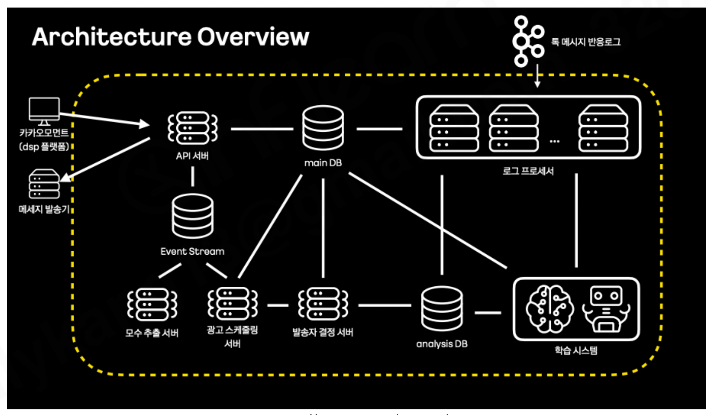
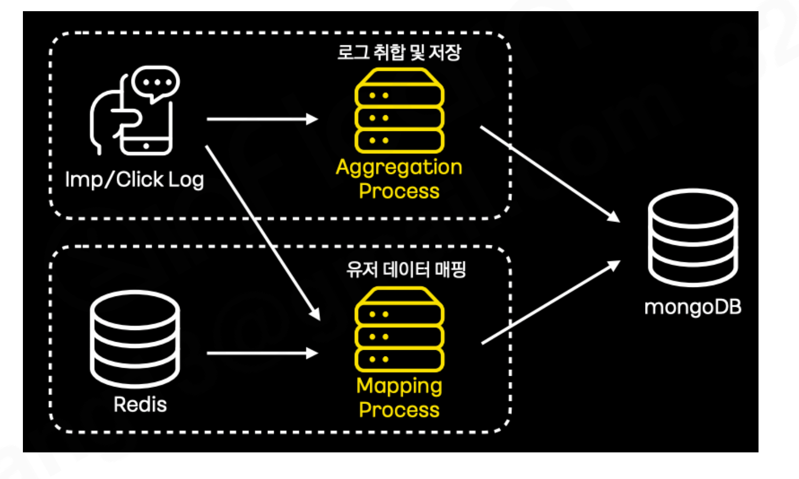
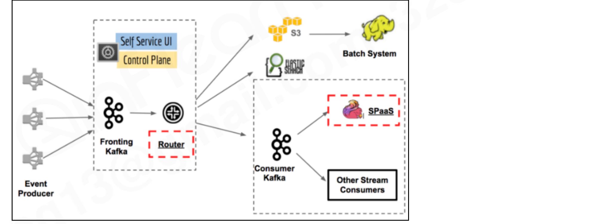
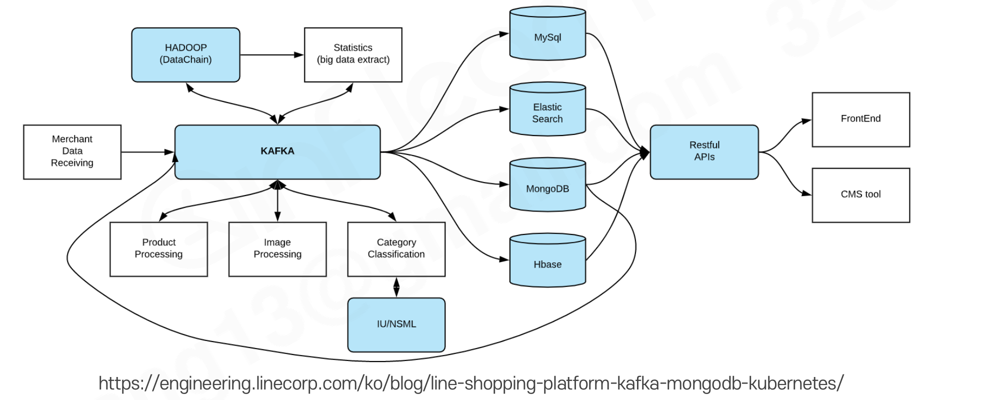
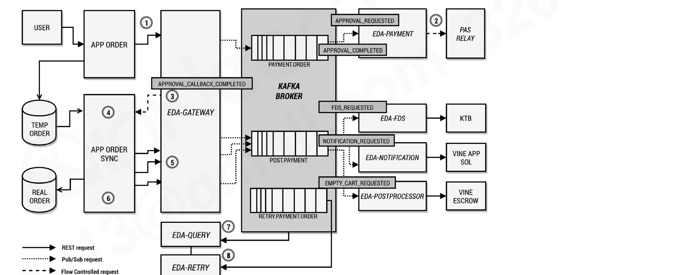
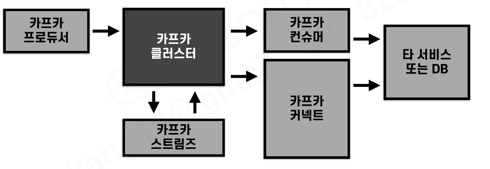

# 섹션 11. 카프카 활용 아키텍처 사례 분석

> 📅 학습일: 2026-08-23

## 1. 카카오 스마트 메시지 서비스

- 소재 최적화와 유저 타게팅을 통해 적합한 유저에게 광고 메시지를 개인화 전송하는 서비스. 
- 사용자에게 흥미가 있는 소재를 최적화하고, 적합한 유저에게 타게팅하여 광고를 선별 전송함

- API 서버가 요청을 받으면 **main DB** 와 **Event Stream(카프카)** 을 중심으로 모수 추출 서버, 광고 스케줄링 서버, 발송자 결정 서버가 순차적으로 연결되어 발송 대상과 시점을 결정
- 톡 메시지 반응로그(수신/클릭 등)는 **로그 프로세서** 여러 대가 받아서 `analysis DB`, `학습 시스템`으로 흘려보내 다음 발송에 반영 → 반응 데이터를 계속 학습에 재사용하는 피드백 루프 구조

---

## 2. 스마트 메시지의 카프카 스트림즈 활용

- 사용자의 반응 로그(imp, click)를 취합·저장하고, 유저 데이터를 매핑 처리하는 용도로 **카프카 스트림즈** 를 활용
- `groupByKey`, `windowedBy`, `aggregate` 구문으로 1분 단위 로그를 윈도우 취합하여 적재
- `map` 구문으로 Redis에 있는 유저 데이터와 결합(매핑) 처리한 뒤 최종적으로 mongoDB에 저장
- 5주차에 정리한 **윈도우 연산**, **KStream/KTable** 개념이 실제로 이런 실시간 집계·매핑 파이프라인에 쓰이는 사례

---

## 3. 넷플릭스 키스톤(Keystone) 프로젝트

- 여러 Event Producer가 보내는 데이터를 1차 카프카(**Fronting Kafka**)가 **라우팅 용도로 전부 수집**
- **Router**(자체 스트림 프로세싱/라우팅 애플리케이션)가 그 데이터를 2차 카프카(**Consumer Kafka**)나 S3(→ 배치 시스템), 엘라스틱서치 등 목적지별로 나눠서 전달
- Consumer Kafka는 다시 SPaaS(자체 스트림 처리 플랫폼), Other Stream Consumers로 분기 → **1차 카프카는 "일단 다 모으는" 역할, 2차 카프카부터 목적별로 세분화**하는 2단 카프카 구조가 특징

---

## 4. 라인 쇼핑 플랫폼 사례

- 시스템 유연성을 개선하고 처리량 한계를 없애기 위해 **카프카를 중앙에 둔 아키텍처**를 적용
- Merchant Data Receiving에서 들어온 데이터를 카프카가 받아 Hadoop(통계 추출), Product/Image Processing, Category Classification(+ 머신러닝 IU/NSML) 등 여러 처리 서버로 분배
- 처리 결과를 MySQL·Elasticsearch·MongoDB·Hbase에 각각 저장하고, Restful API로 묶어 FrontEnd·CMS tool에 제공
- **카프카 커넥트를 도입**해 mongoDB **CDC(Change Data Capture) 커넥터**를 활용 → 이벤트 기반 데이터 처리로 상품 처리 속도가 크게 빨라짐 (지난 섹션에서 배운 CDC 커넥터가 실제로 쓰인 사례)

---

## 5. 11번가 주문/결제 시스템 적용 사례

- 데이터베이스의 **병목현상을 해소**하기 위해 카프카 기반 이벤트 아키텍처(EDA)를 도입
- **카프카를 단일 진실 공급원(Source of Truth)** 으로 정의하고, 메시지를 **Materialized View**로 구축해 배치 데이터처럼 활용
- 흐름: `APP ORDER` 요청이 `EDA-GATEWAY`를 거쳐 카프카 브로커의 `PAYMENT.ORDER`, `POST.PAYMENT`, `RETRY.PAYMENT.ORDER` 토픽에 쌓이고, 각 토픽을 `EDA-PAYMENT`(결제 승인), `EDA-FDS`(이상거래 탐지), `EDA-NOTIFICATION`(알림), `EDA-POSTPROCESSOR`(후처리) 등 **역할별로 나뉜 EDA 컴포넌트들이 각자 구독**해서 처리한 뒤 외부 시스템(PAS RELAY, KTB, VINE APP 등)과 연동
- 요청/응답이 REST 위주였던 구조를, 토픽을 매개로 한 **Pub/Sub 기반 비동기 처리**로 바꿔 DB에 몰리던 부하를 분산시킨 사례

---

## 6. 카프카 기술별 아키텍처 적용 방법 정리

- 프로듀서를 통해 데이터가 카프카 클러스터에 최초로 유입되고, 토픽 기반 데이터 가공은 카프카 스트림즈로 처리하며, 컨슈머·커넥트는 클러스터에서 나가는(외부로 내보내는) 경로를 담당

| 기술 | 언제 선택하나 |
| --- | --- |
| 카프카 커넥트 | 반복적으로 생성해야 하는 파이프라인일 때 → 분산 모드로 설치·운영. 되도록 오픈소스 커넥터를 사용하고, 필요시에만 커스텀 커넥터 개발. REST API와 통신하는 운영용 웹 화면은 직접 개발하거나 오픈소스를 활용 |
| 카프카 스트림즈 | 토픽에 쌓인 데이터를 stateful/stateless하게 가공·집계해야 할 때 |
| 카프카 컨슈머, 프로듀서 | 커넥트·스트림즈로 구현할 수 없는 로직, 단발성(1회성) 파이프라인, 혹은 아직 개발 단계인 경우 직접 구현 |

- 정리하면, 지난 섹션(10주차)에서 배운 "**단순 동기화는 커넥트, 비즈니스 로직은 프로듀서/컨슈머 또는 스트림즈**" 기준이 실무 아키텍처 사례들에도 그대로 적용되고 있음을 확인할 수 있음

---

## 정리

- 카카오, 넷플릭스, 라인, 11번가 사례 모두 **카프카를 여러 시스템 사이의 중앙 허브**로 두고, 프로듀서/컨슈머/스트림즈/커넥트를 목적에 맞게 조합해서 쓰고 있다
- 카카오 스마트 메시지는 카프카 스트림즈로 로그 취합·윈도우 집계·유저 데이터 매핑을 실시간 처리한다
- 넷플릭스 키스톤은 1차 카프카(라우팅 전용)와 2차 카프카(목적별 분기)로 나눈 2단 구조를 쓴다
- 라인 쇼핑 플랫폼은 카프카를 중앙에 두고, 카프카 커넥트의 CDC 커넥터로 이벤트 기반 처리 속도를 높였다
- 11번가는 카프카를 Source of Truth로 삼아 DB 병목을 해소하고, 역할별 EDA 컴포넌트가 토픽을 구독하는 비동기 구조로 전환했다
- 커넥트는 반복적 단순 동기화, 스트림즈는 토픽 데이터의 상태 기반 가공, 컨슈머/프로듀서는 커넥트·스트림즈로 안 되는 로직이나 단발성 파이프라인에 사용한다
